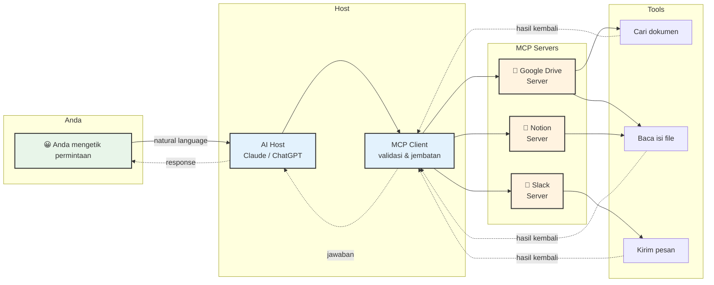
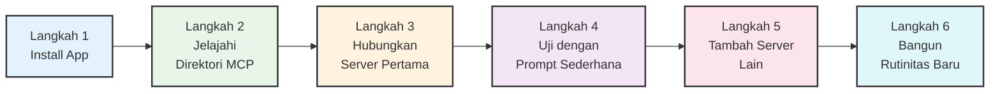

Setiap kali saya membuka ChatGPT atau Claude untuk membantu menyusun modul pembelajaran, ritualnya selalu sama. Buka Google Drive, cari dokumen kurikulum, copy bagian yang relevan, paste ke chat, lalu ketik prompt. Kalau perlu data dari spreadsheet atau referensi dari Notion, ulangi lagi. Copy, paste, copy, paste.

Kalau Anda seorang Learning Designer atau Instructional Designer, saya yakin ritualnya mirip. Pekerjaan kita berhubungan dengan banyak dokumen tersebar di mana-mana—silabus, materi PowerPoint, feedback peserta, hasil assessment, referensi teori. Semua di Google Drive, Notion, Slack, dan email. AI-nya memang pintar, tapi dia buta terhadap dunia kerja kita yang sebenarnya, kecuali kita copy-paste semuanya satu per satu.

Ada teknologi yang sedang mengubah ini. Namanya **Model Context Protocol**, atau singkatnya **MCP**. Dan kabar baiknya: teknologi ini bisa dipakai siapa saja yang sudah terbiasa dengan AI, tanpa perlu jadi programmer.

## "USB-C untuk AI"

Analogi yang paling sering dipakai untuk MCP adalah **USB-C**. Sebelum USB-C, setiap perangkat punya charger dan kabel sendiri. Laci meja kerja penuh kabel yang tidak kompatibel. USB-C mengakhiri kekacauan itu: satu kabel, untuk semua perangkat.

MCP melakukan hal serupa untuk AI. Sebelum MCP, setiap AI (ChatGPT, Claude, Gemini) punya cara sendiri untuk mengakses data eksternal. Kalau Anda punya 3 AI dan 10 tools, secara teori butuh 30 integrasi berbeda. MCP mengganti semua itu dengan satu protokol standar.

Anthropic merilis MCP sebagai proyek open-source pada November 2024. Dalam hitungan bulan, OpenAI, Google, dan Microsoft ikut mendukung. Pada Desember 2025, MCP disumbangkan ke Linux Foundation—artinya tidak dimiliki satu perusahaan, sama seperti Kubernetes atau Python. Per Maret 2026, tercatat lebih dari 10.000 MCP server publik aktif dengan 97 juta unduhan bulanan (Verma, 2026).

## Masalah "Context Starvation"

Anthropic punya istilah untuk masalah yang MCP coba selesaikan: **"context starvation"** atau "kelaparan konteks" (SitePoint, 2026). AI generasi sekarang sudah sangat pintar menalar dan menulis. Tapi kemampuannya terbatas karena dia tidak bisa "melihat" data Anda yang sebenarnya. Model yang tidak bisa membaca kode proyek Anda, mengakses database, atau mengecek kalender hanya bisa bekerja dengan apa yang Anda ketik di prompt.

Ini seperti memiliki asisten riset yang brilian, tapi dikunci di ruangan kosong. Anda harus mengantar semua dokumen ke ruangannya satu per satu. MCP adalah kunci yang membuka pintu ruangan itu.

## Cara Kerjanya (Tanpa Jargon)

Arsitektur MCP punya tiga komponen utama:

Sederhananya:

1. **Host** adalah aplikasi AI yang Anda pakai (Claude Desktop, ChatGPT, dll). Ini "otak" yang memproses permintaan Anda.
2. **MCP Server** adalah program kecil yang menghubungkan AI ke satu tool tertentu. Misalnya MCP Server Google Drive tahu cara mencari file, membaca dokumen, dan membuat file baru di Google Drive Anda.
3. **Tools** adalah aksi spesifik yang bisa dilakukan oleh setiap server: "cari dokumen", "baca file", "buat spreadsheet baru", dan seterusnya.

Satu hal penting: **setiap aksi butuh persetujuan Anda**. Saat AI ingin mengakses Google Drive atau mengirim pesan Slack, akan muncul konfirmasi. Anda selalu punya kontrol penuh.

## Sebelum vs Sesudah MCP: Workflow Learning Designer

Mari lihat perbedaan konkret dalam skenario nyata. Anda ditugaskan membuat modul onboarding karyawan baru:

```mermaid
flowchart TB
    subgraph Before["SEBELUM MCP (Manual)"]
        B1[1. Buka Google Drive] --> B2[2. Cari & buka dokumen SOP]
        B2 --> B3[3. Copy teks yang relevan]
        B3 --> B4[4. Buka spreadsheet feedback]
        B4 --> B5[5. Copy data feedback]
        B5 --> B6[6. Buka AI / ChatGPT]
        B6 --> B7[7. Paste SOP + feedback]
        B7 --> B8[8. Tulis prompt]
        B8 --> B9[9. Copy hasil dari AI]
        B9 --> B10[10. Paste ke dokumen baru]
        B10 --> B11[11. Edit & rapihkan]
    end

    subgraph After["SESUDAH MCP"]
        A1[1. Buka AI] --> A2[2. Ketik: 'Baca SOP\nonboarding & feedback\ntahun lalu, lalu\nbuat draft modul baru']
        A2 --> A3[3. AI baca Google\nDrive sendiri]
        A3 --> A4[4. AI analisa feedback\notomatis]
        A4 --> A5[5. AI buat draft\nlangsung]
        A5 --> A6[6. Review & finalisasi]
    end

    style Before fill:#ffebee,stroke:#c62828,stroke-width:2px
    style After fill:#e8f5e9,stroke:#2e7d32,stroke-width:2px
```

Sebelas langkah menjadi enam. Dan dari enam langkah itu, empat di antaranya dikerjakan AI secara otomatis.

## Lima Skenario Praktis untuk Learning Designer

Berikut contoh konkret bagaimana MCP bisa dipakai dalam pekerjaan sehari-hari, lengkap dengan prompt yang bisa langsung Anda coba:

### 1. Riset & Summary Materi dari Google Drive

**MCP Server:** Google Drive

**Prompt contoh:**
> "Cari semua dokumen di folder 'Training Materials 2025' yang membahas customer service. Baca tiap dokumen, lalu buat ringkasan eksekutif yang mencakup: (1) topik yang dibahas, (2) metode pelatihan yang dipakai, (3) gap atau topik yang belum tercover."

**Tanpa MCP:** Anda harus membuka Google Drive, cari manual, buka tiap dokumen satu per satu, copy isinya, lalu paste ke AI. Untuk 10 dokumen, ini bisa makan 30-45 menit. Dengan MCP, AI mencari dan membaca semuanya sendiri dalam hitungan menit.

### 2. Analisis Feedback Peserta Training

**MCP Server:** Google Sheets atau Airtable

**Prompt contoh:**
> "Baca spreadsheet 'Training Feedback Q1-Q4 2025'. Kolom 'Komentar' berisi feedback terbuka dari peserta. Analisis semua komentar, kategorikan ke dalam 5 tema utama, hitung berapa kali tiap tema muncul, lalu buat rekomendasi 3 perbaikan prioritas untuk modul tahun depan."

**Tanpa MCP:** Anda harus export spreadsheet, copy ratusan baris feedback, lalu paste ke AI (yang mungkin saja melebihi batas token). Dengan MCP, AI membaca langsung dari spreadsheet Anda.

### 3. Ubah Video Training menjadi Modul Tertulis

**MCP Server:** YouTube

**Prompt contoh:**
> "Transkrip video dari URL berikut: [link YouTube]. Setelah itu, ekstrak konsep-konsep kunci, susun menjadi outline modul pembelajaran dengan struktur: Learning Objectives, Materi, Latihan, dan Assessment. Format dalam Bahasa Indonesia formal."

**Tanpa MCP:** Anda harus mencari tool transkripsi terpisah, download transkrip-nya, lalu paste ke AI. Dengan MCP YouTube, AI melakukannya dalam satu percakapan.

### 4. Kolaborasi Riset dengan Web Search

**MCP Server:** Brave Search atau Firecrawl

**Prompt contoh:**
> "Cari 5 artikel terbaru (2025-2026) tentang 'microlearning best practices in corporate training'. Untuk tiap artikel, ekstrak: judul, penulis, 3 poin kunci, dan contoh implementasi. Susun dalam format literature review singkat."

**Tanpa MCP:** Anda googling manual, buka 5 tab, baca tiap artikel, catat poin penting. Dengan MCP, AI mencari, membaca, dan menyusun semuanya.

### 5. Manajemen Modul di Notion

**MCP Server:** Notion

**Prompt contoh:**
> "Baca semua halaman di database 'Curriculum 2026' yang berstatus 'Draft'. Identifikasi modul mana yang belum punya assessment section, lalu buat template assessment sederhana (5 pertanyaan pilihan ganda + 1 essay) untuk tiap modul yang kurang."

**Tanpa MCP:** Anda harus buka Notion, cek tiap halaman satu per satu, copy struktur modul, lalu buat assessment manual.

## Panduan Belajar Mandiri: 6 Langkah

**Langkah 1: Install aplikasi AI yang mendukung MCP.** Pilihan termudah saat ini adalah Claude Desktop (gratis, Mac & Windows) atau ChatGPT versi desktop. Keduanya sudah mendukung MCP secara native. Tidak perlu coding apa pun.

**Langkah 2: Jelajahi direktori MCP Server.** Kunjungi [mcp.so](https://mcp.so) atau [Glitch MCP Directory](https://glitch.com/mcps). Cari tool yang sudah Anda pakai sehari-hari. Setiap server punya deskripsi, screenshot, dan instruksi instalasi. Luangkan waktu 15 menit untuk membaca-baca dan membuat daftar "wish list" server yang ingin dicoba.

**Langkah 3: Hubungkan MCP Server pertama.** Mulai dengan satu yang paling langsung berguna. Untuk Learning Designer, rekomendasi saya: **Google Drive** atau **Notion**, karena di situlah materi pembelajaran Anda tersimpan. Ikuti instruksi instalasi di direktori MCP. Umumnya hanya perlu: klik "Add to Claude/ChatGPT" → ikuti langkah otorisasi → selesai.

**Langkah 4: Uji dengan prompt sederhana.** Jangan langsung buat tugas kompleks. Mulai dengan perintah dasar untuk memastikan koneksi berfungsi:

> *"Cari dokumen apa saja yang saya punya di Google Drive yang mengandung kata 'onboarding'."*

Atau:

> *"Tampilkan 5 halaman terbaru yang saya buat di Notion."*

Kalau responsnya relevan dengan data Anda yang sebenarnya, selamat—MCP sudah berfungsi.

**Langkah 5: Tambahkan server lain secara bertahap.** Setelah nyaman dengan satu server, tambahkan tool lain. Kombinasi yang saya rekomendasikan untuk Learning Designer:

| Kombinasi | Untuk Apa |
|---|---|
| Google Drive + Google Sheets | Akses materi + analisis data feedback |
| Notion + Brave Search | Manajemen kurikulum + riset literatur |
| YouTube + Notion | Ubah video jadi modul tertulis |
| Slack + Google Drive | Tracking diskusi tim + akses materi |

**Langkah 6: Bangun rutinitas baru.** Integrasikan MCP ke workflow harian. Tujuan akhirnya: alih-alih "buka tool → cari dokumen → copy → paste ke AI", rutinitasnya menjadi "buka AI → ketik perintah → dapat hasil". Semua tool Anda ada dalam satu percakapan.

## Catatan Privasi dan Keamanan

Pertanyaan yang wajar: *"Apakah aman? AI bisa baca semua data saya?"*

Beberapa hal penting untuk dipahami:

- **MCP Server berjalan lokal di komputer Anda**, bukan di cloud pihak ketiga.
- **Setiap aksi butuh persetujuan Anda.** Saat AI ingin mengakses tool, akan muncul konfirmasi yang menunjukkan persis apa yang akan dilakukan. Anda bisa menolak.
- **Anda memilih apa yang dishare.** Anda tidak wajib menghubungkan semua tool sekaligus. Mulai dari yang paling tidak sensitif.
- **Gunakan MCP Server resmi.** Untuk tool seperti Google Drive atau Notion, gunakan server yang diverifikasi atau dibuat oleh provider resmi. Hindari server tidak dikenal dari sumber mencurigakan.

Prinsip yang baik: mulai dengan data yang tidak sensitif (materi training publik, referensi umum). Begitu merasa nyaman dan memahami mekanismenya, baru perlahan tambahkan akses ke data yang lebih kritis.

## Bukan Hanya untuk Programmer

Ada kesan bahwa teknologi seperti MCP hanya untuk orang IT. Kenyataannya, MCP dirancang agar bisa dipakai dari percakapan natural language. Anda tidak perlu menulis kode, sama seperti Anda tidak perlu paham cara kerja HTTP untuk membuka website.

Yang dibutuhkan hanyalah: aplikasi AI yang mendukung MCP, MCP Server untuk tool yang sudah Anda pakai sehari-hari, dan sedikit rasa ingin tahu untuk mencoba.

Sebagai Learning Designer, pekerjaan Anda berada di persimpangan pengetahuan, teknologi, dan pengalaman manusia. MCP membuka kemungkinan untuk mengotomatisasi bagian-bagian yang mekanis dari pekerjaan Anda, sehingga energi Anda bisa dialokasikan ke hal yang paling penting: merancang pengalaman belajar yang berdampak.

AI sudah pintar. Pertanyaannya bukan lagi "seberapa pintar AI-nya", tapi "seberapa banyak konteks nyata yang bisa kita berikan". MCP adalah jawaban untuk pertanyaan itu.

## Referensi

1. Anthropic. (2024). *Introducing the Model Context Protocol*. https://www.anthropic.com/news/model-context-protocol
2. Verma, S. (2026). *What is MCP (Model Context Protocol)? The 2026 Guide for SaaS PMs*. Truto Blog. https://truto.one/blog/what-is-mcp-model-context-protocol-the-2026-guide-for-saas-pms/
3. SitePoint Team. (2026). *MCP (Model Context Protocol): Complete 2026 Guide for AI Integration*. https://www.sitepoint.com/model-context-protocol-mcp/
4. Nwibe, G. (2025). *10 MCP (Model Context Protocol) Use Cases Using Claude*. Activepieces. https://www.activepieces.com/blog/10-mcp-model-context-protocol-use-cases
5. Model Context Protocol. (2025). *Specification 2025-11-25*. https://modelcontextprotocol.io/specification/2025-11-25
6. IBM. (2025). *What is Model Context Protocol (MCP)?* https://www.ibm.com/think/topics/model-context-protocol
7. Deepak, G. (2025). *The Complete Guide to Model Context Protocol (MCP): Enterprise Adoption, Market Trends and Implementation Strategies*. https://guptadeepak.com/the-complete-guide-to-model-context-protocol-mcp-enterprise-adoption-market-trends-and-implementation-strategies/
8. Hou, X. et al. (2025). *Model Context Protocol (MCP): Landscape, Security Threats, and Future Research Directions*. arXiv. https://arxiv.org/html/2503.23278v3
