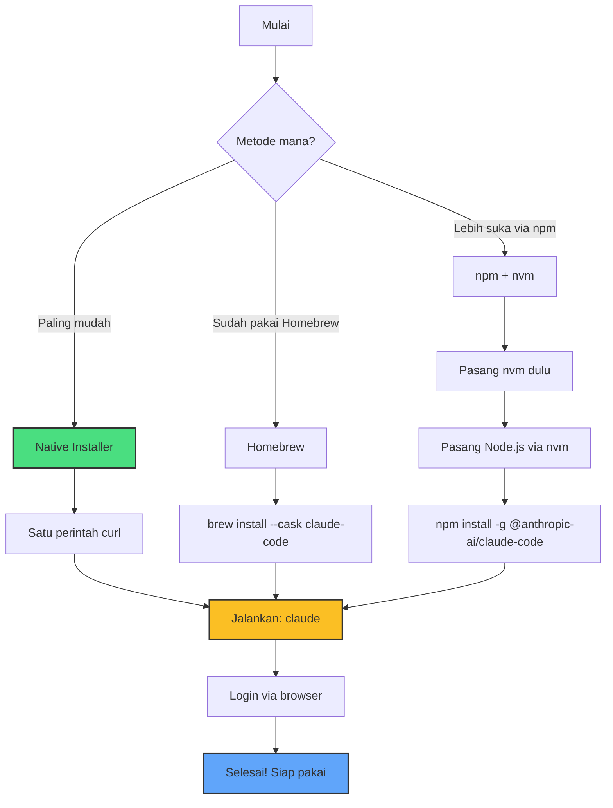

Claude Code adalah asisten coding berbasis AI dari Anthropic yang berjalan langsung di Terminal Mac Anda. Dia bisa membaca seluruh kode proyek Anda, menulis file baru, memperbaiki bug, menjalankan perintah, bahkan membuat pull request di Git — semuanya lewat percakapan bahasa natural.

Panduan ini ditulis untuk siapa saja, termasuk yang belum pernah membuka Terminal sebelumnya. Setiap langkah dijelaskan dari awal, lengkap dengan perintah yang bisa langsung disalin-tempel.

## Apa Saja yang Dibutuhkan?

Sebelum mulai, pastikan Anda punya tiga hal berikut:

**1. Mac dengan macOS versi terbaru.** Panduan ini spesifik untuk macOS. Jika Anda menggunakan Windows atau Linux, proses instalasinya mirip tapi ada perbedaan kecil pada perintahnya.

**2. Akses ke aplikasi Terminal.** Terminal adalah aplikasi bawaan macOS yang memungkinkan Anda mengetik perintah teks untuk mengontrol komputer. Untuk membukanya: tekan `Cmd + Spasi`, ketik "Terminal", lalu tekan Enter.

**3. Akun Claude.** Claude Code memerlukan langganan Claude (Pro, Max, Team, atau Enterprise) atau akun Anthropic Console. Tanpa akun ini, Claude Code tidak bisa berjalan. Anda bisa membuat akun di [claude.com](https://claude.com).

Penting dicatat: **metode instalasi yang direkomendasikan saat ini tidak lagi memerlukan Node.js.** Versi lama Claude Code memang butuh Node.js, tetapi Anthropic kini menyediakan installer native yang mandiri. Namun, jika Anda ingin tetap menggunakan jalur npm (misalnya karena sudah familiar dengan ekosistem Node.js), panduan ini juga membahas cara menginstal Node.js melalui nvm.

## Diagram Alur Instalasi



## Cara 1: Native Installer (Paling Mudah — Direkomendasikan)

Ini adalah cara termudah dan resmi direkomendasikan oleh Anthropic. Tidak perlu menginstal apa pun sebelumnya — cukup satu perintah dan selesai.

**Langkah 1:** Buka Terminal (`Cmd + Spasi`, ketik "Terminal", tekan Enter).

**Langkah 2:** Salin dan tempel perintah berikut ke Terminal, lalu tekan Enter:

```bash
curl -fsSL https://claude.ai/install.sh | bash
```

Jangan khawatir melihat teks berjalan di layar — itu normal. Installer sedang mengunduh dan mengonfigurasi Claude Code untuk Mac Anda.

**Langkah 3:** Tunggu hingga muncul pesan yang menandakan instalasi berhasil. Proses ini biasanya memakan waktu 30 detik hingga 2 menit, tergantung kecepatan internet Anda.

**Langkah 4:** Tutup Terminal dan buka kembali. Ini diperlukan agar sistem mengenali perintah `claude` yang baru terpasang.

**Kelebihan cara ini:** Installer native melakukan pembaruan otomatis di latar belakang. Artinya, Anda selalu menggunakan versi terbaru tanpa perlu melakukan apa pun manual.

## Cara 2: Melalui Homebrew

Homebrew adalah "toko aplikasi" untuk Terminal yang populer di kalangan pengguna Mac. Jika Anda sudah memiliki Homebrew terpasang, cara ini cukup praktis.

**Apakah Homebrew sudah terpasang?** Ketik ini di Terminal:

```bash
brew --version
```

Jika muncul nomor versi (misalnya `Homebrew 4.x.x`), berarti Homebrew sudah ada. Jika muncul pesan `command not found`, Anda perlu memasang Homebrew terlebih dahulu:

```bash
/bin/bash -c "$(curl -fsSL https://raw.githubusercontent.com/Homebrew/install/HEAD/install.sh)"
```

Setelah Homebrew tersedia, pasang Claude Code dengan:

```bash
brew install --cask claude-code
```

Homebrew menyediakan dua varian cask. `claude-code` mengikuti kanal rilis stabil (biasanya tertinggal sekitar satu minggu dan melewatkan rilis yang memiliki bug besar). Sementara `claude-code@latest` mengikuti kanal terbaru dan menerima pembaruan secepatnya. Untuk sebagian besar pengguna, `claude-code` (stabil) sudah cukup.

**Catatan penting:** Instalasi via Homebrew tidak melakukan pembaruan otomatis. Anda perlu memperbarui secara manual dengan:

```bash
brew upgrade claude-code
```

## Cara 3: Melalui npm dengan nvm

Jika Anda seorang developer atau lebih suka menggunakan npm (Node Package Manager), Anda bisa memasang Claude Code melalui npm. Karena npm membutuhkan Node.js, panduan ini menggunakan nvm (Node Version Manager) untuk mengelola Node.js — sesuai praktik terbaik agar tidak mengotori sistem.

### Langkah 3a: Pasang nvm

nvm adalah alat untuk menginstal dan mengelola berbagai versi Node.js tanpa perlu hak administrator. Versi terbaru saat artikel ini ditulis adalah v0.40.5.

Buka Terminal dan jalankan:

```bash
curl -o- https://raw.githubusercontent.com/nvm-sh/nvm/v0.40.5/install.sh | bash
```

Script ini akan mengunduh nvm dan menambahkan konfigurasi yang diperlukan ke file profil Terminal Anda (biasanya `~/.zshrc` di macOS modern).

Setelah selesai, tutup Terminal dan buka kembali. Kemudian verifikasi instalasi:

```bash
nvm --version
```

Jika muncul nomor versi, nvm sudah siap digunakan.

### Langkah 3b: Pasang Node.js

Dengan nvm, memasang Node.js menjadi sangat mudah:

```bash
nvm install --lts
```

Perintah ini mengunduh dan menginstal versi LTS (Long-Term Support) Node.js terbaru. LTS adalah versi yang paling stabil dan didukung jangka panjang.

Verifikasi bahwa Node.js dan npm sudah terpasang:

```bash
node --version
npm --version
```

Anda akan melihat nomor versi untuk masing-masing, misalnya `v24.16.0` untuk Node dan `10.x.x` untuk npm.

### Langkah 3c: Pasang Claude Code

Sekarang, pasang Claude Code secara global melalui npm:

```bash
npm install -g @anthropic-ai/claude-code
```

Tunggu hingga proses selesai. Flag `-g` berarti "global" — Claude Code akan tersedia dari mana saja di Terminal Anda.

## Login untuk Pertama Kali

Setelah instalasi selesai dengan salah satu dari tiga cara di atas, langkah selanjutnya adalah masuk (login) ke akun Claude Anda.

**Langkah 1:** Di Terminal, ketik perintah berikut:

```bash
claude
```

**Langkah 2:** Claude Code akan memandu Anda melalui proses login. Anda akan melihat pesan yang meminta Anda untuk membuka browser dan mengikuti tautan autentikasi.

**Langkah 3:** Browser akan terbuka secara otomatis (atau Anda bisa menyalin tautan yang muncul). Login dengan akun Claude Anda (Pro, Max, atau Console).

**Langkah 4:** Setelah login berhasil di browser, kembali ke Terminal. Anda akan melihat Claude Code siap digunakan.

Jika nanti perlu beralih akun atau login ulang, ketik `/login` di dalam sesi Claude Code yang sedang berjalan.

## Verifikasi: Apakah Claude Code Berfungsi?

Untuk memastikan semuanya terpasang dengan benar, jalankan:

```bash
claude --version
```

Jika muncul nomor versi, selamat — Claude Code sudah siap!

Sebagai tes pertama, coba masuk ke folder proyek apa pun dan ajukan pertanyaan sederhana:

```bash
cd ~/Documents/proyek-anda
claude
```

Kemudian ketik sesuatu seperti:

> what does this project do?

Claude akan menganalisis proyek Anda dan menjelaskannya dalam bahasa natural.

## Cara Memperbarui Claude Code

Cara memperbarui tergantung metode instalasi yang Anda pilih:

| Metode Instalasi | Cara Update |
|---|---|
| Native Installer | Otomatis di latar belakang |
| Homebrew | `brew upgrade claude-code` |
| npm + nvm | `npm update -g @anthropic-ai/claude-code` |

Anda juga bisa memeriksa kesehatan instalasi kapan saja dengan:

```bash
claude doctor
```

Perintah ini akan memeriksa apakah instalasi dan sistem pembaruan Claude Code berjalan dengan baik.

## Troubleshooting: Masalah Umum

**"command not found: claude"** setelah instalasi. Solusi: tutup Terminal sepenuhnya (`Cmd + Q`) dan buka kembali. Jika masih tidak berhasil, jalankan `source ~/.zshrc` (atau `source ~/.bash_profile` jika menggunakan Bash). Untuk instalasi npm, pastikan direktori global npm ada di PATH sistem Anda.

**Proses login gagal atau browser tidak terbuka.** Salin tautan autentikasi yang muncul di Terminal secara manual, lalu tempel di browser. Pastikan Anda login dengan akun yang memiliki langganan Claude aktif.

**"Permission denied" saat menjalankan perintah.** Pastikan Anda memiliki hak akses yang cukup pada folder tersebut. Untuk instalasi npm, nvm secara desain tidak memerlukan `sudo` — jika Anda tergoda menggunakan `sudo npm install`, itu pertanda ada masalah dengan konfigurasi nvm.

**Claude Code lambat atau tidak responsif.** Periksa koneksi internet Anda. Claude Code memerlukan koneksi stabil untuk berkomunikasi dengan server Anthropic. Jalankan `claude doctor` untuk diagnosis lebih lanjut.

## Referensi

1. Anthropic. "Quickstart — Claude Code." *Claude Code Docs*. Tersedia di: https://code.claude.com/docs/en/quickstart
2. Anthropic. "Overview — Claude Code." *Claude Code Docs*. Tersedia di: https://code.claude.com/docs/en/overview
3. nvm-sh. "nvm — Node Version Manager." *GitHub*. Tersedia di: https://github.com/nvm-sh/nvm
4. Homebrew. "The Missing Package Manager for macOS (or Linux)." Tersedia di: https://brew.sh
5. Node.js Foundation. "Node.js Releases." *nodejs.org*. Tersedia di: https://nodejs.org/en/about/previous-releases
