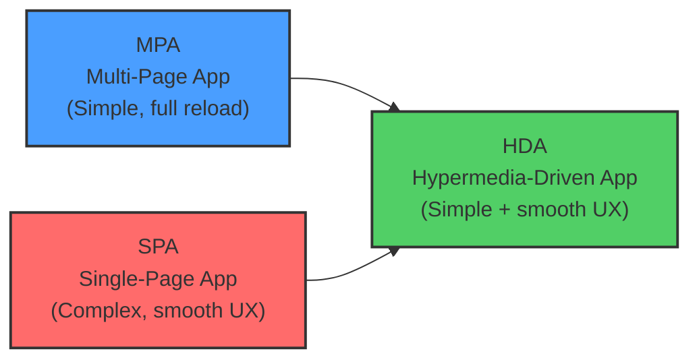
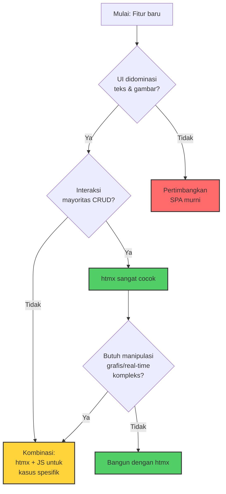

Beberapa bulan lalu, saya menulis tentang Deno dan Bun sebagai alternatif runtime untuk Node.js. Kali ini saya ingin membahas sesuatu yang lebih fundamental: bagaimana kita berinteraksi dengan web itu sendiri. Bukan soal runtime, bukan soal framework, tapi soal cara berpikir tentang arsitektur aplikasi web.

Topiknya adalah htmx—sebuah pustaka kecil yang mengajarkan pertanyaan yang tidak terduga: apakah kita benar-benar perlu 47MB JavaScript bundle hanya untuk menampilkan form pencarian?

## Kompleksitas yang Tumbuh Tanpa Kita Sadari

Selama dekade terakhir, pola *default* untuk membangun aplikasi web hampir selalu sama: pilih SPA framework (React, Vue, Angular), bangun REST atau GraphQL API yang mengembalikan JSON, lalu kelola state di sisi klien dengan library tambahan. Sebagian besar developer yang memulai karier setelah 2015 mungkin tidak pernah membangun aplikasi web tanpa pendekatan ini.

Roy Fielding, dalam disertasinya tahun 2000 yang mendefinisikan arsitektur REST di University of California Irvine, mengusulkan sebuah konstraint bernama HATEOAS (*Hypermedia as the Engine of Application State*). Ide intinya: server harus mengirimkan hypermedia—artinya HTML lengkap dengan link—sehingga klien tahu langkah selanjutnya tanpa perlu pengetahuan yang dikodekan secara *hard-coded* tentang struktur API. Fielding bahkan menulis blog post terpisah pada 2008 berjudul "REST APIs must be hypertext-driven" untuk menegaskan poin ini, karena banyak developer salah memahami REST sebagai sekadar "HTTP + JSON."

Sebagian besar aplikasi web modern justru meninggalkan konstraint ini. Yang terjadi adalah JSON API yang mengharuskan klien mengetahui struktur endpoint secara manual—melalui dokumentasi terpisah, OpenAPI spec, atau trial-and-error. Setiap kali API berubah, front-end harus diperbarui. Setiap fitur baru memerlukan sinkronisasi antara dua *codebase*.

Hasilnya adalah ekosistem yang tumbuh kompleks: virtual DOM, *hydration step*, *state management library*, *build tools* berlapis (Webpack, Vite, esbuild, SWC), dan *dependency tree* yang bisa berisi ratusan paket. Tidak ada yang salah dengan tools ini—mereka lahir dari kebutuhan nyata untuk membangun aplikasi yang semakin kompleks. Tapi pertanyaan kritisnya: apakah semua fitur membutuhkan seluruh mesin ini?

## Apa Itu htmx?

Menurut Wikipedia, htmx adalah pustaka JavaScript *open-source* yang "memperluas HTML dengan atribut khusus yang memungkinkan penggunaan AJAX langsung di HTML dengan pendekatan *hypermedia-driven*." Pustaka ini dibuat oleh Carson Gross pada tahun 2020 sebagai penerus *intercooler.js*, sebuah library berbasis jQuery yang ia kembangkan sejak 2013.

htmx mencapai versi 2.0 pada tahun 2024—versi yang merombak fondasi internal tanpa bergantung pada jQuery lagi. Saat ini repository GitHub-nya memiliki lebih dari 48.000 bintang, dan pada 2023, htmx terpilih sebagai bagian dari kohort pertama GitHub Accelerator Program—program yang memberikan pendanaan dan mentor bagi proyek *open-source* yang menjanjikan.

Yang membuat htmx menarik adalah ukurannya: file `htmx.min.js` hanya sekitar 14KB (gzipped), tanpa *dependency*, tanpa *build step*. Kamu cukup menambahkan satu `<script>` tag dan langsung bekerja.

## Cara Kerja: Lengkap dalam Atribut HTML

Inti dari htmx dapat dipahami dengan satu contoh. Dari dokumentasi resmi:

```html
<button hx-post="/clicked"
        hx-trigger="click"
        hx-target="#parent-div"
        hx-swap="outerHTML">
    Click Me!
</button>
```

Atribut `hx-post` mengirim request POST ke endpoint `/clicked`. `hx-target` menentukan elemen mana di DOM yang akan diupdate. `hx-swap` menentukan cara konten diganti—`outerHTML` berarti elemen target diganti seluruhnya, `innerHTML` berarti hanya kontennya.

Yang dikembalikan server bukan JSON yang harus di-*parse*, di-*map* ke model, dan di-*render* di klien. Yang dikembalikan adalah fragmen HTML langsung. Browser menampilkannya. Selesai.

htmx menggeneralisasi empat hal yang sebelumnya terbatas dalam HTML:

- **Elemen apa pun** (bukan hanya `<a>` dan `<form>`) bisa mengirim HTTP request
- **Event apa pun** (bukan hanya *click* dan *submit*) bisa memicu request—termasuk `keyup`, `change`, `input`, bahkan *custom events*
- **HTTP verb apa pun** (bukan hanya GET dan POST)—PUT, PATCH, DELETE tersedia
- **Elemen apa pun** (bukan hanya *window* penuh) bisa menjadi target update

Untuk fitur seperti *active search*—di mana hasil pencarian muncul saat user mengetik—htmx cukup menambahkan atribut:

```html
<input type="search" name="q"
       hx-post="/search"
       hx-trigger="keyup changed delay:500ms"
       hx-target="#results">
```

Lima ratus milidetik setelah user berhenti mengetik, htmx mengirim POST request, menerima HTML, dan mengganti konten `#results`. Tidak ada `useEffect`, tidak ada `useState`, tidak ada `fetch` dengan `.then()`, tidak ada *loading state management*. Atribut `delay:500ms` menangani *debounce* yang biasanya memerlukan library seperti Lodash atau *custom hook*.

## Ide yang Lebih Besar: Hypermedia-Driven Application

htmx bukan sekadar "AJAX tanpa JavaScript." Dalam esainya tahun 2022, Carson Gross memformalkan konsep *Hypermedia-Driven Application* (HDA) sebagai sintesis dari dua pendekatan yang sudah ada:



MPA (Multi-Page Application) adalah pendekatan tradisional: setiap interaksi memuat ulang halaman penuh dari server. Sederhana, tapi pengalaman pengguna terasa berat. SPA (Single-Page Application) menghilangkan *reload* dengan mengelola semuanya di klien—UX yang halus, tapi dengan biaya kompleksitas yang tinggi. HDA mengambil kesederhanaan MPA (server mengontrol *state*, mengirim HTML) dan menambahkan kelancaran SPA (*update* parsial tanpa *reload* penuh) dengan tetap berada dalam model pemrograman web yang asli.

Dua konstraint utama HDA, menurut Gross: pertama, gunakan sintaks deklaratif yang tertanam di HTML, bukan *scripting* imperatif. Kedua, berinteraksi dengan server dalam format hypermedia (HTML), bukan format non-hypermedia (JSON). Dengan konstraint ini, aplikasi tetap berada dalam arsitektur REST yang sesuai dengan visi asli Fielding—termasuk HATEOAS.

## Studi Kasus: Contexte dan Reduksi 67%

Bukti bahwa htmx bukan sekadar teori datang dari David Guillot, developer di Contexte, sebuah media outlet asal Prancis. Dalam presentasi yang ia sebut "The Mother Of All htmx Demos," Guillot mendokumentasikan migrasi aplikasi internal mereka dari React ke htmx. Hasilnya mencengangkan: pengurangan *codebase* sebesar 67%.

Bukan hanya baris kode yang berkurang. Guillot melaporkan peningkatan performa, penyederhanaan arsitektur yang signifikan, dan eliminasi seluruh lapisan *API client-side* yang sebelumnya diperlukan untuk menghubungkan React dengan backend. Tim Contexte membangun ulang fitur seperti *infinite scroll*, *inline editing*, dan *real-time update* menggunakan kombinasi atribut htmx dan sedikit JavaScript untuk kasus spesifik.

Ini bukan berarti React buruk atau bahwa setiap aplikasi harus migrasi. Tapi untuk aplikasi yang UI-nya didominasi teks dan gambar—seperti kebanyakan aplikasi CRUD, *dashboard admin*, *content management system*, dan portal internal—kompleksitas SPA sering kali tidak proporsional dengan kebutuhan aktual.

## Kapan Hypermedia Cocok, Kapan Tidak

Gross menulis esai khusus berjudul "When Should You Use Hypermedia?" yang jujur membahas *trade-off*. Ia menulis: *"We are obviously fans of hypermedia and think that it can address, at least in part, many of the problems that the web development world is facing today."* Tapi ia juga mengakui keterbatasannya.

Hypermedia cocok ketika UI mayoritas berupa teks dan gambar, ketika interaksi didominasi operasi CRUD, dan ketika kamu ingin mempertahankan logika di server. htmx juga mengurangi tekanan untuk mengadopsi teknologi server tertentu—karena tidak ada *codebase* front-end JavaScript yang besar untuk dipelihara, backend bisa ditulis dalam bahasa apa pun yang mengembalikan HTML.

Sebaliknya, hypermedia kurang cocok untuk aplikasi yang membutuhkan manipulasi grafis kompleks di sisi klien (editor gambar, *canvas-based game*), aplikasi dengan komputasi *real-time* intensif di klien, atau ketika kamu membangun aplikasi yang harus bekerja sepenuhnya *offline*.

Konsep penting di sini adalah *Transitional Application*—istilah yang dipopulerkan Rich Harris (pembuat Svelte) dalam ceramahnya "Have SPAs Ruined The Web?" Ide Harris: aplikasi tidak harus murni satu pendekatan. Kamu bisa menggunakan hypermedia untuk 80% fitur dan JavaScript kompleks untuk 20% yang membutuhkannya. Gross berargumen bahwa dengan htmx, batas hypermedia bisa digeser jauh lebih jauh dari yang umumnya diasumsikan developer.

## Implikasi untuk Tim Engineering

Sebagai *engineering manager*, saya melihat tiga implikasi praktis dari fenomena htmx.

**Pertama, *tooling fatigue* adalah masalah nyata yang sering diabaikan.** Ketika *onboarding* engineer baru membutuhkan waktu berminggu-minggu hanya untuk memahami *build pipeline*, *state management patterns*, dan *data fetching conventions*, ada biaya tersembunyi yang tidak muncul di burndown chart. htmx menawarkan jalan keluar radikal: untuk banyak fitur, kompleksitas bisa dikurangi dengan satu *library* 14KB tanpa *build step*.

**Kedua, arsitektur harus dipilih berdasarkan kebutuhan, bukan *default*.** Pertanyaan "apakah fitur ini benar-benar butuh SPA?" layak diajukan sebelum mengambil keputusan. Saya tidak menyarankan meninggalkan React—tetapi mempertimbangkan htmx untuk *dashboard* internal, halaman admin, atau fitur CRUD bisa menghemat waktu *development* dan *maintenance* yang signifikan. Setiap baris kode yang tidak ditulis adalah baris yang tidak perlu di-*test*, di-*debug*, dan di-*maintain*.

**Ketiga, htmx menarik secara strategis karena tidak memaksa memilih *tech stack*.** Server bisa ditulis dalam Go, Python, Ruby, PHP, atau Node.js—selama yang dikembalikan adalah HTML, htmx bekerja. Ini mengurangi *vendor lock-in* pada ekosistem tertentu. Bagi tim yang sudah memiliki backend matang dalam bahasa non-JavaScript, htmx memungkinkan pembangunan UI interaktif tanpa harus mengadopsi ekosistem JavaScript penuh.

## Decision Framework



Ada kritik yang valid terhadap htmx. Menulis logika front-end dalam atribut HTML bisa terasa tidak *ergonomic* bagi developer yang terbiasa dengan kekuatan TypeScript dan *component composition*. *Testing* memiliki karakteristik berbeda—kamu menguji endpoint yang mengembalikan HTML, bukan fungsi *pure*. Dan untuk tim yang sudah berinvestasi besar dalam ekosistem React atau Vue, migrasi parsial membutuhkan strategi yang matang untuk menghindari dua *codebase* yang tidak koheren.

Tapi inti pesan htmx lebih luas dari pustaka itu sendiri. htmx mengingatkan bahwa web memiliki mekanisme yang elegan untuk interaktivitas—HTML dan HTTP—yang telah ada sejak awal. Selama bertahun-tahun, industri secara kolektif memperlakukan mekanisme ini sebagai sesuatu yang harus diatasi, bukan dimanfaatkan. htmx membalik perspektif itu: alih-alih mengganti HTML dengan JavaScript, mengapa tidak memperluas HTML itu sendiri?

Bagi saya, pelajaran terbesar bukan soal memilih htmx versus React. Pelajarannya adalah tentang kesadaran teknologi—tahu kapan kompleksitas sepadan dan kapan tidak. Sebagai orang yang membuat keputusan arsitektur untuk tim, kemampuan untuk mengevaluasi *trade-off* dengan jujur jauh lebih berharga daripada loyalitas pada *tech stack* tertentu. Terkadang jawabannya adalah SPA yang lengkap dengan *state management* dan *build pipeline*. Terkadang jawabannya adalah lima baris atribut HTML.


## Referensi

1. Wikipedia contributors. "htmx." *Wikipedia, The Free Encyclopedia*. — https://en.wikipedia.org/wiki/Htmx
2. Gross, Carson. "Hypermedia-Driven Applications." *htmx.org*, 6 Februari 2022. — https://htmx.org/essays/hypermedia-driven-applications/
3. Gross, Carson. "When Should You Use Hypermedia?" *htmx.org*, 23 Oktober 2022. — https://htmx.org/essays/when-to-use-hypermedia/
4. htmx Documentation. "htmx in a Nutshell." — https://htmx.org/docs/
5. Fielding, Roy Thomas. "Architectural Styles and the Design of Network-based Software Architectures." *Doctoral Dissertation*, University of California, Irvine, 2000. — https://www.ics.uci.edu/~fielding/pubs/dissertation/
6. Fielding, Roy Thomas. "REST APIs must be hypertext-driven." *Roy T. Fielding Blog*, 20 Oktober 2008. — https://roy.gbiv.com/untangled/2008/rest-apis-must-be-hypertext-driven
7. Harris, Rich. "Have SPAs Ruined The Web?" *JAMstack Conf*, 2021. Konsep "Transitional Applications."
8. Guillot, David. "A Real-World React to htmx Port." *Contexte / htmx.org Essays*. — https://htmx.org/essays/a-real-world-react-to-htmx-port/
9. htmx GitHub Repository. *bigskysoftware/htmx*, 48.000+ stars. — https://github.com/bigskysoftware/htmx
