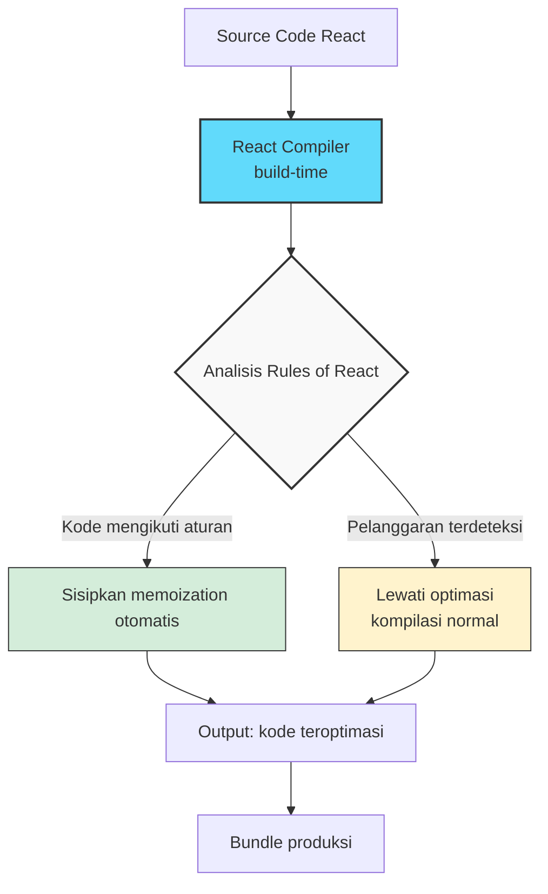

Setiap developer React pernah menghadapi momen yang sama: aplikasi mulai terasa lambat, Anda membuka profiler, dan menemukan bahwa sebuah komponen sederhana me-render ulang ratusan kali tanpa alasan yang jelas. Solusi yang selalu diajarkan? Bungkus dengan `useMemo`, `useCallback`, dan `React.memo`. Tapi di dunia nyata, memoization manual ini seperti menambal ban sambil mengemudi — berisiko, melelahkan, dan sering tidak menyelesaikan akar masalah.

React Compiler, yang stabil sejak akhir 2024 bersamaan dengan rilis React 19, menjanjikan untuk menghapus beban ini sepenuhnya. Bukan lagi eksperimen riset — compiler ini sudah menjalankan instagram.com di produksi di Meta, dan kini tersedia untuk semua orang. Pertanyaannya: apakah ini benar-benar mengubah cara kita menulis React, atau sekadar optimasi inkremental yang bisa diabaikan?

## Masalah dengan Memoization Manual

Sebelum membahas solusi, mari kita pahami masalahnya secara konkret. Dalam model React saat ini, ketika state sebuah komponen berubah, React me-render ulang komponen tersebut beserta semua child-nya — kecuali Anda secara eksplisit mengoptimasinya.

Tim React menjelaskan dalam dokumentasi resmi bahwa memoization manual memiliki tiga kelemahan fundamental: membosankan, mudah salah, dan menambah kode yang perlu dirawat (React Docs, "React Compiler Introduction"). Bayangkan sebuah komponen seperti ini:

```jsx
function FriendList({ friends }) {
  const onlineCount = useFriendOnlineCount();
  
  return (
    <div>
      <span>{onlineCount} online</span>
      {friends.map(friend => (
        <FriendListCard key={friend.id} friend={friend} />
      ))}
      <MessageButton />
    </div>
  );
}
```

Setiap kali `onlineCount` berubah, seluruh tree ini me-render ulang — termasuk setiap `<FriendListCard>` dan `<MessageButton>`, meskipun tidak ada hubungannya dengan jumlah teman online. Solusi tradisional adalah membungkus `FriendListCard` dengan `React.memo` dan memastikan semua props-nya stabil dengan `useMemo`. Tapi di komponen yang lebih kompleks, rantai dependensi ini menjadi sangat sulit dilacak.

Yang lebih menjengkelkan, memoization manual sering memiliki bug yang tidak terlihat. Tim React menunjukkan contoh di mana `useCallback` digunakan dengan benar, tapi arrow function inline `() => handleClick(item)` tetap membuat function baru setiap render, membatalkan memoization sepenuhnya. Bug seperti ini hampir mustahil dideteksi tanpa profiling mendalam.

Ironisnya, kebutuhan untuk memoization muncul justru karena kekuatan terbesar React: model mentalnya yang sederhana. UI adalah fungsi dari state — `f(state) = UI`. Ketika state berubah, React me-render ulang. Tidak ada manual DOM manipulation, tidak ada observability yang perlu disetel. Tapi sederhana bukan berarti gratis: render ulang yang berlebihan menggerus performa, dan itulah mengapa `useMemo` dan kawan-kawan diperkenalkan. Mereka adalah kompromi — bukan bagian inti dari model React, melainkan escape hatch yang kita terima sebagai normal.

## Bagaimana React Compiler Bekerja

React Compiler adalah tool build-time (berjalan saat kompilasi, bukan runtime) yang menganalisis kode React Anda dan secara otomatis menyisipkan optimasi memoization yang setara dengan `useMemo`, `useCallback`, dan `React.memo` — tetapi dengan presisi yang mustahil dicapai secara manual.

Yang menarik adalah caranya memahami kode. Compiler ini memodelkan dua hal sekaligus: aturan JavaScript (semantik bahasa) dan "Rules of React" (aturan kerangka kerja). Menurut postingan React Labs Februari 2024, React components harus idempotent — mengembalikan nilai yang sama untuk input yang sama — dan tidak boleh memutasi props atau state. Aturan-aturan ini menciptakan "ruang aman" yang memungkinkan compiler melakukan optimasi tanpa mengubah perilaku program (React Labs, "What We've Been Working On", Februari 2024).

Compiler mendeteksi ketika kode tidak mengikuti Rules of React secara ketat dan akan mengambil salah satu dua jalan: mengoptimasi bagian yang aman, atau melewati kompilasi untuk bagian yang tidak aman. Pendekatan pragmatis ini berarti Anda tidak perlu memperbaiki seluruh codebase sebelum mengadopsi compiler.



Hasilnya: kode yang sama, tetapi dengan performa yang lebih baik. Sebelum compiler, Anda menulis:

```jsx
const ExpensiveComponent = memo(function({ data, onClick }) {
  const processedData = useMemo(() => expensiveProcessing(data), [data]);
  const handleClick = useCallback((item) => {
    onClick(item.id);
  }, [onClick]);
  // ...
});
```

Dengan compiler, Anda menulis:

```jsx
function ExpensiveComponent({ data, onClick }) {
  const processedData = expensiveProcessing(data);
  const handleClick = (item) => {
    onClick(item.id);
  };
  // ...
}
```

Compiler menangani sisanya. Kode lebih bersih, lebih mudah dibaca, dan lebih mudah di-refactor karena tidak ada dependency array yang perlu dirawat.

## Dari Eksperimen ke Produksi

Perjalanan React Compiler cukup panjang. Diumumkan pertama kali sebagai proyek riset, compiler ini diuji pada satu halaman instagram.com pada akhir 2023. Hasilnya cukup meyakinkan sehingga Meta menggulirkannya ke seluruh instagram.com di produksi. Tim React menyebut ini sebagai tonggak penting — bukan lagi prototype, tapi tool yang menjalankan salah satu aplikasi web terbesar di dunia (React Labs, Februari 2024).

Yang membuat ini menarik adalah skala instagram.com. Codebase Meta dikenal sangat besar dan bervariasi, dengan jutaan baris kode yang dikembangkan oleh ribuan engineer selama bertahun-tahun. Jika compiler bisa bekerja di lingkungan sekompleks itu, kemungkinan besar ia akan bekerja di codebase Anda juga. Tim React secara eksplisit menyebut bahwa mereka menguji compiler terhadap codebase Meta yang "besar dan bervariasi" untuk memvalidasi pendekatannya.

Pada Desember 2024, React 19 dirilis sebagai versi stabil dengan compiler sebagai komponen opsional. Selain compiler, React 19 membawa fitur-fitur penting lainnya. **Actions** menyederhanakan penanganan async mutations — alih-alih manually mengelola pending state, error handling, dan optimistic updates, Anda cukup mengoper fungsi async ke prop `action` pada elemen `<form>`. Hook baru seperti `useActionState` dan `useOptimistic` memberikan abstraksi yang lebih bersih untuk pola-pola yang sebelumnya membutuhkan banyak boilerplate. React 19 juga menstabilkan Server Components, yang mengubah arsitektur frontend dengan memungkinkan komponen yang hanya berjalan di server (React v19 Blog, Desember 2024).

Versi terbaru saat artikel ini ditulis adalah 19.2.7, dirilis 1 Juni 2026 (Wikipedia, "React (software)"). Survey Stack Overflow 2025 menempatkan React sebagai salah satu teknologi web yang paling banyak digunakan, mengonfirmasi posisinya yang masih dominan setelah lebih dari satu dekade.

## Pergeseran Tata Kelola: Yayasan React

Ada juga perubahan tata kelola yang signifikan. Pada Oktober 2025, Meta mengumumkan akan mendonasikan React, React Native, dan JSX ke sebuah yayasan baru di bawah Linux Foundation. Yayasan React resmi diluncurkan pada 24 Februari 2026.

Ini bukan sekadar formalitas administratif. Selama bertahun-tahun, kritik terhadap React selalu menyentuh satu titik: sebuah teknologi yang digunakan oleh jutaan developer di seluruh dunia dikendalikan oleh satu perusahaan. Donasi ke Linux Foundation mengubah dinamika ini. Pengambilan keputusan kini melibatkan komunitas yang lebih luas, dan keberlanjutan React tidak lagi terikat pada nasib bisnis satu entitas. Untuk tim engineering yang mempertimbangkan adopsi jangka panjang, ini memberikan keyakinan struktural yang sebelumnya tidak ada.

## Adopsi Bertahap: Bukan Semua atau Tidak Sama Sekali

Salah satu pertanyaan praktis yang muncul: bagaimana mengadopsi compiler di codebase yang sudah besar? Tim React merancangnya untuk adopsi bertahap. Anda bisa mengaktifkannya hanya untuk direktori tertentu, meninggalkan bagian lain tetap tanpa kompilasi. Strategi ini sangat bergantung pada seberapa sehat codebase Anda — seberapa baik mengikuti Rules of React.

Compiler mendukung berbagai build tools: Babel, Vite, Metro (React Native), dan Rsbuild. Integrasi dilakukan melalui plugin Babel yang membungkus core compiler. Tim React juga menyediakan ESLint plugin untuk membantu mendeteksi pola yang mungkin melanggar Rules of React, sehingga Anda bisa membersihkan kode sebelum mengaktifkan compiler.

Yang praktis untuk diketahui: compiler fokus pada dua optimasi utama. Pertama, mencegah cascading re-render — situasi di mana satu perubahan state memicu re-render seluruh subtree padahal hanya satu komponen yang relevan. Kedua, memoizing perhitungan yang mahal di dalam komponen dan hooks. Yang tidak dilakukan compiler: mengoptimasi fungsi-fungsi di luar komponen React. Jadi jika Anda punya fungsi utility yang memproses array besar dan dipanggil dari banyak komponen, compiler tidak akan sharing hasilnya antar komponen. Untuk kasus seperti itu, Anda masih perlu memoization manual di level fungsi itu sendiri.

```mermaid
flowchart LR
    subgraph Fase 1
        A[Aktifkan ESLint\nRules of React] --> B[Perbaiki warning]
    end
    subgraph Fase 2
        B --> C[Aktifkan compiler\ndi direktori kecil]
        C --> D[Monitor error log]
    end
    subgraph Fase 3
        D --> E[Luaskan cakupan\nsecara bertahap]
        E --> F[Compiler aktif\nuntuk seluruh app]
    end
    
    Fase 1 --> Fase 2 --> Fase 3
    
    style A fill:#fff3cd,stroke:#333
    style C fill:#d4edda,stroke:#333
    style F fill:#d4edda,stroke:#333,stroke-width:2px
```

Saran praktis dari dokumentasi: mulai dari komponen yang paling sederhana dan paling murni (tanpa side effects, tanpa mutasi state langsung). Jangan terburu-buru mengaktifkannya di komponen yang sudah tua dan kompleks — biarkan compiler bekerja di area yang bersih dulu, lalu perluas.

## Tentang Keamanan: Catatan Penting

Sebagai catatan tambahan yang relevan untuk tim engineering, akhir 2025 menunjukkan bahwa ekosistem React menghadapi tantangan keamanan yang serius. CVE-2025-55182, dijuluki "React2Shell", adalah kerentanan remote code execution dengan skor CVSS maksimum 10.0 yang ditemukan pada November 2025. Tim React merilis patch di versi 19.0.1, 19.1.2, dan 19.2.1. Selain itu, kerentanan tambahan pada React Server Components dilaporkan pada Desember 2025: denial-of-service (CVE-2025-55184 dan CVE-2025-67779) serta source code exposure (CVE-2025-55183) (Wikipedia, "React (software)").

Ini adalah pengingat bahwa upgrade ke versi terbaru bukan hanya soal fitur baru, tapi juga patch keamanan kritis. Jika tim Anda masih di React 18 atau versi awal React 19, mempertimbangkan upgrade adalah keputusan engineering yang penting.

## Refleksi Praktis

Sebagai developer yang sehari-hari bekerja dengan React, saya melihat React Compiler sebagai lebih dari sekadar tool optimasi. Ini adalah pergeseran filosofis: React berkata, "Anda fokus pada logika bisnis, kami urus performanya." Dependency array yang selama ini menjadi sumber bug halus dan frustrasi tidak lagi menjadi beban mental.

Tapi compiler bukan tongkat sihir. Ia bekerja optimal ketika kode Anda sudah mengikuti prinsip-prinsip dasar React — komponen murni, tidak ada mutasi langsung, tidak ada side effect di render. Jika codebase Anda penuh dengan "React anti-pattern", compiler mungkin melewati banyak bagian tanpa mengoptimasinya. Artinya, adopsi compiler juga merupakan kesempatan untuk audit kualitas kode.

Dari sudut pandang tim, ada implikasi yang menarik. Junior developer yang baru bergabung tidak perlu lagi memikirkan "haruskah saya pakai useMemo di sini?" — mereka bisa fokus pada menulis komponen yang benar secara fungsional, dan compiler yang akan menentukan apa yang perlu dioptimasi. Ini menyederhanakan code review: alih-alih berdebar tentang dependency array yang benar, reviewer bisa fokus pada logika bisnis dan arsitektur.

Bagi tim engineering, saya menyarankan pendekatan tiga fase: pertama, jalankan ESLint dengan Rules of React di seluruh codebase dan perbaiki warning. Kedua, aktifkan compiler di modul yang paling bersih dan ukur peningkatannya. Ketiga, perluas secara bertahap sambil memantau production error logs. Jangan terburu-buru — tapi jangan juga menunda selamanya. Tim React sendiri mengatakan bahwa di masa depan, beberapa fitur React mungkin memerlukan compiler untuk bekerja penuh. React telah berubah, dan kita perlu berubah bersamanya.

## Referensi

1. React Team. "React Compiler Introduction." *React Documentation*. https://react.dev/learn/react-compiler
2. Savona, J., Hanlon, R., Clark, A., Carroll, M., & Abramov, D. "React Labs: What We've Been Working On – February 2024." *React Blog*, 15 Februari 2024. https://react.dev/blog/2024/02/15/react-labs-what-we-have-been-working-on-february-2024
3. React Team. "React v19." *React Blog*, 5 Desember 2024. https://react.dev/blog/2024/12/05/react-19
4. "React (software)." *Wikipedia*. https://en.wikipedia.org/wiki/React_(software)
5. React Compiler Working Group. *GitHub Discussions*. https://github.com/reactwg/react-compiler
6. Stack Overflow Developer Survey 2025. *Stack Overflow*. https://survey.stackoverflow.co/2025/