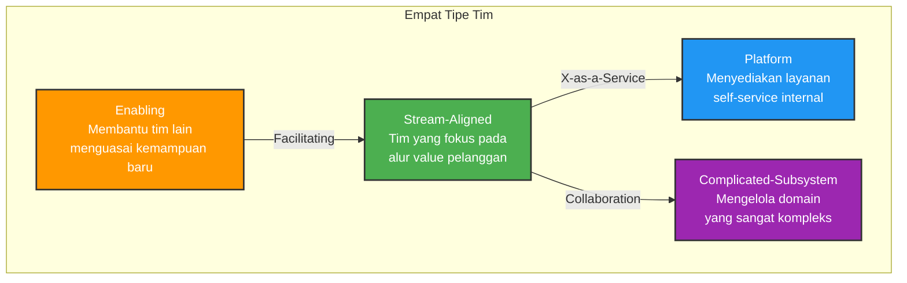

Sebagai engineering manager, salah satu kesalahan paling umum yang pernah saya lihat — dan pernah saya lakukan sendiri — adalah menganggap bahwa masalah teknis selalu butuh solusi teknis. Build lambat? Tambah CI pipeline. Bug banyak? Tambah testing. Tim tidak produktif? Rekrut orang baru. Tetapi sering kali, akar masalahnya bukan teknis sama sekali. Akar masalahnya adalah cara kita mengatur tim.

Pada tahun 1967, seorang programmer bernama Melvin Conway menulis sebuah kalimat yang kelak menjadi terkenal: *"Organizations which design systems are constrained to produce designs which are copies of the communication structures of these organizations."* Kalimat ini, yang kemudian dikenal sebagai Conway's Law, menyatakan bahwa arsitektur software akan selalu mencerminkan struktur komunikasi tim yang membangunnya. Jika organisasi Anda terbagi dalam silo yang ketat, software yang dihasilkan akan terfragmentasi. Jika lima tim harus berkoordinasi untuk men-deploy satu fitur, arsitektur Anda akan menjadi monolitik yang kaku, terlepas dari seberapa modern tech stack yang dipilih.

Penelitian dari MIT dan Harvard Business School, yang dipimpin oleh Alan MacCormack dkk., memberikan bukti empiris untuk konsep ini. Mereka menemukan *"strong evidence to support the mirroring hypothesis"* — produk yang dibangun oleh organisasi dengan kopling longgar (loosely-coupled) secara signifikan lebih modular daripada produk dari organisasi dengan kopling ketat (tightly-coupled). Dengan kata lain, Anda tidak bisa mengharapkan arsitektur microservice yang elegan jika struktur tim Anda masih beroperasi seperti monolit.

## Brooks's Law dan Biaya Komunikasi yang Terlupakan

Fred Brooks, dalam bukunya *The Mythical Man-Month* (1975), merumuskan hukum yang terkenal: *"Adding manpower to a late software project makes it later."* Banyak orang ingat kalimat ini, tetapi sering melewatkan mengapa.

Brooks menjelaskan dua faktor utama. Pertama, setiap orang baru butuh waktu ramp-up — mereka harus belajar codebase, memahami keputusan arsitektur yang sudah dibuat, dan menyesuaikan diri dengan dinamika tim. Proses ini menarik perhatian engineer yang sudah produktif, mengurangi kontribusi mereka sementara orang baru belum berkontribusi secara bermakna.

Kedua, dan ini lebih fundamental, biaya komunikasi meningkat secara kombinatorial. Jumlah channel komunikasi dalam tim berukuran *n* adalah n(n-1)/2. Tim 5 orang punya 10 channel. Tim 10 orang punya 45. Tim 20 orang punya 190. Pada titik tertama, sebagian besar waktu tim habis untuk sinkronisasi, bukan untuk menulis kode.

Jeff Bezos memahami ini ketika menerapkan "Two-Pizza Rule" di Amazon — tim harus cukup kecil untuk bisa dimakan dengan dua pizza. Konsep ini bukan tentang pelit; ini tentang menjaga kecepatan dan otonomi. Tim kecil yang punya konteks lengkap bisa membuat keputusan dalam hitungan menit. Tim besar butuh rapat untuk menjadwalkan rapat lain.

Batas ukuran tim ini juga didukung oleh riset antropolog Robin Dunbar dari University of Oxford. Dunbar menemukan korelasi antara ukuran neocortex primata dan ukuran kelompok sosial yang bisa mereka pertahankan. Untuk manusia, angka yang diperkirakan adalah sekitar 150 — yang dikenal sebagai Dunbar's Number. Namun yang lebih relevan untuk tim engineering adalah lingkaran yang lebih kecil dalam model Dunbar: sekitar 15 orang untuk hubungan dekat, dan sekitar 5 untuk lingkaran paling intim. Dalam praktik engineering, ukuran tim ideal biasanya berkisar antara 5-8 orang — cukup besar untuk memiliki keahlian yang beragam, cukup kecil untuk tetap lincah. Penelitian QSM (Quantitative Software Management) terhadap lebih dari 4.000 proyek software menunjukkan bahwa tim kecil secara konsisten menghasilkan produktivitas per orang yang lebih tinggi dibanding tim besar, dengan kualitas yang setara atau lebih baik.

## Cognitive Load: Mengapa Otak Engineer Bukan Sumber Daya Tak Terbatas

Tim Topologies, sebuah framework yang diperkenalkan Matthew Skelton dan Manuel Pais pada 2019, membawa konsep dari psikologi kognitif ke dunia engineering management: **cognitive load**. Teori ini awalnya dikembangkan oleh John Sweller di akhir 1980-an untuk instructional design, tetapi Skelton dan Pais mengaplikasikannya ke cara kita menyusun tim software.

Cognitive load theory membedakan tiga jenis beban kognitif. *Intrinsic cognitive load* adalah kompleksitas inheren dari domain yang sedang dikerjakan. *Germane cognitive load* adalah usaha untuk membangun pemahaman dan schema mental yang permanen. *Extraneous cognitive load* adalah beban yang tidak menambah nilai — caused by cara informasi atau tugas disajikan.

Dalam konteks engineering, extraneous load ini muncul ketika developer harus memahami infrastruktur yang tidak relevan dengan fitur yang sedang dibangun, ketika harus mengikuti proses deployment yang manual dan rumit, atau ketika harus berkomunikasi dengan empat tim berbeda untuk mengubah satu endpoint API.

Skelton dan Pais berargumen bahwa setiap tim engineering punya kapasitas cognitive load yang terbatas. Jika tim harus memahami terlalu banyak domain — frontend, backend, database, DevOps, security, infrastructure — mereka tidak akan bisa mendalami satupun. Hasilnya: pekerjaan yang dangkal, bug yang berulang, dan kecepatan delivery yang menurun.

## Empat Tipe Tim dan Tiga Mode Interaksi

Inti dari Team Topologies adalah penggolongan tim ke dalam empat tipe fundamental:

**Stream-aligned team** adalah tulang punggung organisasi — tim yang punya tanggung jawab end-to-end untuk satu alur nilai pelanggan (misalnya: tim "checkout experience" atau tim "user onboarding"). Mereka seharusnya merupakan mayoritas tim di organisasi Anda.

**Platform team** menyediakan layanan internal self-service yang mengurangi cognitive load tim stream-aligned. Alih-alih setiap tim harus setup CI/CD, database, dan monitoring sendiri, platform team menyediakan "golden path" — jalur default yang sudah teruji dan terdokumentasi.

**Enabling team** bertugas membantu tim lain menguasai kemampuan baru — misalnya, tim yang spesialis dalam AI/ML yang membantu product team mengintegrasikan model machine learning, atau tim security yang membantu tim lain mengadopsi praktik secure coding. Interaksi mereka bersifat sementara: datang, transfer pengetahuan, lalu pergi.

**Complicated-subsystem team** menangani domain yang sangat kompleks dan specialized — seperti engine recommendation, sistem fraud detection, atau video transcoding — di mana dibutuhkan keahlian mendalam yang tidak realistis untuk dimiliki oleh stream-aligned team.

Tiga mode interaksi antar tim juga didefinisikan dengan presisi: **Collaboration** (kerja sama intensif untuk eksplorasi), **X-as-a-Service** (mengonsumsi layanan tim lain sebagai produk), dan **Facilitating** (membantu tim lain belajar). Yang krusial: interaksi Collaboration seharusnya bersifat sementara. Begitu solusi ditemukan, tim harus transisi ke mode X-as-a-Service untuk mengurangi kopling.

## Platform Engineering: Bukan Buzzword, tapi Reduksi Beban

Gartner, dalam riset mereka, memprediksi bahwa 80% organisasi engineering besar akan memiliki tim platform engineering pada 2026. Ini bukan kebetulan. Platform engineering berkembang justru karena masalah cognitive load yang diidentifikasi oleh Team Topologies.

Definisi Wikipedia untuk platform engineering cukup tepat: *"a software engineering discipline focused on the development of self-service toolchains, services, and processes to create an internal developer platform (IDP)."* Tujuannya jelas — mengurangi cognitive load developer dengan menyatukan multiple tools dan technologies ke dalam satu self-service experience.

Yang penting dipahami: platform engineering bukan tentang membangun portal web yang cantik. Ini tentang memperlakukan internal platform sebagai produk. Tim platform harus berpikir seperti product team — memahami "customer" (developer lain), menerima feedback, melakukan iterasi, dan menjaga dokumentasi. Jika tim platform membangun tools yang tidak digunakan karena tidak sesuai kebutuhan, itu bukan platform engineering — itu hanya overhead.

Di PlatformCon 2024, konferensi terbesar untuk komunitas platform engineering, sebuah panel ahli menyimpulkan bahwa membangun internal developer platform memberikan dampak yang melampaui sekadar produktivitas developer. Platform engineering menormalisasi dan menstandardisasi workflow developer dengan menyediakan "golden paths" — jalur yang sudah dioptimalkan untuk sebagian besar workload, dengan fleksibilitas untuk mendefinisikan pengecualian ketika dibutuhkan. Manfaat yang sering dilaporkan meliputi: time to market yang lebih cepat, risiko security dan compliance yang berkurang, dan developer experience yang lebih baik.

## Inverse Conway Maneuver: Desain Organisasi Sebelum Arsitektur

Salah satu ide paling praktis dari literatur ini adalah "inverse Conway maneuver." Alih-alih mendesain arsitektur software lalu membentuk tim untuk membangunnya, kita melakukan kebalikannya: mendesain struktur tim untuk mendapat arsitektur yang kita inginkan.

Coplien dan Harrison, dalam buku *Organizational Patterns of Agile Software Development* (2004), menulis dengan tegas: *"If the parts of an organization do not closely reflect the essential parts of the product, or if the relationships between organizations do not reflect the relationships between product parts, then the project will be in trouble."*

Implikasi praktisnya besar. Jika Anda ingin arsitektur yang modular dengan boundary yang jelas, pastikan tim Anda juga memiliki boundary yang jelas. Jika Anda ingin dua service tidak saling bergantung, pastikan dua tim yang membangunnya tidak perlu berkoordinasi setiap hari. Struktur komunikasi yang Anda rancang — siapa rapat dengan siapa, siapa melapor kepada siapa, bagaimana dependency diselesaikan — akan langsung membentuk software yang dihasilkan.

## Apa Ini Berarti dalam Praktik

Sebagai engineering manager, saya merasa framework ini memberikan bahasa yang berguna untuk berpikir tentang keputusan organisasi. Beberapa pertanyaan konkret yang muncul:

Apakah setiap tim di organisasi saya bisa menjelaskan alur nilai pelanggan yang mereka layani? Jika tidak, mungkin mereka bukan stream-aligned team yang sejati — mungkin mereka adalah tim komponen yang hanya membangun piece yang tidak punya makna sendiri.

Berapa banyak domain yang harus dipahami setiap tim? Jika satu tim harus mengelola frontend, API, database migration, CI/CD, dan security scanning, mereka kemungkinan mengalami cognitive overload. Pertimbangkan apakah beberapa tanggung jawab ini bisa diserap oleh platform team.

Apakah ada tim yang selalu menjadi bottleneck? Ini sering tanda bahwa tim tersebut adalah complicated-subsystem team yang belum diakui sebagai demikian, atau platform team yang kewalahan karena setiap tim butuh sesuatu yang berbeda.

Apakah interaksi antar tim sudah tepat? Banyak organisasi terjebak dalam mode Collaboration yang permanen — rapat koordinasi yang tidak pernah berakhir. Pertanyaan kuncinya: apakah interaksi ini eksploratif (maka Collaboration masuk akal) atau transaksional (maka seharusnya X-as-a-Service)?

Satu indikator yang sering saya gunakan: lihat seberapa sering engineer dari tim yang berbeda harus berkomunikasi untuk menyelesaikan satu task. Jika jawabannya "setiap hari, beberapa kali", itu sinyal bahwa boundary antar tim tidak sehat. Entah timnya terlalu kecil sehingga harus selalu minta bantuan, atau arsitektur softwarenya tidak punya separation of concerns yang jelas. Dalam kedua kasus, solusinya bukan menambah rapat — solusinya adalah merestrukturisasi tim atau codebase agar dependency berkurang.

Tim engineering yang efektif bukan sekadar kumpulan individu cerdas. Tim yang efektif adalah yang strukturnya dirancang dengan sadar — meminimalkan cognitive load, memaksimalkan otonomi, dan memastikan bahwa cara tim berkomunikasi menghasilkan arsitektur software yang sehat. Ini bukan teori akademis. Ini adalah keputusan harian tentang siapa bekerja pada apa, bagaimana tim dibentuk, dan interaksi apa yang kita dorong atau hilangkan.

## Referensi

1. Conway, M. (1968). "How Do Committees Invent?" — artikel asli yang memperkenalkan Conway's Law. Tersedia di: https://www.melconway.com/Home/Committees.pdf
2. Brooks, F. (1975). *The Mythical Man-Month: Essays on Software Engineering*. Addison-Wesley. Buku klasik yang memperkenalkan Brooks's Law.
3. Skelton, M. & Pais, M. (2019). *Team Topologies: Organizing Business and Technology Teams for Fast Flow*. IT Revolution. Website resmi: https://teamtopologies.com/key-concepts
4. Sweller, J. (1988). "Cognitive Load During Problem Solving: Effects on Learning." *Cognitive Science*, 12, 257-285. Dasar teori cognitive load.
5. MacCormack, A., Rusnak, J., & Baldwin, C. Y. (2006). "Exploring the Structure of Complex Software Designs: An Experimental Study of the Relationship Between Design Modularity and Design Effort." MIT Sloan School of Management dan Harvard Business School.
6. Coplien, J. O. & Harrison, N. B. (2004). *Organizational Patterns of Agile Software Development*. Prentice Hall.
7. Dunbar, R. I. M. (1992). "Neocortex size as a constraint on group size in primates." *Journal of Human Evolution*, 22(6), 469-493.
8. Wikipedia. "Platform engineering." https://en.wikipedia.org/wiki/Platform_engineering — diakses Juli 2026.

