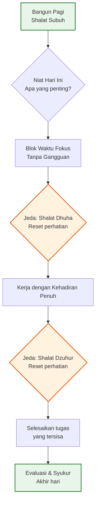

Ada fenomena yang sudah lama saya perhatikan tapi sulit saya jelaskan secara logis. Beberapa hari, saya mulai kerja jam 7 pagi, terus menyala sampai malam, tapi akhir hari rasanya tidak ada apa-apa yang selesai. Catatan todo malah bertambah. Hari lain, saya bangun lebih pagi, shalat Subuh berjamaah, baca Quran sebentar, lalu mulai fokus — dan sebelum jam 11 siang, pekerjaan yang dirasa berat sudah beres. Jam yang lebih sedikit, hasil yang lebih banyak.

Kalau saya cari istilahnya dalam tradisi Islam, fenomena ini paling dekat dengan konsep **barakah**.

## Barakah: Bukan Magic, Tapi Cara Kerja yang Berbeda

Barakah sering diterjemahkan sebagai "berkah," tapi terjemahan itu terlalu tipis untuk menangkap substansinya. Dalam tradisi Islam, barakah adalah keberkahan yang mengalir dari Allah — semacam kualitas yang membuat sesuatu yang terbatas menjadi cukup, bahkan berlebih. Air sedikit menjadi cukup untuk banyak orang. Waktu sedikit menjadi cukup untuk banyak pekerjaan. Uang sedikit menjadi cukup untuk banyak kebutuhan.

Ensiklopedi Islam dan karya akademis seperti yang ditulis Annemarie Schimmel dalam *Deciphering the Signs of God* (1994) menjelaskan barakah sebagai "kekuatan berkah" yang berkelanjutan — bukan sekadar kebetulan baik, tapi sebuah realitas spiritual yang mengalir melalui ketaatan dan kedekatan dengan Allah. Konsep ini juga dipakai oleh komunitas Kristen Arab, terutama Koptik di Mesir, untuk menggambarkan kekuatan suci yang memancar dari tempat dan orang-orang yang diberkati.

Yang menarik, barakah bukan konsep pasif. Ada sebab-sebab yang secara tradisional dikaitkan dengan turunnya barakah: membaca Al-Quran, shalat tepat waktu, makan halal, bersyukur, bangun pagi, dan menjaga silaturahmi. Ini bukan rumus mekanis — tidak ada jaminan "lakukan A, B, C, lalu barakah otomatis turun." Tapi para ulama konsisten menyebutkan pola-pola ini sebagai "pintu" yang dilalui barakah.

## Hadis Pagi: "Berkah Ada di Pagi Hari"

Salah satu hadis yang paling sering dikutip soal barakah dalam waktu adalah sabda Nabi Muhammad ﷺ:

> "Ya Allah, berkahilah umatku pada waktu paginya." *(HR. Tirmidzi, Abu Dawud)*

Hadis ini bukan sekadar pernyataan motivasional. Sahabat Nabi seperti Sakhr bin Wadah Al-Ghamidi, seorang pedagang, secara literal mengamalkannya dengan mengirim kapal dagangnya di pagi hari — dan ia menjadi orang kaya. Tentu, konteksnya berbeda dengan kehidupan profesional modern. Tapi prinsipnya tetap: ada kualitas khusus di pagi hari yang, kalau dimanfaatkan, menghasilkan lebih dari yang diharapkan dari sekadar jumlah jamnya.

Hadis lain yang sejalan adalah tentang sahur: Nabi ﷺ bersabda, *"Bersantaplah untuk sahur, karena dalam sahur ada berkah."* (HR. Bukhari). Ini menarik karena sahur adalah makanan yang dimakan saat sebagian besar orang masih tertidur — bukan karena banyaknya, tapi karena waktunya diberkahi.

## Sains tentang Pagi dan Persepsi Waktu

Di sinilah tradisi Islam bertemu dengan penelitian modern dengan cara yang menarik.

Riset tentang **ritme sirkadian** — siklus biologis 24 jam yang mengatur tubuh manusia — menunjukkan bahwa performa kognitif manusia tidak merata sepanjang hari. Pada pagi hari, setelah tidur yang cukup, kortisol berada di puncaknya, kewaspadaan meningkat, dan kapasitas untuk pekerjaan analitis kompleks berada di level tertinggi. Ini bukan opini; ini pola biologis yang terdokumentasi.

Tapi ada hal yang lebih dalam dari sekadar "pagi = produktif." Psikolog Mihaly Csikszentmihalyi dalam penelitiannya yang dipresentasikan pertama kali tahun 1975 dalam *Beyond Boredom and Anxiety* menemukan fenomena yang ia sebut **flow** — kondisi mental di mana seseorang begitu terserap dalam aktivitas sehingga pengalaman subjektif terhadap waktu berubah. Dalam flow, dua jam terasa seperti dua puluh menit. Atau sebaliknya, momen singkat terasa kaya akan detail.

Enam karakteristik flow yang diidentifikasi Csikszentmihalyi dan Nakamura termasuk: konsentrasi intens pada momen sekarang, peleburan kesadaran dengan aksi, hilangnya kesadaran diri yang reflektif, rasa kontrol, **distorsi persepsi waktu**, dan pengalaman yang intrinsik bermanfaat.

Ini bukan barakah dalam pengertian teologis. Tapi fenomenanya tumpang tindih: ketika seseorang bekerja dengan kehadiran penuh, tanpa gangguan, dengan niat yang jelas — waktu terasa berbeda. Lebih lapang. Lebih cukup.

## Mengapa "Sibuk" Membunuh Barakah

Ada perbedaan mendasar antara sibuk dan produktif, dan barakah tampaknya tidak hadir dalam keadaan sibuk yang kacau.

Ketika saya multitasking — menjawab Slack, mengecek email, ikut meeting yang tidak perlu, sambil mencoba nulis kode — tidak ada flow, tidak ada kehadiran penuh. Otak berpindah-pindah konteks setiap beberapa menit, dan penelitian kognitif menunjukkan setiap perpindahan konteks memakan biaya: butuh rata-rata 23 menit untuk kembali fokus penuh setelah gangguan. Jam yang dihabiskan untuk "banyak hal" tidak menghasilkan apa-apa yang substantif.

Shalat, dalam konteks ini, berfungsi sebagai **forced pause** yang justru memulihkan kapasitas kognitif. Lima kali sehari, seorang Muslim berhenti dari pekerjaan, berwudu, lalu berdiri menghadap kiblat selama beberapa menit. Ini bukan sekadar ritual — ini adalah reset perhatian. Riset tentang **mindfulness** yang diperkenalkan dalam kedokteran Barat oleh Herbert Benson tahun 1975 dan dikembangkan Jon Kabat-Zinn menunjukkan bahwa jeda meditatif yang singkat dan teratur dapat menurunkan stres, memperbaiki fokus, dan meningkatkan kesejahteraan keseluruhan.

Dalam tradisi Islam, pause ini sudah ada selama 1400 tahun. Bukan sebagai teknik produktivitas, tapi sebagai ibadah — yang kebetulan juga membawa manfaat kognitif.

## Praktis: Bagaimana Barakah Bekerja dalam Keseharian

Saya tidak mau terdengar seperti sedang menjual formula "bangun jam 4 pagi lalu sukses." Realitanya lebih bernuansa dari itu. Tapi ada beberapa praktik yang konsisten disebutkan baik dalam tradisi Islam maupun penelitian modern:

**1. Niat sebagai kompas, bukan slogan**

Dalam Islam, niat menentukan nilai setiap amal. Niat yang jelas — bukan sekadar "mau produktif" tapi spesifik tentang apa yang ingin dicapai dan untuk siapa — bekerja seperti filter yang memotong hal-hal yang tidak penting. Penelitian tentang *goal-setting* (Edwin Locke dan Gary Latham, sejak 1990-an) menunjukkan bahwa tujuan yang spesifik dan menantang menghasilkan performa lebih tinggi daripada tujuan yang kabur. Niat dalam Islam, kalau dijalankan dengan serius, bekerja dengan cara yang sama.

**2. Konsistensi di atas intensitas**

Aisyah RA meriwayatkan bahwa amalan yang paling dicintai Nabi ﷺ adalah "amalan yang dilakukan secara konsisten, walau sedikit." (HR. Bukhari). Ini bukan nasihat spiritual belaka — ini prinsip yang sangat modern. James Clear dalam *Atomic Habits* (2018) membangun seluruh bukunya dari ide yang sama: perubahan kecil yang konsisten mengalahkan ledakan motivasi yang berlangsung tiga hari.

**3. Pagi sebagai modal utama**

Bukan harus jam 4. Tapi memulai hari dengan sesuatu yang bermakna — shalat Subuh, membaca sedikit Quran, lalu langsung ke tugas paling penting sebelum dunia "berisik" — menciptakan momentum yang berbeda. Csikszentmihalyi menemukan bahwa flow lebih mudah dicapai ketika kita mulai dengan perhatian yang belum terkuras.

**4. Jeda sebagai investasi, bukan kerugian**

Salah satu kebiasaan yang saya pelajari adalah berhenti sejenak sebelum shalat Dhuha — shalat sunnah yang dilakukan setelah matahari naik, kira-kira jam 9 pagi. Menurut riwayat dari Abu Dzar, Nabi ﷺ bersabda bahwa dua rakaat Dhuha sudah cukup sebagai sedekah untuk seluruh persendian tubuh. Secara praktis, ini adalah checkpoint: setelah 2-3 jam fokus, berdiri sebentar, reset pikiran, lalu kembali. Bukan membuang waktu — justru melindungi waktu yang tersisa dari kelelahan kognitif.

## Yang Saya Pelajari: Barakah adalah Soal Kehadiran

Setelah merenungkan ini beberapa lama, saya sampai pada satu kesimpulan yang mungkin terlalu sederhana tapi ternyata dalam: **barakah hadir ketika kita hadir.**

Bukan kebetulan bahwa praktik-praktik Islam yang terkait dengan barakah — shalat tepat waktu, tadabbur Quran, berdzikir, bersyukur — semuanya bermuara pada satu hal: membawa kita kembali ke momen sekarang. Dan secara paradoks, penelitian psikologi modern tentang flow, mindfulness, dan time perception semua menunjuk ke arah yang sama: manusia paling produktif, paling kreatif, dan paling merasa "cukup waktu" ketika mereka sepenuhnya hadir di apa yang sedang dilakukan.

Mungkin itulah mengapa Nabi ﷺ mengajarkan doa: *"Ya Allah, berkahilah umatku pada waktu paginya."* Bukan karena pagi ajaib. Tapi karena pagi adalah ketika kita punya kesempatan terbaik untuk memulai dengan kehadiran — sebelum gangguan menumpuk, sebelum perhatian terfragmentasi, sebelum kita kehilangan kesadaran akan apa yang sedang kita lakukan.

Dan sebagai seorang ayah dan profesional yang sering merasa waktu tidak pernah cukup, ini adalah pengingat yang saya butuhkan setiap hari. Bukan lebih banyak jam. Tapi lebih banyak kehadiran di jam yang sudah ada.

## Referensi

1. Schimmel, Annemarie (1994). *Deciphering the Signs of God: A Phenomenological Approach to Islam*. State University of New York Press. — Tentang konsep barakah dalam tradisi Islam. [Wikipedia: Barakah](https://en.wikipedia.org/wiki/Barakah)
2. Csikszentmihalyi, Mihaly (1975/1990). *Beyond Boredom and Anxiety* / *Flow: The Psychology of Optimal Experience*. Harper & Row. — Konsep flow dan distorsi persepsi waktu. [Wikipedia: Flow (psychology)](https://en.wikipedia.org/wiki/Flow_(psychology))
3. Hadis Tirmidzi dan Abu Dawud: "Allahumma barik li ummati fi bukuriha" (Ya Allah, berkatilah umatku di pagi hari). [Wikipedia: Duha](https://en.wikipedia.org/wiki/Duha)
4. Hadis Bukhari: "Bersantaplah untuk sahur, karena dalam sahur ada berkah." [Wikipedia: Suhur](https://en.wikipedia.org/wiki/Suhur)
5. Benson, Herbert (1975). *The Relaxation Response*. — Pionir riset respons relaksasi dan meditasi dalam kedokteran Barat. [Wikipedia: Mindfulness](https://en.wikipedia.org/wiki/Mindfulness)
6. Clear, James (2018). *Atomic Habits: An Easy & Proven Way to Build Good Habits & Break Bad Ones*. Avery. — Tentang konsistensi kebiasaan kecil. [atomichabits.com](https://jamesclear.com/atomic-habits)
7. Locke, E.A. & Latham, G.P. (2002). "Building a Practically Useful Theory of Goal Setting and Task Motivation." *American Psychologist*, 57(9), 705–717. — Riset tentang goal-setting dan performa.
