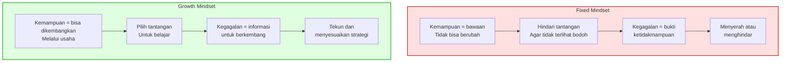

"Wah, pinter banget sih kamu!"

Kalimat itu keluar begitu saja dari mulut saya. Anak saya baru saja menyelesaikan puzzle yang menurut usianya cukup menantang. Saya merasa sudah melakukan hal yang benar—memuji, memberi semangat, menunjukkan bahwa saya bangga. Tapi beberapa tahun yang lalu, saya menemukan riset Carol Dweck, profesor psikologi di Stanford University, yang membuat saya berhenti dan mempertanyakan kebiasaan yang terasa begitu natural ini.

Dweck menemukan bahwa **cara kita memuji anak bisa membentuk cara mereka berpikir tentang kemampuan diri sendiri**—dan tidak semua pujian berdampak positif. Beberapa pujian justru memperkuat ketakutan akan kegagalan dan membuat anak menghindari tantangan.

## Dua Teori tentang Intelijen

Inti penelitian Dweck, yang pertama kali diperkenalkan oleh Ellen Leggett pada 1985 dan dikembangkan lebih lanjut oleh Dweck bersama rekan-rekannya, adalah konsep *implicit theories of intelligence*—kepercayaan mendasar tentang apakah kemampuan bisa berubah atau tidak.

Seseorang dengan **entity theory** (yang Dweck populerkan sebagai *fixed mindset*) meyakini bahwa kecerdasan dan bakat adalah sifat bawaan yang tidak bisa diubah. Jika mereka merasa pintar, mereka akan berusaha menjaga citra tersebut dengan menghindari kesalahan. Jika merasa tidak pintar, mereka cenderung menyerah karena percaya tidak ada gunanya berusaha.

Sebaliknya, seseorang dengan **incremental theory** (*growth mindset*) meyakini bahwa kemampuan bisa dikembangkan melalui usaha, strategi yang tepat, dan ketekunan. Menurut data yang dirangkum dalam literatur psikologi, sekitar 40% populasi condong ke entity theory, 40% ke incremental theory, dan 20% sisanya tidak terlalu cocok dengan kedua kategori tersebut.

Yang menarik dari penelitian Dweck bukan sekadar kategorisasi ini, tapi penemuannya bahwa **mindset bisa diubah**—dan salah satu cara paling kuat untuk mengubahnya adalah melalui cara kita memuji.

## Eksperimen yang Mengubah Cara Kita Melihat Pujian

Dalam studi klasik yang dipublikasikan pada 1998, Claudia Mueller dan Carol Dweck melakukan eksperimen yang elegan. Mereka memberikan serangkaian tes kepada anak-anak usia 10-12 tahun. Setelah anak-anak menyelesaikan tes pertama dengan hasil yang baik, para peneliti membagi mereka ke dalam tiga kelompok dan memberikan pujian yang berbeda:

- **Kelompok 1** dipuji untuk kecerdasan: "Kamu pasti pintar dalam hal ini."
- **Kelompok 2** dipuji untuk usaha: "Kamu pasti bekerja keras dalam hal ini."
- **Kelompok 3** (kelompok kontrol) hanya diberi tahu bahwa mereka berhasil.

Hasilnya mencengangkan. Anak-anak yang dipuji karena kecerdasannya—persis seperti kalimat "pinter banget" yang sering saya ucapkan—menunjukkan pola perilaku yang tidak diharapkan. Ketika diberi kesempatan untuk memilih tugas berikutnya, mayoritas dari mereka **memilih tugas yang mudah** alih-alih tugas yang bisa membuat mereka belajar hal baru. Mereka juga menunjukkan **penurunan performa** pada tes berikutnya dan **menyembunyikan skor buruk** mereka dari orang lain.

Sebaliknya, anak-anak yang dipuji karena usahanya cenderung memilih tugas yang lebih menantang, mempertahankan performa mereka setelah kegagalan, dan justru menikmati tugas yang sulit.

Mengapa? Karena pujian terhadap kecerdasan, meskipun niatnya baik, mengirimkan pesan tersembunyi: *kecerdasan adalah sesuatu yang kamu miliki atau tidak miliki, dan setiap kegagalan akan mempertanyakan apakah kamu benar-benar "pintar."* Anak-anak ini menjadi protektif terhadap label "pintar" yang baru saja diberikan kepada mereka.

## Process Praise: Memuji Proses, Bukan Pribadi

Dari penelitian ini, Dweck mengenalkan konsep **process praise**—pujian yang berfokus pada proses yang menghasilkan keberhasilan, bukan pada atribut pribadi. Process praise mencakup pengakuan terhadap usaha, strategi, fokus, ketekunan, dan kemauan untuk mencoba pendekatan baru.

Ini berbeda dari **person praise** seperti "Kamu pintar" atau "Kamu anak yang hebat" yang menilai siapa anak tersebut, bukan apa yang mereka lakukan. Menurut riset dalam bidang *behavioral reinforcement* yang dirangkum dalam literatur akademis tentang pujian, person praise berisiko membuat motivasi anak bergantung pada validasi eksternal—mereka butuh terus dipuji untuk merasa berharga.

Process praise, di sisi lain, mengarahkan perhatian anak pada hal-hal yang berada dalam kendali mereka: seberapa keras mereka berusaha, strategi apa yang mereka gunakan, bagaimana mereka mengatasi kesulitan. Ini sejalan dengan **Self-Determination Theory** yang dikembangkan Edward Deci dan Richard Ryan, yang menyatakan bahwa motivasi intrinsik—motivasi yang datang dari dalam diri—tumbuh ketika tiga kebutuhan psikologis terpenuhi: otonomi (merasa memiliki kendali), kompetensi (merasa mampu), dan keterhubungan (merasa dihargai).

## Dalam Praktik Sehari-hari

Menerjemahkan riset ini ke dalam keseharian pengasuhan tidak serumit kedengarannya. Berikut beberapa perubahan konkret yang bisa dilakukan:

**Ganti "Kamu pintar!" dengan deskripsi spesifik tentang apa yang mereka lakukan.** Alih-alih memberi label, jelaskan apa yang Anda amati: "Aku lihat kamu mencoba beberapa kali sampai berhasil menyelesaikannya" atau "Strategimu menyusun bagian pinggir dulu ternyata efektif." Ini mengarahkan perhatian anak pada tindakan yang bisa mereka ulang, bukan pada atribut yang terasa di luar kendali.

**Bukan hanya usaha—puji strategi dan pendekatan.** Dweck sendiri mengoreksi kesalahpahaman umum bahwa growth mindset hanya soal "berusaha lebih keras." Dalam sebuah tulisan, dia menegaskan bahwa growth mindset bukan sekadar tentang effort, tapi tentang menilai secara jujur di mana posisi saat ini dan kemudian bekerja sama untuk memperbaikinya. Jadi, ketika anak menghadapi kesulitan, pertanyaan yang lebih bermanfaat bukan "Sudah berusaha keras belum?" tapi "Strategi apa yang sudah dicoba? Apa yang bisa dicoba berbeda?" Ini mengajarkan anak bahwa kemampuan bukan tentang menekan diri lebih keras, tapi tentang menemukan pendekatan yang lebih baik.

**Sambut kesalahan sebagai bagian dari belajar.** Reaksi kita terhadap kegagalan anak sama pentingnya dengan pujian kita terhadap keberhasilan. Jika anak melihat kita merespons kesalahan dengan rasa ingin tahu—"Wah, menarik. Apa yang bisa kita pelajari dari ini?"—mereka menyerap pesan bahwa kegagalan adalah data, bukan vonis. Dalam komunitas engineering, kita mengenal konsep *blameless postmortem*: setiap insiden dianalisis tanpa mencari siapa yang salah, fokusnya pada apa yang bisa diperbaiki. Prinsip yang sama berlaku saat anak jatuh dari sepeda atau mendapat nilai buruk di sekolah.

**Hindari pujian yang membandingkan.** "Kamu lebih pintar dari kakakmu" atau "Kamu satu-satunya yang bisa di kelas" memperkuat fixed mindset karena menyiratkan bahwa kemampuan adalah perbandingan antar individu, bukan perjalanan masing-masing. Bandingkan dengan diri sendiri di masa lalu jauh lebih konstruktif: "Dulu kamu belum bisa naik sepeda tanpa roda bantu, sekarang sudah bisa."

## Kekuatan Kata "Belum"

Salah satu intervensi paling sederhana yang Dweck promosikan adalah menambahkan satu kata: **"belum."** Ketika anak berkata "Aku tidak bisa mengerjakan ini," respons yang membentuk growth mindset adalah "Kamu **belum** bisa mengerjakannya." Kata kecil ini mengubah pernyataan dari vonis permanen menjadi titik dalam proses.

Ini mungkin terdengar remeh, tapi bahasa yang kita gunakan membentuk realitas kognitif anak. Dalam studinya, Dweck dan rekan-rekannya menemukan bahwa anak-anak yang diajari bahwa setiap kali mereka berusaha keras dan belajar sesuatu yang baru, otak mereka membentuk koneksi baru yang seiring waktu membuat mereka lebih pintar—menunjukkan perubahan motivasi yang nyata. Pengetahuan tentang neuroplastisitas, dikemas dengan sederhana, bisa mengubah cara anak memandang kesulitan.

Di banyak keluarga di Indonesia, saya melihat pola yang menarik. Anak yang kesulitan matematika dengan cepat diberi label "emang bukan anak IPA" atau "mirip ayahnya, gaptek." Label-label ini, meskipun maksudnya mungkin santai atau humoris, mengirim sinyal fixed mindset yang kuat: kemampuan adalah warisan, bukan sesuatu yang bisa diupayakan.

## Tapi, Seberapa Kuat Bukti Ini?

Sebagai seseorang yang bekerja di engineering, saya terbiasa bertanya: apakah efek ini terreplication dengan baik? Jujur saja, growth mindset adalah salah satu konsep psikologi yang menghadapi tantangan replikasi yang serius.

Timothy Bates, profesor psikologi di University of Edinburgh, mencoba mereplikasi temuan Dweck selama bertahun-tahun tanpa hasil yang konsisten. Nick Brown, yang ikut mengembangkan uji statistik GRIM, pada 2017 mempertanyakan fragilitas efek ini: *"Jika efek Anda begitu rapuh sehingga hanya bisa direproduksi dalam kondisi yang sangat terkontrol, mengapa Anda berpikir guru sekolah biasa bisa mereproduksinya?"*

Meta-analisis terbesar tentang growth mindset, yang dipublikasikan oleh Macnamara dan rekan-rekannya, menemukan efek yang **jauh lebih kecil** dari yang diklaim literatur populer—terutama untuk siswa dengan performa rata-rata atau di atas rata-rata. Efeknya paling terlihat pada siswa yang berisiko tinggi mengalami kegagalan akademis. Beberapa peneliti juga mencatat bahwa banyak studi growth mindset dilakukan oleh Dweck atau kolaboratornya sendiri, yang menimbulkan pertanyaan tentang independensi temuan.

Dalam konteks parenting, ini memberi kita perspektif yang realistis. Growth mindset bukan solusi tunggal yang akan mengubah anak Anda menjadi juara dunia. Tapi perubahan dalam cara kita memuji—from person praise ke process praise—adalah intervensi berisiko rendah dengan logika yang kuat di belakangnya. Kalaupun efeknya lebih kecil dari klaim populer, tidak ada kerugian dalam menggambarkan apa yang anak lakukan daripada memberi label siapa mereka.

## Yang Saya Bawa Pulang

Sebagai ayah, saya tidak sempurna dalam menerapkan ini. Masih ada kalimat "pinter banget" yang keceplosan, masih ada momen di mana saya terlalu cepat memberi label ketika yang sebenarnya dibutuhkan anak adalah deskripsi sederhana tentang apa yang mereka capai. Kadang di akhir hari yang panjang, yang keluar justru pujian paling otomatis dan generik.

Tapi riset Dweck—dengan semua kelebihan dan keterbatasannya—mengajarkan saya satu hal yang terasa benar: anak-anak tidak membutuhkan kita untuk menilai siapa mereka. Mereka membutuhkan kita untuk **melihat apa yang mereka lakukan, menghargai bagaimana mereka melakukannya, dan membantu mereka menyadari bahwa kemampuan bukan sesuatu yang diberikan, tapi sesuatu yang dibangun.**

Ada perbedaan besar antara anak yang tumbuh dengan keyakinan "Aku ini pintar" versus anak yang tumbuh dengan keyakinan "Aku belajar dengan baik." Yang pertama akan terus berusaha menjaga citra tersebut dan menghindari apapun yang bisa menggoyahkannya. Yang kedua tahu bahwa kemampuan adalah proses, dan setiap kesulitan adalah undangan untuk berkembang.

Pertanyaannya bukan "Pintar atau tidak pintar?" tapi "Sudah mencoba strategi apa, dan mau ke mana selanjutnya?"

## Referensi

1. Dweck, C. S. (2006). *Mindset: The New Psychology of Success*. Random House. — Buku populer yang memperkenalkan konsep fixed dan growth mindset ke khalayak luas.
2. Mueller, C. M., & Dweck, C. S. (1998). "Praise for intelligence can undermine children's motivation and performance." *Journal of Personality and Social Psychology*, 75(1), 33–52. — Studi klasik tentang dampak berbagai jenis pujian terhadap motivasi anak.
3. Leggett, E. L. (1985). "Children's entity and incremental theories of intelligence: Relationships to achievement behavior." — Presentasi perdana konsep implicit theories of intelligence di Eastern Psychological Association, Boston.
4. Deci, E. L., & Ryan, R. M. (1985). *Intrinsic Motivation and Self-Determination in Human Behavior*. — Dasar teori Self-Determination yang menjelaskan kebutuhan otonomi, kompetensi, dan keterhubungan.
5. Wikipedia. "Carol Dweck." — Termasuk bagian kritik tentang tantangan replikasi oleh Timothy Bates dan Nick Brown. Tersedia di: https://en.wikipedia.org/wiki/Carol_Dweck
6. Wikipedia. "Implicit theories of intelligence." — Ringkasan entity vs incremental theory dan data distribusi populasi (~40%/40%/20%). Tersedia di: https://en.wikipedia.org/wiki/Implicit_theories_of_intelligence
7. Dweck, C. S. (2007). "The perils and promises of praise." *Educational Leadership*, 65(2), 34–39. — Artikel Dweck yang menekankan pentingnya process praise dan mengoreksi kesalahpahaman bahwa growth mindset hanya soal effort.
8. Cimpian, A., Arce, H. C., Markman, E. M., & Dweck, C. S. (2007). "Subtle linguistic cues affect children's motivation." *Psychological Science*, 18(4), 314–316.
