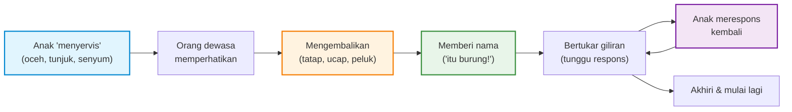

Bayi mengangkat tangannya, menunjuk ke burung yang lewat di luar jendela. Ayah menoleh, mengikuti arah jari itu, lalu berkata: "Oh, burung. Iya, burung!" Bayi menggumam sesuatu, ayah membalas dengan senyuman dan nada bicara yang hangat. Pertukaran ini berlangsung mungkin lima detik. Seperti tidak ada apa-apanya.

Tapi di dalam otak bayi itu, sedang terjadi sesuatu yang luar biasa: sirkuit saraf baru sedang terbentuk dan diperkuat. Koneksi antara suara, makna, perhatian bersama, dan ikatan emosional sedang "dilas" satu sama lain. Harvard Center on the Developing Child menyebut momen seperti ini dengan istilah **serve and return** — interaksi bolak-balik antara anak dan orang dewasa yang peduli, yang membentuk arsitektur otak anak satu pertukaran pada satu waktu.

Konsep ini bukan sekadar nasihat parenting. Ini adalah temuan ilmu saraf (neuroscience) dengan dasar penelitian yang dalam, dan memahaminya mengubah cara kita melihat setiap interaksi kecil dengan anak.

## Serve and Return: Tenis Mini di Otak Anak

Istilah "serve and return" sengaja dipilih untuk menggambarkan interaksi ini seperti permainan tenis. Anak melakukan "servis" — mengoceh, menunjuk, tersenyum, atau bahkan menangis. Orang dewasa melakukan "return" — menatap mata anak, mengucapkan kata, membalas senyuman, atau mengangkat anak. Lalu anak merespons kembali. Bolak-balik. Ping-pong.

Harvard Center on the Developing Child menjelaskan bahwa interaksi yang responsif dan berulang ini memainkan peran kunci dalam membentuk arsitektur otak. Setiap kali seorang bayi atau anak kecil mengoceh, melakukan gestur, atau menangis — dan orang dewasa merespons dengan kontak mata, kata-kata, atau pelukan — interaksi ini membantu membangun dan memperkuat koneksi neural di otak anak. Koneksi ini esensial untuk perkembangan kemampuan komunikasi dan sosial.

Yang membuat konsep ini begitu kuat adalah klaimnya yang berani: **otak manusia secara biologis mengharapkan permainan bolak-balik ini**. Kehadirannya bukan bonus — itu kebutuhan. Ketidakhadirannya bukan kekurangan — itu ancaman.

## Eksperimen Wajah Diam: Ketika "Return" Hilang

Untuk memahami mengapa serve and return begitu fundamental, ada satu eksperimen yang paling sering dikutip: **Still Face Experiment** oleh Edward Tronick, psikolog perkembangan dari University of Massachusetts Boston, yang pertama kali dilakukan pada tahun 1970-an.

Dalam eksperimen ini, seorang ibu diminta berinteraksi normal dengan bayinya — tersenyum, mengoceh bersama, kontak mata. Lalu ibu diminta menghentikan semua respons. Wajahnya menjadi datar. Tidak tersenyum, tidak bicara, tidak menatap.

Reaksi bayinya konsisten dan mencengangkan: pertama, bayi mencoba mendapatkan kembali perhatian ibu — tersenyum, menunjuk, mengoceh lebih keras. Ketika tidak ada respons, bayi mulai menunjukkan tanda-tanda stres yang jelas. Bayi berteriak, membuang muka, akhirnya menangis. Dalam beberapa menit saja, ketiadaan respons menyebabkan tekanan emosional yang nyata.

Tronick menunjukkan bahwa ketika koneksi antara bayi dan pengasuh terputus, bayi berusaha melibatkan pengasuh, dan ketika tidak ada respons, bayi menarik diri — pertama secara fisik, lalu secara emosional. Eksperimen ini menggambarkan dengan jelas: anak-anak tidak hanya "mau" respons dari orang dewasa, mereka **mengharapkannya** secara neurologis. Ketika respons itu absen, sistem stres tubuh aktif.

## Bukan Soal Jumlah Kata, Tapi Soal Giliran Bicara

Salah satu penelitian paling terkenal dalam perkembangan bahasa anak adalah studi "30 million word gap" oleh Betty Hart dan Todd Risley (1995), yang menemukan bahwa anak dari keluarga berpenghasilan rendah terpapar jutaan kata lebih sedikit dibanding anak dari keluarga profesional — dan kesenjangan ini berkorelasi dengan perkembangan bahana dan akademik.

Tapi penelitian yang lebih baru mengoreksi narasi ini. Pada 2018, Rachel Romeo dan rekan-rekannya dari MIT menerbitkan studi berjudul *"Beyond the 30-million-word Gap"* di jurnal *Psychological Science*. Menggunakan pemindaian otak (fMRI), mereka menemukan bahwa bukan jumlah kata yang anak dengar yang paling kuat memprediksi kemampuan bahana dan aktivitas otak. Yang lebih penting adalah **conversational turns** — jumlah kali anak dan orang dewasa saling bertukar kata secara aktual.

Anak-anak yang mengalami lebih banyak conversational turns menunjukkan aktivasi yang lebih besar di area Broca (area bahasa di otak bagian depan) saat memproses bahasa. Hubungan antara conversational turns dan kemampuan verbal menjelaskan hampir setengah dari korelasi antara paparan bahana dan kemampuan bahasa anak.

Implikasinya sederhana namun mendalam: sekadar berbicara *kepada* anak (seperti menghidupkan TV atau monolog tanpa henti) tidak sebanding dengan *berbicara bersama* anak. Serve and return — bertukar giliran, menunggu respons anak, membalas dengan sesuatu yang relevan — adalah yang membangun otak.

## Lima Langkah Serve and Return yang Membangun Otak

Harvard Center on the Developing Child, bekerja sama dengan program *Filming Interactions to Nurture Development* (FIND), menyederhanakan serve and return menjadi lima langkah yang bisa dipraktikkan siapa saja:

1. **Perhatikan servisnya** — Amati apa yang sedang menjadi fokus perhatian anak. Apa yang dia tunjuk? Apa yang dia ocehkan? Apa yang membuatnya tertawa? "Servis" anak bisa berupa apa pun — dari gumaman hingga isyarat tangan.

2. **Kembalikan servisnya** — Respons dengan kontak mata, kata-kata, sentuhan, atau ekspresi wajah. Yang penting adalah bahwa respons Anda berhubungan dengan apa yang sedang menjadi fokus anak, bukan agenda Anda sendiri.

3. **Beri nama** — Beri label pada apa yang sedang dilihat, dilakukan, atau dirasakan anak. "Itu kucing." "Kamu senang ya." "Wah, hujan." Penamaan membantu anak menghubungkan pengalaman dengan kata, membangun jembatan kognitif bahkan sebelum mereka bisa bicara.

4. **Bertukar giliran** — Tunggu. Beri anak waktu untuk merespons kembali. Serve and return yang sejati bukan satu arah — itu adalah dansa. Giliran anak, giliran Anda, giliran anak lagi. Menunggu mungkin hanya satu atau dua detik, tapi itu ruang di mana otak anak bekerja memproses dan merespons.

5. **Akhiri dan mulai lagi** — Anak akan memberi sinyal ketika suatu interaksi sudah selesai (mengalihkan pandangan, menjadi diam, menarik diri). Hormati penutupan itu. Lalu bersiaplah untuk ronde berikutnya, karena anak akan segera "menyervis" lagi.

Lima langkah ini terlihat sederhana, dan memang begitu. Tapi kesederhanaannya justru intinya: serve and return tidak memerlukan alat mahal, kurikulum khusus, atau waktu yang diblok kalender. Yang dibutuhkan adalah kehadiran, perhatian, dan kesediaan untuk ikut bermain.

## Ketika Respons Tidak Datang: Toxic Stress

Di sisi lain, ketika serve and return secara konsisten absen — bukan sesekali, tapi terus-menerus — otak anak menghadapi lebih dari sekadar kekurangan stimulasi. Harvard menjelaskan bahwa ketidakhadiran interaksi responsif yang persisten tidak hanya menghilangkan stimulasi positif yang dibutuhkan otak, tetapi juga mengaktifkan respons **toxic stress** tubuh — yang membanjiri otak yang sedang berkembang dengan hormon stres yang berbahaya.

Penelitian Kok dan rekan-rekannya (2015), yang dipublikasikan di *Journal of the American Academy of Child and Adolescent Psychiatry*, menemukan bahwa sensitivitas pengasuhan di masa awal kehidupan secara positif berasosiasi dengan penanda perkembangan otak yang lebih optimal pada usia 8 tahun — termasuk volume otak total yang lebih besar, volume materi abu-abu yang lebih besar, dan korteks yang lebih tebal di area frontal.

Studi Sethna et al. (2017) menemukan bahwa sensitivitas ibu yang lebih rendah berkorelasi dengan volume materi abu-abu subkortikal yang lebih kecil. Rifkin-Graboi et al. (2015) menemukan asosiasi langsung antara sensitivitas pengasuhan dan konektivitas antara hippocampus dengan area penting untuk regulasi emosi.

Intinya: interaksi yang responsif tidak hanya membuat anak merasa aman secara emosional — interaksi itu secara fisik membentuk struktur otak yang akan menentukan cara anak berpikir, merasakan, dan berinteraksi selama sisa hidupnya.

## Lebih Dari Sekadar "Menghabiskan Waktu"

Ada perbedaan penting antara berada di dekat anak dan benar-benar *terlibat* dalam serve and return. Sebagai orang tua yang juga bekerja, saya sering menyadari betapa mudahnya berada dalam mode "hadir secara fisik tapi tidak secara perhatian" — mata di layar ponsel sambil anak mengoceh di samping, atau menjawab dengan "hmm, iya" tanpa benar-benar menoleh.

Tidak ada orang tua yang bisa melakukan serve and return setiap detik. Itu tidak realistis dan tidak perlu. Yang penting adalah frekuensi interaksi yang berkualitas sepanjang hari — beberapa detik penuh perhatian di sela-sela kesibukan. Anak tidak butuh sesi interaksi maraton; anak butuh puluhan micro-momen di mana orang dewasa benar-benar "datang" untuk mereka.

Penelitian tentang sinkronisitas pengasuh-anak (parent-child synchrony) menunjukkan bahwa selama momen sinkron, pengasuh dan anak berada dalam keadaan resonansi nonverbal — pengasuh menyesuaikan tatapan, ekspresi afektif, kualitas vokal, dan gerakan dengan sinyal-sinyal awal anak untuk menciptakan dialog bersama. Sinkronisitas ini mendukung perkembangan kemampuan yang menopang keterlibatan sosial, termasuk pembentukan simbol, pemahaman moral, regulasi emosi, dan toleransi terhadap frustrasi.

## Tantangan Nyata: Ketika Serve and Return Sulit

Penting untuk mengakui bahwa serve and return tidak selalu mudah. Depresi pasca-persalinan, kelelahan kronis, stres finansial, beban kerja yang berat — semua ini bisa mengganggu kapasitas orang dewasa untuk merespons dengan konsisten. Harvard sendiri mengakui bahwa ada banyak alasan mengapa seorang pengasuh mungkin tidak terlibat dalam interaksi serve and return yang konsisten, dan solusinya bukan menyalahkan orang tua, melainkan membangun sistem dukungan yang memungkinkan orang tua hadir untuk anak mereka.

Sebagai seorang ayah yang juga seorang engineering manager, saya merasa ketegangan ini setiap hari. Ada hari-hari ketika pulang kerja dengan kepala penuh masalah teknis, dan satu-satunya yang saya inginkan adalah sepuluh menit keheningan. Pada hari-hari seperti itu, serve and return terasa seperti satu tugas lagi yang harus diselesaikan. Tapi justru di hari-hari seperti itu, lima detik kontak mata penuh perhatian mungkin lebih berharga daripada satu jam duduk di sebelah anak sambil memikirkan pekerjaan.

Konsep serve and return memberi kami sesuatu yang konkret: bukan teori abstrak tentang "jadilah orang tua yang baik", tapi praktik spesifik — perhatikan, balas, beri nama, bertukar giliran, akhiri dengan baik. Lima langkah. Bisa dimulai dari detik ini.

Otak anak dibangun dari interaksi, bukan dari instruksi. Setiap kali kita membalas "servis" mereka — dengan kata, tatapan, atau pelukan — kita sedang ikut membangun arsitektur yang akan menopang cara mereka berpikir dan merasakan selama puluhan tahun ke depan. Itu mungkin investasi dengan rasio pengembalian tertinggi yang pernah ada: lima detik perhatian untuk seumur hidup konektivitas.

## Referensi

1. Harvard Center on the Developing Child. "Serve and Return." *Key Concepts*. https://developingchild.harvard.edu/science/key-concepts/serve-and-return/
2. Harvard Center on the Developing Child. "How-to: 5 Steps for Brain-Building Serve and Return." *Resources*, 2019. https://developingchild.harvard.edu/resources/how-to-5-steps-for-brain-building-serve-and-return/
3. Romeo, R.R., Leonard, J.A., Robinson, S.T., et al. (2018). "Beyond the 30-million-word Gap: Children's Conversational Exposure Is Associated with Language-Related Brain Function." *Psychological Science*, 29(5), 700–710.
4. Kok, R., Thijssen, S., Bakermans-Kranenburg, M., et al. (2015). "Normal Variation in Early Parental Sensitivity Predicts Child Structural Brain Development." *Journal of the American Academy of Child and Adolescent Psychiatry*, 54(10), 824–831.
5. Sethna, V., Pote, I., Wang, S., et al. (2017). "Mother–Infant Interactions and Regional Brain Volumes in Infancy: An MRI Study." *Brain Structure and Function*, 222, 2379–2388.
6. Rifkin-Graboi, A., Kong, L., Sim, L.W., et al. (2015). "Maternal Sensitivity, Infant Limbic Structure Volume and Functional Connectivity: A Preliminary Study." *Translational Psychiatry*, 5, e668.
7. Tronick, E. (1970s–present). The Still Face Experiment. University of Massachusetts Boston / Harvard Medical School. Wikipedia: https://en.wikipedia.org/wiki/Edward_Tronick
8. Hart, B. & Risley, T.R. (1995). *Meaningful Differences in the Everyday Experience of Young American Children*. Baltimore: Paul H. Brookes Publishing.
