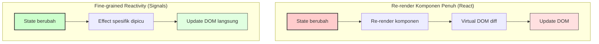

Bayangkan Anda sedang bekerja dengan spreadsheet Excel. Anda mengetik `= A0 + A1` di sel A2, dan setiap kali nilai A0 atau A1 berubah, A2 otomatis ter-update. Tidak perlu klik tombol "refresh", tidak perlu memanggil fungsi apa pun. Sistem tahu sendiri bahwa A2 bergantung pada A0 dan A1, lalu menjalankan kembali perhitungan saat keduanya berubah.

Itulah inti dari reaktivitas — sebuah konsep yang dokumentasi Vue.js sebut sebagai paradigma deklaratif untuk merespons perubahan state secara otomatis. Dalam JavaScript murni, variabel tidak bekerja seperti itu. Jika Anda menulis `let A2 = A0 + A1`, mengubah A0 tidak akan mengubah A2. Anda harus secara manual memperbarui, memanggil fungsi, atau memicu re-render.

Selama lebih dari satu dekade, framework frontend JavaScript berusaha memecahkan masalah ini dengan pendekatan yang berbeda-beda. Dan dalam beberapa tahun terakhir, sebuah primitive yang disebut **Signals** muncul sebagai jawaban yang konvergen — diadopsi oleh Angular, Vue, Solid.js, Preact, Svelte, dan kini sedang dalam proses standardisasi oleh TC39, komite yang mengatur evolusi bahasa JavaScript.

## Apa Itu Signals?

Sederhananya: **Signal adalah nilai yang reaktif**. Saat nilainya berubah, semua bagian aplikasi yang bergantung pada nilai tersebut otomatis diperbarui — tetapi hanya bagian yang benar-benar bergantung, bukan seluruh aplikasi.

Proposal TC39 mendefinisikan dua primitive inti:

- **`Signal.State`** — menyimpan sebuah nilai. Setara dengan variabel biasa, tapi reaktif. Ketika nilainya di-set, semua yang bergantung padanya akan diberi tahu.
- **`Signal.Computed`** — nilai turunan yang dihitung dari Signal lain. Saat dependency-nya berubah, computed ini dihitung ulang secara otomatis.

Mari kita lihat contoh dari proposal TC39 itu sendiri:

```javascript
const counter = new Signal.State(0);
const isEven = new Signal.Computed(() => (counter.get() & 1) == 0);
const parity = new Signal.Computed(() => isEven.get() ? "genap" : "ganjil");

// Effect: menjalankan side effect saat parity berubah
effect(() => element.innerText = parity.get());

// Setiap 1 detik, counter bertambah
setInterval(() => counter.set(counter.get() + 1), 1000);
```

Perhatikan apa yang terjadi: `parity` bergantung pada `isEven`, yang bergantung pada `counter`. Saat `counter` berubah dari 0 ke 1, sistem tahu bahwa `isEven` perlu dihitung ulang, yang berarti `parity` juga berubah, yang akhirnya memicu effect untuk mengupdate DOM. Semua ini terjadi tanpa satu pun baris kode yang mendeklarasikan relasi tersebut secara eksplisit.

Yang membuat Signals begitu powerful ada tiga properti yang disorot dalam proposal TC39:

**Pertama, Automatic Dependency Tracking.** Computed Signal otomatis menemukan Signal lain yang ia baca saat dievaluasi. Anda tidak perlu menulis array dependency manual seperti `useEffect(() => {...}, [dep1, dep2])` di React. Sistem melacak dependency saat runtime berdasarkan Signal apa saja yang benar-benar diakses.

**Kedua, Lazy Evaluation.** Perhitungan tidak dieksekusi saat dideklarasikan, juga tidak langsung dieksekusi saat dependency berubah. Computed Signal baru menghitung nilainya ketika ada yang benar-benar meminta nilainya. Ini menghindari komputasi yang tidak perlu.

**Ketiga, Memoization.** Computed Signal menyimpan nilai terakhir. Jika dependency tidak berubah sejak evaluasi terakhir, membaca computed tersebut tidak memicu perhitungan ulang, seberapa pun sering ia diakses.

## Sejarah Singkat: Dari Knockout ke Konvergensi

Konsep signal bukan ide baru. Proposal TC39 mencatat bahwa kemunculan pertama primitive reaktif yang populer dalam JavaScript terjadi bersama **Knockout.js pada tahun 2010**, ketika Steve Sanderson memperkenalkan *observables* — nilai yang bisa "diobservasi" sehingga view otomatis ter-update saat model berubah.

Kemudian datang **React pada 2013** dengan pendekatan fundamental yang berbeda. Alih-alih melacak dependency pada level nilai individual, React merender ulang seluruh komponen dan menggunakan **Virtual DOM** untuk menghitung perbedaan dengan representasi sebelumnya. Filosofinya elegan dalam kesederhanaannya: `UI = f(state)`. Ubah state, React akan menghitung ulang seluruh pohon UI, lalu membandungkan hasilnya dengan versi sebelumnya untuk menentukan perubahan DOM minimal.

Kedua pendekatan ini bersaing selama bertahun-tahun. Tapi bertumpu pada pengalaman lebih dari satu dekade, komunitas mulai konvergen. Vue 3 menulis ulang sistem reaktivitasnya menggunakan Proxy JavaScript untuk dependency tracking yang lebih akurat — dokumentasinya menjelaskan bagaimana `reactive()` membungkus objek dengan Proxy yang mencegat setiap akses property untuk tracking. Angular, framework yang dulunya bergantung pada Zone.js untuk change detection, memperkenalkan Signals mulai versi 16 sebagai primitive reaktif baru yang lebih efisien. Solid.js dibangun dari nol dengan signals sebagai inti — tanpa Virtual DOM sama sekali. Svelte 5 memperkenalkan **Runes** yang pada dasarnya adalah signals dengan sintaks deklaratif yang di-compile.



Diagram di atas menunjukkan perbedaan fundamental. React merender ulang seluruh fungsi komponen, membuat virtual DOM tree baru, lalu membandingkannya dengan tree sebelumnya untuk menemukan apa yang berubah. Framework berbasis signals melompati langkah-langkah ini — saat sebuah signal berubah, hanya effect yang terdaftar sebagai subscriber yang dipicu, dan mereka langsung mengupdate DOM node yang spesifik.

## Proposal Standardisasi TC39

Yang membuat tren ini semakin menarik adalah adanya upaya formal untuk menstandardisasi Signals di tingkat bahasa JavaScript itu sendiri. Proposal TC39, yang didorong oleh Daniel Ehrenberg (mantan representative di Igalia), Yehuda Katz (pembuat Ember), dan Rob Eisenberg (pembuat Aurelia), bertujuan membuat signals menjadi primitive bawaan JavaScript.

Dalam README resmi proposal, para champion menulis bahwa upaya ini "fokus pada penyelarasan ekosistem JavaScript". Kolaborasi melibatkan maintainer dan pencipta dari Angular, Vue, Solid, Preact, Svelte, MobX, Qwik, Ember, FAST, Starbeam, dan lebih banyak lagi. Tujuannya bukan membuat satu API yang identik untuk semua developer — melainkan menstandardisasi **semantik inti dari signal graph** sehingga framework bisa saling berinteroperasi.

Proposal ini menyoroti empat manfaat utama standardisasi:

**Interoperabilitas** adalah motivasi terbesar. Saat ini, setiap implementasi signals punya auto-tracking mechanism sendiri, sehingga sulit untuk berbagi model reaktif antar framework. Sebuah signal dari MobX tidak bisa dibaca oleh sistem reaktivitas Vue. Standardisasi mengubah ini — developer bisa menulis model reaktif sekali dan menggunakannya di framework apa pun.

**Performa** adalah manfaat kedua. Implementasi native di level engine (C++ di V8, SpiderMonkey) bisa lebih efisien daripada polyfill JavaScript, terutama untuk signal graph yang kompleks dengan ribuan node. Proposal ini secara realistis mencatat bahwa peningkatan mungkin hanya konstan faktor, bukan perubahan algoritmik.

**DevTools** adalah manfaat yang sering diabaikan. Dengan signals sebagai bagian dari platform, browser DevTools bisa menampilkan dependency graph, trace callstack melalui chain computed signals, dan highlight signals dalam performance profiling. Hal-hal yang sulit dilakukan dengan library-level implementations.

Saat artikel ini ditulis, proposal berada di **Stage 1** — tahap eksplorasi awal dalam proses TC39. Namun dukungan dari hampir semua framework utama membuatnya memiliki momentum yang serius.

## Implementasi di Berbagai Framework

Setiap framework mengemas signals dengan API yang berbeda, tetapi mekanisme intinya sama. Mari kita lihat bagaimana tiga framework populer mengimplementasikannya.

**Angular** memperkenalkan signals sebagai fungsi zero-argument. Sebuah signal adalah fungsi yang saat dipanggil mengembalikan nilai saat ini dan secara otomatis mendaftarkan diri sebagai dependency dalam reactive context:

```typescript
const count = signal(0);
const double = computed(() => count() * 2);

count.set(5);   // mengubah nilai
double();        // 10 — otomatis dihitung ulang
```

Dokumentasi Angular menekankan bahwa eksekusi signal tidak memicu side effect — ia hanya membaca nilai dan melacak dependency. Equality comparator opsional bisa mencegah update yang tidak perlu jika nilai baru dianggap sama dengan nilai lama.

**Vue 3** menggunakan pendekatan berbeda via Proxy. Alih-alih memanggil fungsi, Anda mengakses property dari objek reaktif, dan Proxy secara otomatis mencegat akses tersebut untuk tracking:

```javascript
const state = reactive({ count: 0 });
const double = computed(() => state.count * 2);

state.count = 5;
double.value; // 10
```

**Svelte 5** dengan Runes mungkin yang paling ergonomis — sintaksnya terlihat seperti JavaScript biasa, tapi compiler mengubahnya menjadi signals:

```javascript
let count = $state(0);
let doubled = $derived(count * 2);
```

Yang perlu dipahami: di balik perbedaan API ini, prinsip kerjanya identik. Semuanya membangun dependency graph pada runtime untuk melacak hubungan antar nilai reaktif, dan semuanya memperbarui hanya bagian yang terpengaruh saat sebuah nilai berubah.

## React: Pengecualian yang Menarik

Pertanyaan yang wajar muncul: mengapa React tidak ikut mengadopsi signals? Tim React secara konsisten mempertahankan model `UI = f(state)` — di mana perubahan state memicu re-render komponen, dan Virtual DOM menangani efisiensi.

Ryan Florence dari React Team menulis kritik bahwa signals memaksa developer berpikir tentang mekanisme reaktivitas, bukan tentang apa yang dirender. Tim React lebih percaya pada pendekatan deklaratif penuh di mana developer tidak perlu mengelola dependency secara manual.

Sebagai ganti signals, React mengembangkan **React Compiler** — yang menganalisis kode secara static di compile time untuk mengoptimalkan re-render secara otomatis, menghilangkan kebutuhan `useMemo` dan `useCallback` manual. Pendekatan ini menjaga model mental React tetap sederhana sambil mengatasi masalah performa yang signals coba selesaikan.

Debat antara fine-grained reactivity versus Virtual DOM sebenarnya bukan tentang mana yang lebih baik secara absolut. Ini tentang trade-off: signals memberikan kontrol granularitas dan performa yang lebih prediktible pada aplikasi dengan banyak state yang berubah independen, sementara model React unggul dalam kesederhanaan reasoning untuk komponen yang kompleks dengan banyak interaksi state.

## Apa Artinya bagi Kita?

Sebagai developer yang sehari-hari bekerja dengan ekosistem React dan Node.js, saya melihat signals bukan sebagai ancaman terhadap stack yang sudah saya kenal, tetapi sebagai perluasan pemahaman tentang bagaimana reaktivitas bisa bekerja.

Beberapa insight praktis yang saya dapat: pertama, memahami signals membuat saya lebih sadar tentang *apa sebenarnya* yang terjadi saat state berubah di aplikasi React. React merender ulang seluruh komponen karena ia tidak tahu dependency secara granular — signals menunjukkan alternatif di mana hanya bagian yang terpengaruh yang dihitung ulang. Kedua, jika suatu hari saya perlu bermigrasi ke Vue atau Angular (sangat realistis di industri Indonesia yang multistack), pemahaman tentang signals langsung transferable.

Untuk sekarang, saran praktis: tidak perlu buru-buru migrasi dari React ke framework berbasis signals. Tapi cobalah signals di playground Solid.js atau Preact Signals untuk merasakan bedanya. Konsep ini akan semakin relevan setiap tahunnya, terutama jika proposal TC39 terus melaju.

Signals mengingatkan kita bahwa dalam dunia frontend yang sering terasa terlalu kompleks, kadang jawabannya bukan menambahkan abstraksi baru, tapi kembali ke primitive yang sederhana: sebuah nilai yang tahu sendiri kapan harus berubah, dan siapa yang perlu diberi tahu.


## Referensi

1. TC39. *JavaScript Signals Standard Proposal*. GitHub. `github.com/tc39/proposal-signals` — Proposal resmi standardisasi signals dengan kontribusi dari maintainer Angular, Vue, Solid, Preact, Svelte, MobX, Qwik, dan lainnya.
2. Vue.js. *Reactivity in Depth*. `vuejs.org/guide/extras/reactivity-in-depth.html` — Penjelasan detail sistem reaktivitas Vue 3 berbasis Proxy, termasuk konsep track/trigger dan analogi spreadsheet.
3. Angular Team. *Angular Signals Implementation*. `github.com/angular/angular` (packages/core/primitives/signals/README.md) — Dokumentasi algoritma signal Angular: dependency tracking, equality comparator, lazy memoization.
4. Wikipedia. *Reactive Programming*. `en.wikipedia.org/wiki/Reactive_programming` — Konsep akademis reaktivitas: data streams, change propagation algorithms (push, pull, push-pull), dan dependency graph.
5. Wikipedia. *Observer Pattern*. `en.wikipedia.org/wiki/Observer_pattern` — Pola desain Gang of Four yang menjadi fondasi konseptual signals: subject-observer relationship dan automatic notification.
6. Sanderson, Steve. *Introducing Knockout*. 2010. `blog.stevensanderson.com` — Artikel perkenalan Knockout.js yang dianggap sebagai implementasi populer pertama reactive observables di JavaScript.
7. Vue.js. *Reactivity Fundamentals*. `vuejs.org/guide/essentials/reactivity-fundamentals.html` — Pengenalan praktis cara menggunakan reaktivitas Vue dengan `reactive()` dan `ref()`.
