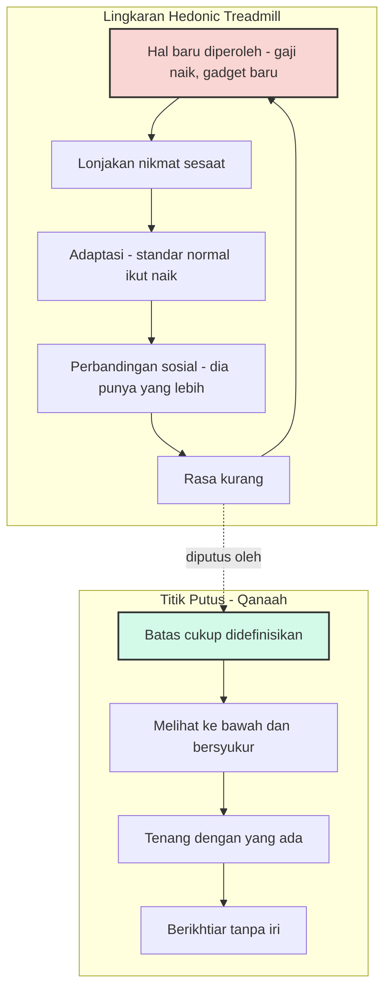

Ada pola yang hampir semua kita kenal, meski jarang kita beri nama. Gaji naik, dan selama beberapa minggu semuanya terasa lebih ringan. Lalu cicilan menyesuaikan diri, gaya hidup menyesuaikan diri, dan setahun kemudian angka itu terasa seperti sudah menjadi hak kita sejak lama — sementara keinginan berikutnya sudah duduk rapi di daftar tunggu. Ponsel yang tadinya keren mulai terasa lambat. Laptop yang tadinya canggih mulai terasa berat. Standar "cukup" kita tidak pernah benar-benar tercapai; ia hanya berpindah.

Psikologi memberi fenomena ini sebuah nama: **hedonic treadmill**, atau adaptasi hedonis. Istilahnya dicetuskan Philip Brickman dan Donald Campbell pada 1971 untuk menggambarkan kecenderungan manusia kembali ke tingkat kebahagiaan dasar mereka, apa pun yang baru saja terjadi. Seperti berjalan di atas treadmill: seberapa pun cepat kita melangkah, kita tetap berada di tempat yang sama.

## Pemenang lotere dan titik kembali kebahagiaan

Bukti klasiknya datang dari studi Brickman, Coates, dan Janoff-Bulman (1978) berjudul "Lottery Winners and Accident Victims: Is Happiness Relative?". Para peneliti membandingkan pemenang lotere besar di Illinois dengan kelompok kontrol dan korban kecelakaan yang mengalami kelumpuhan. Hasilnya melawan intuisi: beberapa bulan setelah menang, kebahagiaan para pemenang lotere kembali mendekati level sebelum mereka menang. Uang yang datang tiba-tiba teradaptasi dengan cepat; kenikmatan-kenikmatan kecil yang dulu mereka sukai justru terasa lebih hambar dibanding sebelum menang.

Penelitian lanjutan menambahkan nuansa. Diener, Lucas, dan Scollon (2006) dalam tinjauan "Beyond the Hedonic Treadmill" menunjukkan bahwa titik dasar kebahagiaan tiap orang berbeda, sebagian diwariskan, dan tidak semua orang beradaptasi dengan kecepatan yang sama. Tapi kesimpulan besarnya bertahan: kejadian hebat — baik maupun buruk — jarang mengubah kebahagiaan kita secara permanen. Kita menyesuaikan diri, lalu mencari stimulus berikutnya.

Persoalannya, masyarakat modern dibangun di atas stimulus berikutnya itu. Ekonom Richard Easterlin sejak 1974 mendokumentasikan apa yang kemudian dikenal sebagai **Easterlin paradox**: pada satu titik waktu, orang berpenghasilan lebih tinggi memang cenderung lebih bahagia. Tapi sepanjang waktu, ketika pendapatan masyarakat naik bersamaan, kebahagiaan tidak ikut naik. Data Amerika Serikat dari 1946 hingga 2014 menunjukkan pendapatan riil meningkat lebih dari tiga kali lipat dalam tujuh dekade — sementara tren kebahagiaan datar, bahkan sedikit menurun. Easterlin sendiri memperbarui buktinya hingga 2022 dan kesimpulannya bertahan.

## Uang membantu, sampai tidak

Debat serupa terjadi pada level individu. Kahneman dan Deaton (2010) menganalisis ratusan ribu respons survei Gallup dan menemukan bahwa kesejahteraan emosional — seberapa sering orang merasa gembira, sedih, atau stres pada hari itu — cenderung mendatar setelah pendapatan sekitar 75.000 dolar per tahun, meski penilaian hidup secara keseluruhan terus naik. Sebelas tahun kemudian, Matthew Killingsworth (2021) dengan metode *experience sampling* lewat smartphone menantang temuan itu: kesejahteraan terus meningkat seiring pendapatan, bahkan jauh di atas 75.000 dolar.

Kedua kubu lalu sepakat menguji ulang bersama dalam format yang mereka sebut *adversarial collaboration*, dan pada 2023 Killingsworth, Kahneman, dan Mellers menerbitkan hasilnya di PNAS: keduanya benar sebagian. Untuk kebanyakan orang, kebahagiaan memang terus naik dengan pendapatan. Tapi bagi kelompok yang paling tidak bahagia — sekitar 15–20% responden — kenaikan pendapatan berhenti memberi efek setelah titik tertentu. Uang membantu, tapi uang tidak menambal lubang di dasar sana.

Ada satu catatan matematis yang sering luput: hubungan pendapatan dan kebahagiaan berbentuk logaritmik. Artinya, makin tinggi posisi kita, makin besar kenaikan yang dibutuhkan untuk menambah kebahagiaan dalam jumlah yang sama. Dari 5 juta ke 10 juta terasa. Dari 50 juta ke 55 juta nyaris tidak terasa. Kita harus menggandakan yang sudah dimiliki untuk merasakan selisih yang setara — dan tuntutan penggandaan ini tidak pernah usai.

Sekilas, lingkarannya seperti ini:

## Perbandingan yang dirancang

Treadmill tidak bekerja sendirian. Ada mesin kedua di sebelahnya: perbandingan sosial. Leon Festinger (1954) menunjukkan bahwa manusia mengevaluasi pendapat dan kemampuannya lewat perbandingan dengan orang lain ketika ukuran objektif tidak tersedia. Penelitian selanjutnya memilah dua arahnya: perbandingan ke atas (membuat kita merasa kurang) dan ke bawah (membuat kita menghargai yang ada). Masalahnya, media sosial mengubah perbandingan yang dulu sesekali terjadi menjadi arus yang mengalir terus-menerus — dan hampir seluruhnya adalah perbandingan ke atas yang dikurasi: promosi jabatan, pembelian pertama rumah, liburan, penawaran kerja.

Kross dan koleganya (2013) menemukan bahwa penggunaan Facebook — terutama yang pasif, sekadar membuka berita orang lain — memprediksi penurunan kesejahteraan emosional dari hari ke hari. Hunt dkk. (2018) melangkah lebih jauh: mahasiswa yang membatasi media sosial ke sekitar 30 menit per hari selama tiga minggu mengalami penurunan kesepian dan gejala depresi yang signifikan dibanding kelompok kontrol. Perbandingan bukan sekadar kebiasaan buruk; ia variabel yang bisa dimanipulasi, dan menguranginya terbukti mengubah hasilnya.

Dunia teknologi tempat saya bekerja punya versinya sendiri: thread penghasilan engineer, laman perbandingan gaji berdasarkan level, dan siklus framework baru setiap kuartal yang membuat kode yang kemarin masih bagus terasa jadul hari ini. Menariknya, perasaan "tertinggal" ini jarang datang dari kebutuhan nyata — hampir selalu dari melihat posisi orang lain di grafik yang tidak kita lihat konteksnya.

## Qana'ah: memutus lingkaran dari dalam

Di sinilah Islam menawarkan sesuatu yang bukan sekadar nasihat moral, melainkan kerangka kerja yang justru selaras dengan temuan-temuan di atas. **Qana'ah** biasa diterjemahkan "merasa cukup" — menerima pemberian yang ada tanpa gelisah mengejar apa yang di tangan orang lain. Kata *content* dalam bahasa Inggris berakar dari bahasa Latin *contentus*, yang berarti "utuh, terkandung penuh"; aslinya dipakai untuk wadah — ember yang penuh dan tidak bocor. Qana'ah kira-kira itu: hati yang utuh, yang tidak bocor ke mana-mana.

Nabi Muhammad ﷺ bersabda: "Sungguh beruntung orang yang masuk Islam, diberi rezeki yang secukupnya, dan Allah menjadikannya qana'ah dengan apa yang diberikan kepadanya" (HR Muslim no. 1054). Perhatikan strukturnya: ada rezeki secukupnya di luar, dan ada hati yang dibuat puas oleh Allah di dalam. Dua variabel yang berbeda — dan yang kedua bukan konsekuensi otomatis dari yang pertama. Studi-studi di atas mengatakan hal yang persis sama: variabel luar (pendapatan, peristiwa) jarang mengubah titik dasar; yang menentukan justru mekanisme di dalam — bagaimana kita beradaptasi dan dengan siapa kita membandingkan diri.

Hadits lain bahkan berbentuk instruksi operasional: "Lihatlah kepada orang yang berada di bawah kalian, dan janganlah kalian melihat orang yang berada di atas kalian; itu lebih layak agar kalian tidak meremehkan nikmat Allah atas kalian" (HR Bukhari no. 6490 dan Muslim no. 2964). Festinger baru menemukan pada 1954 bahwa manusia adalah makhluk yang menilai dirinya lewat perbandingan — hadits ini sudah menunjukkan arah mana dari perbandingan itu yang membinasakan, dan arah mana yang menyehatkan. Riset syukur modern mengonfirmasi sisi itu: Emmons dan McCullough (2003) menemukan bahwa partisipan yang rutin mencatat hal-hal yang mereka syukuri menjadi lebih optimis dan melaporkan keluhan fisik lebih sedikit dibanding kelompok yang diminta mencatat beban atau hal biasa saja.

Al-Quran menyebut perbandingan sosial dengan presisi yang mencolok: "Dan janganlah kamu tujukan pandanganmu kepada kenikmatan hidup yang Kami berikan kepada beberapa golongan di antara mereka sebagai perhiasan kehidupan dunia untuk Kami uji mereka dengannya; dan karunia Tuhanmu adalah lebih baik dan lebih kekal" (QS Taha [20]: 131). Ayat ini tidak melarang memiliki harta; ia melarang arah pandangan tertentu — memelihara perbandingan sebagai kebiasaan. Perbandingan yang dipelihara disebut ayat ini sebagai ujian, bukan ukuran. Dan tentang sumber ketenangan, Al-Quran menempatkannya bukan pada penambahan aset: "Ingatlah, hanya dengan mengingat Allah hati menjadi tenang" (QS Ar-Ra'd [13]: 28).

## Qana'ah bukan pasrah, apalagi malas

Klarifikasi ini penting, karena qana'ah sering disalahpahami sebagai sikap anti-ambisi. Tidak. Qana'ah menetapkan hubungan kita dengan yang *sudah ada*; ikhtiar mengurus yang *belum ada*. Keduanya berjalan di jalur yang berbeda. Sejarah Islam mencatat sahabat yang kaya raya seperti Utsman bin Affan dan Abdurrahman bin Auf — kekayaan mereka justru menjadi perisai yang melindungi banyak orang. Qana'ah bukan kemiskinan yang dipaksakan; ia kemerdekaan dari perasaan miskin.

Ujian sebenarnya bukan pada kepemilikan, melainkan pada kebocoran: memiliki banyak tapi terus merasa kurang adalah tanda hati yang bocor. Sebaliknya, memiliki secukupnya dengan dada yang lapang adalah tanda hati yang utuh. Ambisi yang sehat berkata "saya ingin membangun lebih" tanpa perlu merendahkan yang sudah ada; ketamakan berkata "yang saya punya tidak berarti apa-apa sampai saya punya yang dia punya". Yang pertama menggerakkan kerja, yang kedua menggerakkan resah.

## Memutus treadmill dalam praktik

**Tulis definisi "cukup" Anda.** Angka yang tidak pernah ditulis akan selalu digeser oleh adaptasi. Tentukan secara sadar: berapa yang dibutuhkan agar keluarga hidup layak, sehat, dan produktif — lalu perlakukan angka itu sebagai patokan, bukan titik start menuju patokan berikutnya. Ini bukan anti kenaikan rezeki, melainkan pembeda antara menerima nikmat dan mengejar nikmat tanpa garis akhir.

**Jadwalkan diet perbandingan.** Batasi konsumsi pasif media sosial — temuan Hunt dkk. (2018) menunjukkan batas sekitar 30 menit per hari sudah memberi efek terukur. Dan ketika dorongan membandingkan datang di luar media sosial, gunakan arah hadits: pandanglah ke bawah, ke mereka yang berharap memiliki separuh dari yang kita miliki sekarang, lalu sebutkan nikmat itu satu per satu.

**Belanjakan sebagian untuk orang lain.** Dunn, Aknin, dan Norton (2008) menemukan dalam eksperimen mereka di *Science* bahwa uang yang dibelanjakan untuk orang lain menaikkan kebahagiaan lebih besar daripada uang yang dibelanjakan untuk diri sendiri — dan Aknin dkk. (2013) mereplikasi temuan ini pada data dari 136 negara, dari negara kaya sampai miskin. Sangat sedikit jenis belanja yang tahan terhadap adaptasi hedonis; memberi ternyata salah satunya. Nabi ﷺ sudah meringkasnya: "Tangan yang memberi lebih baik daripada tangan yang menerima" (HR Bukhari no. 1429).

**Rawat jangkar bagian dalam.** Adaptasi membuat setiap kenikmatan lama memudar — kecuali yang tidak bergantung pada stimulus. Dzikir, doa, dan muhasabah bekerja pada lapisan yang berbeda dari konsumsi; penelitian tentang orang beragama secara konsisten menemukan kaitan antara praktik doa dan kesejahteraan. Al-Quran tidak menyebut dzikir sebagai tambahan aktivitas, melainkan sebagai sumber ketenangan itu sendiri.

## Garis yang berpindah bukanlah garis

Sebagai orang yang bekerja di industri yang setiap kuartal punya produk baru untuk diinginkan, dan sebagai ayah yang ingin anak-anaknya melihat orang tua yang bahagia dengan hidupnya — bukan yang terus gelisah mengejar yang berikutnya — saya semakin yakin bahwa pertanyaan terpenting soal rezeki bukan "berapa lagi yang harus saya dapat", melainkan "di mana garis cukup saya berada". Karena kalau garis itu tidak pernah ditetapkan, tidak ada jumlah yang akan pernah sampai.

Hedonic treadmill menjelaskan mengapa rasa cukup selalu berpindah. Qana'ah menjelaskan ke mana rasa itu harus dipulangkan. Dan anehnya, memutus lingkaran itu tidak membuat kita berhenti bekerja — justru membuat kerja kita bebas dari iri, sebab yang dikejar bukan lagi posisi orang lain, melainkan versi terbaik dari amanah yang sudah dipegang.

## Referensi

1. "Hedonic treadmill" — Wikipedia: https://en.wikipedia.org/wiki/Hedonic_treadmill
2. Brickman, P., Coates, D., & Janoff-Bulman, R. (1978). *Lottery Winners and Accident Victims: Is Happiness Relative?* Journal of Personality and Social Psychology, 36(8), 917–930.
3. Diener, E., Lucas, R. E., & Scollon, C. N. (2006). *Beyond the Hedonic Treadmill: Revising Adaptation Theory*. American Psychologist, 61(4), 305–314.
4. "Easterlin paradox" — Wikipedia: https://en.wikipedia.org/wiki/Easterlin_paradox
5. Kahneman, D., & Deaton, A. (2010). *High income improves evaluation of life but not emotional well-being*. PNAS, 107(38). https://www.pnas.org/doi/10.1073/pnas.1011492107
6. Killingsworth, K. A., Kahneman, D., & Mellers, B. (2023). *Income and emotional well-being: The conflict resolved*. PNAS, 120(10). https://www.pnas.org/doi/10.1073/pnas.2208661120
7. "Social comparison theory" — Wikipedia: https://en.wikipedia.org/wiki/Social_comparison_theory
8. Kross, E., et al. (2013). *Facebook use predicts declines in subjective well-being in young adults*. PNAS, 110(24). https://www.pnas.org/doi/10.1073/pnas.1218770110
9. Hunt, M. G., Marx, R., Lipson, C., & Young, J. (2018). *No More FOMO: Limiting Social Media Decreases Loneliness and Depression*. Journal of Social and Clinical Psychology, 37(10), 751–768.
10. Emmons, R. A., & McCullough, M. E. (2003). *Counting blessings versus burdens*. Journal of Personality and Social Psychology, 84(2), 377–389.
11. Dunn, E. W., Aknin, L. B., & Norton, M. I. (2008). *Spending Money on Others Promotes Happiness*. Science, 319(5870); serta Aknin, L. B., et al. (2013). *Prosocial spending and well-being: cross-cultural evidence for a psychological universal*. Journal of Personality and Social Psychology, 104(4).
12. "Contentment" — Wikipedia: https://en.wikipedia.org/wiki/Contentment
13. Hadits: HR Muslim no. 1054; HR Bukhari no. 6490 dan Muslim no. 2964; HR Bukhari no. 1429.
