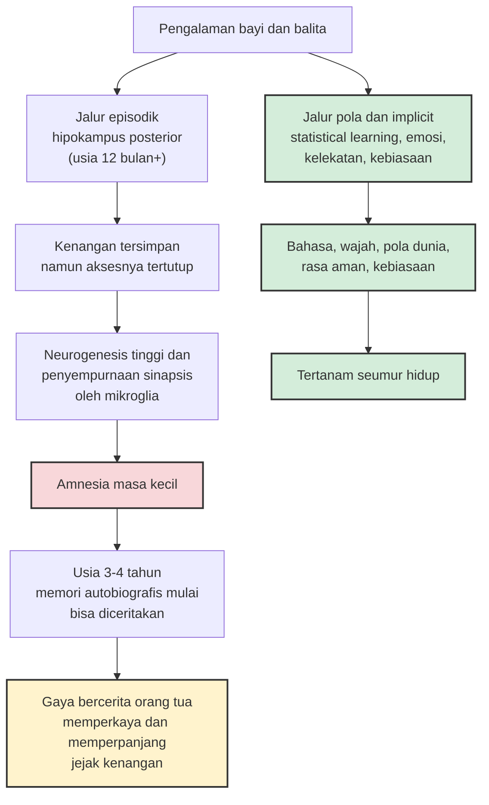

Coba panggil kenangan tertua yang bisa Anda jelaskan dengan kata-kata. Sebagian besar orang berhenti di usia tiga sampai empat tahun. Sebelumnya? Keheningan yang aneh, seperti membuka album foto yang ternyata kosong. Padahal di masa-masa itu kita belajar hal-hal paling fundamental dalam hidup: berjalan, berbicara, mengenali wajah-wajah yang kelak menjadi dunia kita. Bagaimana mungkin masa paling produktif dalam perkembangan otak justru meninggalkan jejak naratif yang nyaris nol?

Fenomena ini punya nama: *childhood amnesia* atau amnesia masa kecil. Ia pertama kali dilaporkan secara formal oleh psikolog Caroline Miles di *American Journal of Psychology* tahun 1895, dan lima tahun kemudian survei Henri bersaudara menemukan bahwa rata-rata kenangan pertama responden jatuh di usia tiga tahun satu bulan. Lebih dari seabad kemudian, data modern masih menunjukkan angka yang serupa. Artikel Wikipedia tentang *childhood amnesia* merangkumnya dengan rapi: periode kenangan yang terfragmentasi mereda di sekitar usia 4,7 tahun, dan memori autobiografis baru benar-benar stabil dan setara dengan orang dewasa di usia lima sampai enam tahun.

Yang menarik, ini bukan sekadar fakta lucu untuk direnungkan di waktu senggang. Bagi orang tua dengan anak di bawah usia lima tahun, jawaban ilmiah atas teka-teki ini mengubah cara kita menilai apa yang sebenarnya berharga dari tahun-tahun awal anak. Dan tahun 2025 lalu, dua publikasi besar baru saja mengguncang asumsi yang selama ini dipegang para ilmuwan.

## Anak-Anak Juga Lupa — Itulah Petunjuk Pertama

Dulu orang mengira amnesia masa kecil cuma soal jarak waktu: kenangan bayi terkubur terlalu dalam di gudang ingatan orang dewasa. Tapi penelitian menunjukkan sesuatu yang lebih mengejutkan — anak-anak sendiri yang mengalaminya secara langsung. Anak usia lima sampai tujuh tahun masih bisa mengingat peristiwa dari masa sebelum usia dua tahun dengan akurasi sekitar lima puluh persen. Orang dewasa? Nyaris nol. Artinya, kenangan itu tidak pernah sampai ke usia dewasa; mereka menguap di tengah jalan, saat anak itu sendiri sedang tumbuh.

Studi Patricia Bauer dan Marina Larkina (2013) yang menggunakan metode *cued recall* — memberi kata petunjuk lalu meminta partisipan menceritakan kenangan pribadi terkait kata itu — menemukan bahwa anak kecil membutuhkan lebih banyak petunjuk daripada orang dewasa, tapi usia kenangan tertua yang bisa mereka akses mirip: sekitar tiga tahun. Ada pengecualian kecil yang menarik: peristiwa seperti kelahiran adik atau opname rumah sakit kadang masih teringat dari usia dua tahun, walau dalam bentuk fragmen tanpa konteks utuh.

Jadi masalahnya bukan anak tidak merekam. Masalahnya ada di rantai panjang antara merekam, menyimpan, dan mengambil kembali.

## Dari Freud hingga Neurogenesis

Penjelasan paling terkenal datang dari Sigmund Freud, yang pada 1910 mempopulerkan istilah *infantile amnesia* dan berteori bahwa kenangan awal kehidupan direpresi karena sifatnya yang mengganggu. Wikipedia mencatat dengan jelas: hingga kini tidak ada studi eksperimental yang mendukung gagasan itu. Warisan Freud soal amnesia masa kecil lebih bernilai sebagai sejarah, bukan sains.

Penjelasan modern bergerak ke arah biologi. Hipokampus — struktur otak yang vital untuk memori episodik (kenangan peristiwa) — memang belum matang di masa bayi. Tapi penjelasan favorit saat ini lebih spesifik lagi: **neurogenesis**, atau lahirnya neuron baru. Di masa awal kehidupan, tingkat neurogenesis di hipokampus sangat tinggi lalu menurun seiring bertambahnya usia. Penelitian pada model tikus menunjukkan korelasi yang menggoda: masa dengan neurogenesis tertinggi justru masa ketika kenangan permanen paling kecil kemungkinan terbentuk. Meningkatkan neurogenesis pada tikus meningkatkan pelupakan; menurunkannya setelah kenangan terbentuk mengurangi pelupakan.

Logikanya begini: kenangan tersimpan dalam jaringan sinapsis. Ketika gelombang neuron baru datang dan "merombak" sirkuit yang ada — kompetisi, penggantian sinapsis — jejak kenangan lama tergerus atau setidaknya kehilangan titik aksesnya. Ada pula peran GABA, neurotransmitter yang aktivitasnya tinggi di otak berkembang dan terbukti membantu pelupakan memori takut pada masa bayi. Otak bayi seperti kota yang sedang membangun ulang jalannya setiap beberapa bulan; papan nama yang dipasang hari ini tidak akan tetap di tempatnya.

## Temuan 2025: Bayi Membentuk Kenangan, Lalu Kehilangan Kuncinya

Pada 20 Maret 2025, jurnal *Science* menerbitkan studi yang mengubah percakapan soal ini. Tim dari Yale yang dipimpin Tristan Yates — bekerja di laboratorium Nicholas Turk-Browne — melakukan sesuatu yang selama ini nyaris mustahil: memindai otak bayi yang *terjaga* dengan fMRI, sesuatu yang butuh satu dekade penyempurnaan metode karena bayi punya rentang atensi pendek dan tidak bisa diminta diam.

Mereka menunjukkan gambar wajah, objek, dan pemandangan baru kepada 26 bayi berusia empat bulan sampai dua tahun, sambil mengukur aktivitas hipokampus. Beberapa waktu kemudian, gambar yang sudah dilihat diperlihatkan kembali berdampingan dengan gambar baru. Prinsipnya sederhana: bayi cenderung menatap lebih lama pada hal yang mereka kenali. Hasilnya mencengangkan — semakin kuat aktivitas hipokampus saat bayi pertama kali melihat gambar, semakin lama mereka menatapnya saat gambar itu muncul lagi. Kenangan memang terbentuk, dan hipokampuslah yang merekamnya. Bahkan, aktivitas pengodean terkuat berada di bagian posterior hipokampus — wilayah yang sama yang paling terkait memori episodik pada orang dewasa — dan efek ini paling jelas pada bayi di atas dua belas bulan.

Studi ini juga memetakan dua jalur perkembangan yang berbeda di hipokampus. Jalur di bagian anterior aktif lebih dulu, sejak usia tiga bulan, dan menangani *statistical learning* — mengekstraksi pola lintas peristiwa, fondasi bagi bahasa, penglihatan, dan konsep. Jalur episodik di bagian posterior menyala lebih belakangan. Turk-Browne menafsirkan urutan ini masuk akal secara evolusioner: bayi lebih dulu butuh memahami struktur dunia, baru kemudian mengarsipkan peristiwa spesifik.

Kesimpulan utamanya, seperti dirangkum berita *Nature* dengan judul yang jujur — *Babies do make memories* — adalah bahwa amnesia masa kecil kemungkinan besar bukan kegagalan merekam, melainkan kegagalan mengambil kembali. Komentari di *Science* oleh Ramsaran dan Frankland menegaskan hal serupa: studi pada hewan pengerat menunjukkan jejak kenangan (*engram*) masa kecil sebenarnya bertahan sampai dewasa, hanya saja tidak terakses tanpa rangsangan spesifik — di laboratorium, lewat aktivasi optogenetik langsung pada sel-sel yang menyimpan kenangan itu.

## Tidak Terhapus, Hanya Terkunci

Ini bagian yang paling berpotensi diubah cara pandang. Tim di Trinity College Dublin pada 2023 melaporkan bahwa amnesia masa kecil pada tikus bersifat **dapat dibalik dan dapat dicegah**, lewat studi yang menghubungkan retensi memori dini dengan lintasan perkembangan otak termasuk yang terkait autisme. Dan pada Oktober 2025, peneliti dari kampus yang sama mempublikasikan preprint yang menunjuk pelaku baru: **mikroglia**, sel imun otak yang bertugas memangkas dan menyempurnakan sinapsis. Ketika aktivitas mikroglia dihambat pada jendela waktu perkembangan tertentu, tikus-tikus muda tidak lagi "mengidap" amnesia masa kecil untuk satu jenis memori emosional — kenangannya tetap bisa diakses di usia dewasa.

Perlu kejujuran di sini: temuan mikroglia itu masih preprint, belum melalui peer review penuh, dan seluruh bukti "kenangan terkunci" berasal dari model hewan. Tidak ada yang bisa — atau seharusnya — mencoba "membuka kunci" memori anak manusia. Tapi arah penelitiannya konsisten: kenangan masa bayi tidak dihapus, ia kehilangan pintu masuknya. Otak berkembang memilih untuk memprioritaskan pembangunan infrastruktur — bahasa, pola, keterikatan — di atas arsip peristiwa. Ada sesuatu yang hampir filosofis di sini: fase kehidupan yang justru ditandai pembelajaran paling cepat adalah fase yang paling murah hati membuang arsip.

Diagram di atas adalah inti artikel ini. Jalur hijau — pola, bahasa, emosi, kelekatan — bertahan seumur hidup meski tak pernah bisa "diceritakan". Jalur merah — kenangan peristiwa — terbentuk lalu terkunci, baru benar-benar terbuka dan tahan lama setelah usia tiga sampai empat tahun, dan kemudian bisa diperkaya oleh cara kita bercerita dengan anak.

## Apa Artinya bagi Kita sebagai Orang Tua

Implikasi pertama agak membebaskan, jujur saja. Liburan mewah ke luar kota untuk anak usia dua tahun sering dijual dengan janji tak tertulis: "membuat kenangan yang tak terlupakan." Sains bilang sebaliknya — secara episodik, memang akan terlupakan. Anak di bawah tiga tahun tidak menyimpan film perjalanan itu; yang tersisa paling banyak serpihan. Ini bukan alasan untuk tidak mengajak anak pergi, tapi alasan untuk melepaskan tekanan soal "momen bersejarah" dan berhenti merasa bersalah karena tidak bisa menghadirkan acara besar. Yang dialami anak *saat itu juga* — kegembiraan di detik terjadi — tetap nyata dan tetap bernilai, terlepas dari apakah ia akan diingat. Anak kecil adalah makhluk yang hidup penuh di masa kini; mungkin kita yang perlu belajar dari mereka, bukan sebaliknya.

Implikasi kedua lebih serius. Karena jalur yang bertahan bukan jalur peristiwa melainkan jalur pola dan emosi, maka kurikulum sesungguhnya dari tahun-tahun awal adalah *tekstur hariannya*: nada suara kita saat lelah, konsistensi rutinitas tidur, kehangatan saat digendong, kecepatan kita merespons tangisan. Ini bukan pesan sentimental, ini arsitektur. Otak bayi sibuk mengekstraksi statistik dari dunia — seberapa bisa diprediksi orang di sekitarnya, seberapa aman lingkungan ini — dan statistik itulah yang terbawa seumur hidup dalam bentuk keterikatan dan rasa aman. Tidak ada satu momen epik yang bisa menggantikan seribu pagi yang tenang.

## Setelah Usia Tiga: Kita Menjadi Arsip Mereka

Mulai usia tiga sampai empat tahun, anak memasuki jendela ketika memori autobiografis mulai bisa dinarasikan dan bertahan lebih lama. Di sinilah peran orang tua berubah dari penyedia pengalaman menjadi penyimpan cerita — dan di sinilah penelitian memberi kabar yang sangat praktis.

Studi tentang *maternal narrative style* menunjukkan bahwa anak-anak yang ibunya (atau ayahnya — mekanismenya sama) sering dan kaya mengenang kembali peristiwa bersama — *gaya reminiscing elaboratif*, bertanya terbuka, menambahkan detail, mengaitkan emosi — ternyata mampu mengingat kenangan pertama yang lebih awal. Lebih dari itu, mengenang bersama dengan konteks emosional dikaitkan dengan kelekatan yang lebih aman, pemahaman emosi yang lebih baik, dan rasa diri yang lebih kuat. Perbedaan budaya pun terlihat: anak-anak Māori di Selandia Baru — komunitas yang menekankan sejarah lisan — melaporkan kenangan pertama lebih awal dibanding kelompok lain, sementara rata-rata kenangan pertama perempuan Tiongkok dalam satu survei mencapai 6,1 tahun. Wikipedia merangkum implikasinya dengan kalimat yang layak digarisbawahi: batas amnesia masa kecil itu *dapat dimodifikasi* oleh gaya pengasuhan dan pengajaran — tidak sepenuhnya ditentukan oleh biologi.

Praktiknya sederhana dan murah: menceritakan kembali hari mereka di meja makan, membuka album foto dan bertanya "kamu ingat ini nggak?", menutup hari dengan cerita tentang hari itu. Setiap pengulangan naratif adalah latihan bagi memori anak sekaligus transfer arsip — karena untuk peristiwa yang mereka alami sebelum ingatan mereka sendiri menguat, kenangan kita tentang mereka adalah satu-satunya versi yang ada. Dari kita mereka belajar bahwa masa kecilnya layak diceritakan.

Sebagai ayah yang jam kerjanya sering menelan akhir pekan, saya menemukan titik tenang di temuan-temuan ini. Anak-anak saya yang masih kecil tidak sedang mengumpulkan kenangan untuk ditonton nanti; mereka sedang menghitung pola — pola kehadiran, pola kesabaran, pola kehangatan — yang akan menjadi temperatur batin mereka jauh setelah detail-detilnya hilang. Dan untuk sisa masa yang akan datang ketika memori mereka mulai bisa menyimpan, tugas saya sederhana: hadir di dalamnya, lalu menceritakannya kembali. Sisanya, biarkan hipokampus mereka yang bekerja.

## Referensi

1. Wikipedia — *Childhood amnesia*: sejarah (Caroline Miles 1895, Henri & Henri, Freud 1910), data usia kenangan pertama, hipotesis neurogenesis, gaya narasi ibu, dan perbedaan budaya. https://en.wikipedia.org/wiki/Childhood_amnesia
2. Yates, T. S., Fel, J., Choi, D., Trach, J. E., Behm, L., Ellis, C. T., & Turk-Browne, N. B. (2025). "Hippocampal encoding of memories in human infants." *Science* 387(6740), 1316–1320. DOI: 10.1126/science.adt7570
3. Simms, C. (2025). "Babies do make memories — so why can't we recall our earliest years?" *Nature News*, 20 Maret 2025. https://doi.org/10.1038/d41586-025-00855-0
4. Ramsaran, A. I., & Frankland, P. W. (2025). "Babies form fleeting memories" (komentar). *Science*. DOI: 10.1126/science.adw1923
5. SciTechDaily / Yale University (2025). "Scientists Reveal Why We Can't Remember Our Earliest Years" — liputan studi fMRI bayi, preferential looking, dan dua jalur hipokampus. https://scitechdaily.com/scientists-reveal-why-we-cant-remember-our-earliest-years/
6. SciTechDaily / Trinity College Dublin (2023). "Unlocking Childhood Memories: The Role of Autism Brain States" — amnesia masa kecil bersifat dapat dibalik dan dicegah pada model hewan. https://scitechdaily.com/unlocking-childhood-memories-the-role-of-autism-brain-states/
7. Stewart, E., Zielke, L. G., Guillaume, G., De Boer, A., Power, S. D., & Ryan, T. J. (2025). "Microglial plasticity across development mediates infantile amnesia." *bioRxiv* (preprint). DOI: 10.1101/2025.10.17.683060
