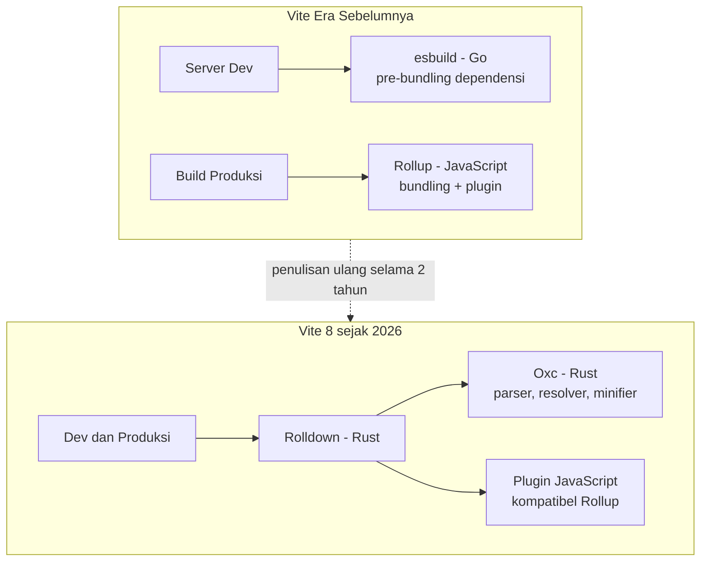

Ada satu momen yang selalu saya perhatikan sebagai penanda betapa mahalnya waktu yang kita buang untuk menunggu: saat mengetik perintah build, lalu mata otomatis berpindah ke jendela lain, membuka sesuatu yang tidak berkaitan, dan ketika kembali — build belum selesai. Tiga menit hilang begitu saja, berkali-kali setiap hari, dikalikan jumlah engineer dalam tim. Itulah konteks penting dari sebuah berita yang bagi banyak orang lewat begitu saja: pada Maret 2026, Vite 8 rilis dengan Rolldown sebagai satu-satunya bundler di dalamnya, menggantikan arsitektur ganda yang dipakainya selama bertahun-tahun, dengan klaim build 10 sampai 30 kali lebih cepat.

Dalam pengumuman resminya, tim Vite menyebut ini sebagai perubahan arsitektur paling signifikan sejak Vite 2. Perubahan itu bukan sekadar angka benchmark. Ini adalah puncak dari sebuah gelombang besar yang telah lama bergerak di bawah permukaan ekosistem JavaScript: penulisan ulang perkakas developer dalam bahasa pemrograman sistem seperti Rust dan Go.

## Dua bundler dalam satu rumah

Untuk memahami kenapa perubahan ini besar, perlu melihat ke belakang. Sejak versi awal, Vite memasang taruhan pragmatis pada dua bundler sekaligus. esbuild — ditulis dalam Go — menangani tahap pengembangan karena kecepatannya, sementara Rollup — ditulis dalam JavaScript — menangani build produksi karena kualitas output dan ekosistem pluginnya yang kaya. Menurut catatan rilis Vite 8, pendekatan ganda ini "melayani mereka dengan baik selama bertahun-tahun", tapi harga yang dibayar tersembunyi: dua pipeline transformasi, dua sistem plugin, dan lapisan lem kode yang terus membesar.

Lem semacam inilah yang pelan-pelan menjadi langit-langit. Setiap fitur baru harus dijembatani dua dunia, dan setiap perbedaan perilaku antara mode pengembangan dan produksi menjadi sumber bug yang paling menyebalkan untuk dilacak — kode berjalan baik saat dev, meledak saat build.

Jawabannya adalah Rolldown, bundler berbasis Rust yang membangun fondasinya di atas Oxc, kumpulan perkakas bahasa JavaScript yang juga ditulis dalam Rust. Perjalanannya tidak instan: rilis publik pertama April 2024, paket preview `rolldown-vite` Mei 2025, menjadi bundler default di Vite 8 beta Desember 2025, hingga akhirnya mencapai versi 1.0 yang stabil pada Mei 2026. Dua tahun penulisan ulang, dan hasilnya kini dinikmati semua pengguna Vite — yang menurut Evan You dalam tulisannya Juni 2026 sudah lebih dari 100 juta unduhan per minggu.

## Gelombang yang lebih besar

Vite hanyalah satu bagian dari cerita. Pola yang sama terjadi hampir di semua lapisan tooling JavaScript.

esbuild memelopori gelombang ini sekitar 2020 dan membuktikan bahwa bundler tidak harus lambat. swc menggantikan Babel di banyak pipeline transformasi. Turbopack membawa pendekatan serupa ke ekosistem Next.js. Di ranah linting, Oxlint mengklaim 50 sampai 100 kali lebih cepat dari ESLint dengan 800+ aturan dan kompatibilitas plugin, sementara Oxfmt mengklaim 30 kali lebih cepat dari Prettier — keduanya bagian dari proyek Oxc. Biome menyusul dengan pendekatan berbeda: linter yang awalnya mampu melakukan type-aware linting tanpa bergantung pada compiler TypeScript, kini tumbuh sampai versi 2.5 dengan 500 aturan lint dan analisis lint lintas berkas.

Lalu ada satu penulisan ulang yang menurut saya paling fenomenal karena sifatnya: TypeScript sendiri. Pada Maret 2025, Anders Hejlsberg mengumumkan port native compiler TypeScript ke Go. Angka-angkanya sulit diabaikan: menjalankan `tsc` pada codebase VS Code seluas 1,5 juta baris turun dari 77,8 detik menjadi 7,5 detik — 10,4 kali lebih cepat. Pada TypeORM, speedup-nya mencapai 13,5 kali. Wikipedia kini mencatat secara lugas: sebelum TypeScript 7.0, compiler-nya ditulis dalam TypeScript dan dikompilasi ke JavaScript; pada TypeScript 7.0, ia ditulis ulang dalam Go.

Menariknya, motivasinya bukan hanya kenyamanan manusia. Hejlsberg menyebut bahwa pengalaman berbasis AI membutuhkan jendela informasi semantik yang besar dengan batas latensi yang jauh lebih ketat. Kode yang lambat hari ini bukan hanya mengganggu engineer — ia membatasi seberapa cerdas asisten coding bisa bekerja.

## Kenapa native bisa secepat itu

Pertanyaan yang jujur perlu dijawab: apa sebenarnya yang dibeli dengan Rust dan Go ini? Evan Wallace, pencipta esbuild, memberikan penjelasan paling jernih yang pernah saya baca tentang topik ini di FAQ esbuild.

Pertama, soal JIT. Aplikasi command-line adalah skenario terburuk bagi bahasa yang di-JIT: setiap kali bundler dijalankan, mesin JavaScript melihat kode bundler untuk pertama kalinya, tanpa cache optimasi, tanpa hint. Wallace merangkumnya dalam satu kalimat yang mengena: sementara esbuild sibuk mem-parsing JavaScript Anda, Node sibuk mem-parsing JavaScript milik bundler-nya sendiri. Kode native tidak punya masalah pemanasan ini.

Kedua, soal paralelisme dan memori. Go dan Rust dirancang dari akar untuk shared-memory concurrency — semua thread berbagi satu heap. JavaScript harus melakukan serialisasi data antar worker thread, dan setiap thread JavaScript punya heap terpisah yang masing-masing perlu di-garbage-collect. Dalam pengujian Wallace, hal ini praktis menggiring separuh core CPU Anda untuk mengurus sampah thread yang lain. Padahal pekerjaan bundling — parsing dan code generation — sangat paralelisabel.

Ketiga, yang sering dilupakan: bahasanya bukan satu-satunya penyebab. Algoritma esbuild memang didesain untuk menjenuhkan semua core yang tersedia. Rust tidak otomatis membuat kode Anda cepat, sama seperti JavaScript tidak otomatis membuat kode lambat. Yang dibeli sebenarnya adalah *hilangnya lantai pengaman yang lebih rendah* — kemampuan untuk mendesain paralelisme agresif tanpa membayar pajak runtime.

## Artinya bagi meja kerja kita

Angka adopsi biasanya lebih meyakinkan daripada benchmark laboratorium. Rolldown 1.0 menyertakan beberapa studi kasus nyata: Ramp memangkas waktu build mereka 57%, Mercedes-Benz.io hingga 38%, dan Beehiiv 64%. Framer dan PLAID disebut sudah memakainya di produksi jauh sebelum 1.0.

Bagi engineer harian seperti saya — kerjanya React dan Node.js — implikasi praktisnya cukup jelas. Upgrade ke Vite 8 kini bukan lompatan menakutkan karena kompatibilitas plugin Rollup adalah prioritas desain sejak hari pertama; mayoritas plugin bekerja tanpa perubahan. Oxlint bisa dicoba berdampingan dengan ESLint di CI untuk mendeteksi dulu, karena kompatibilitas plugin-nya memungkinkan migrasi bertahap. Dan `tsgo` — compiler TypeScript native — layak dipantau karena janjinya bukan cuma build: startup editor yang responsif di codebase besar mengubah cara menjelajah kode.

Ada juga hitungan yang jarang dihitung dengan jujur: biaya menit CI. Bayangkan sepuluh engineer yang masing-masing memicu pipeline build dua puluh kali sehari di berbagai cabang. Jika setiap pipeline memotong empat menit berkat bundler yang lebih cepat, itu berarti lebih dari tiga belas jam waktu komputasi yang hilang setiap hari — sebelum menghitung jam kerja manusia yang menunggu di depan layar. Ketika Beehiiv melaporkan pengurangan waktu build 64%, angka itu bukan sekadar pujian diri di blog rilis; itu penghematan operasional yang berulang setiap hari, setiap minggu, tanpa henti.

Tapi ada pelajaran arsitektur yang lebih halus di sini, dan menurut saya ini bagian paling penting: kunci keberhasilan Rolldown bukan kecepatannya, melainkan kompatibilitasnya. Tim VoidZero sadar betul bahwa memaksa jutaan developer menulis ulang plugin mereka adalah pengalaman migrasi terburuk yang bisa diberikan. Mereka bahkan mendesain hook filter agar plugin JavaScript tidak berada di jalur panas performa. Kecepatan menarik perhatian; kompatibilitas yang mengubahnya jadi adopsi.

## Mulai dari mana, tanpa migrasi besar

Kabar baiknya, gelombang ini bisa dinaiki secara bertahap. Untuk proyek yang masih di Vite 6 atau 7, paket preview `rolldown-vite` pernah disediakan justru untuk ini — mencicipikan Rolldown pada konfigurasi yang ada sebelum berkomitmen upgrade mayor. Sebelum berpindah, inventarisasi plugin yang dipakai dan cocokkan di registry resmi yang diluncurkan bersamaan dengan Vite 8, sebuah direktori plugin yang datanya diambil dari npm setiap hari. Untuk linting, jalankan Oxlint pada subset aturan yang paling sering dilanggar dulu, lalu bandingkan temuannya dengan ESLint sebelum memindahkan pekerjaan. Pola umumnya satu arah: mulai dari jalur paling aman, ukur, baru perluas.

## Sisi yang jarang dibicarakan

Gelombang penulisan ulang ini punya biaya yang tidak muncul di grafik benchmark.

Yang pertama adalah kontribusi. Ketika bundler ditulis dalam JavaScript, siapa pun dari jutaan penggunanya berpotensi jadi kontributor — mereka sudah menguasai bahasanya. Ketika ditulis dalam Rust, kolam kontributor menyusut drastis menjadi mereka yang bersedia mempelajari borrow checker dan model ownership. Wikipedia mencatat Rust memang menjamin memori aman tanpa garbage collector lewat pemeriksaan di waktu kompilasi, tapi kurva belajarnya nyata. Proyek seperti Oxc dan Biome menanggapi dengan menulis dokumentasi internal yang baik, tetapi hambatan masuknya tetap lebih tinggi.

Yang kedua, dan menurut saya lebih menarik: keberlanjutan. Kisah VoidZero menutup satu babak dengan cara yang tidak diramalkan siapa pun. Perusahaan yang didirikan Evan You pada 2023 untuk membangun toolchain terpadu — dan berhasil melakukannya secara teknis — akhirnya mengakui bahwa monetisasi tooling open source terbukti sangat sulit. Eksperimen lisensi campuran untuk Vite+ dibatalkan karena "tidak terasa benar", dan pada Juni 2026 VoidZero resmi bergabung ke Cloudflare, dengan komitmen seluruh proyek tetap open source berlisensi MIT. Sebuah pengingat yang jujur: teknologi yang bagus tidak otomatis berkelanjutan, bahkan ketika dipakai ratusan juta kali per minggu.

Ada juga detail kecil yang berdampak ke ritme instalasi: perkakas native didistribusikan sebagai binary untuk tiap platform — Linux, macOS, Windows, tiap arsitektur prosesor. `npm install` kini menarik paket biner yang tepat untuk mesin Anda alih-alih kode yang bisa dibaca dan di-patch semaunya. Praktis dan cepat, tapi juga menggeser sedikit budaya ekosistem yang selama ini bangga karena semuanya "hanya JavaScript".

Yang ketiga: jangan menjadikan "tulis ulang di Rust" sebagai dogma. esbuild sendiri ditulis dalam Go, begitu juga TypeScript 7, sementara sebagian tooling tetap ditulis JavaScript dan cukup cepat untuk kasusnya. Bahasa yang tepat tergantung pada masalahnya. Yang penting dipahami adalah alasan struktural kenapa untuk perkakas CLI berumur pendek dan padat komputasi, bahasa sistem punya keunggulan bawaan — bukan bahwa satu bahasa menang mutlak atas yang lain.

## Menutup: waktu tunggu adalah biaya budaya

Saya sering berpikir bahwa kecepatan build itu seperti kualitas udara — tidak ada yang memperhatikan saat baik, semua orang terdampak saat buruk. Setiap menit tunggu adalah sedikit konteks yang hilang dari kepala engineer, sedikit dorongan untuk context-switch ke hal lain, sedikit alasan menunda menjalankan tes. Dikalikan frekuensi dan jumlah orang dalam tim, itu bukan lagi soal teknis, tapi soal budaya kerja.

Gelombang Rust dan Go di tooling JavaScript, pada akhirnya, bukan tentang membenci JavaScript. Bahasa itu tetap menjadi bahasa yang kita tulis setiap hari. Yang berubah adalah lapisan di bawahnya — bagian yang tidak perlu kita sentuh tapi menentukan ritme hari kita. Ketika siklus umpan balik memendek dari menit menjadi detik, yang berubah bukan hanya grafik CI, tapi keberanian untuk mencoba. Dan tim yang berani mencoba lebih sering adalah tim yang belajar lebih cepat.

Minggu depan, saat memulai proyek baru atau meng-upgrade yang lama, saya akan menaruh satu pertanyaan tambahan di daftar pertimbangan: berapa lama saya menunggu alat ini bekerja — dan apa yang bisa saya lakukan dengan waktu itu.

## Referensi

1. Vite Team — *Announcing Vite 8* (Vite Blog, 12 Maret 2026) — https://vite.dev/blog/announcing-vite8
2. Yuhao Zhao, sapphi-red, et al. — *Announcing Rolldown 1.0* (VoidZero Blog, 7 Mei 2026) — https://voidzero.dev/posts/announcing-rolldown-1-0
3. Evan You — *VoidZero is Joining Cloudflare* (VoidZero Blog, 4 Juni 2026) — https://voidzero.dev/posts/voidzero-cloudflare
4. Anders Hejlsberg — *A 10x Faster TypeScript* (Microsoft TypeScript DevBlog, 11 Maret 2025) — https://devblogs.microsoft.com/typescript/typescript-native-port/
5. Evan Wallace — *Why is esbuild fast?*, esbuild FAQ — https://esbuild.github.io/faq/
6. Oxc Project — *The JavaScript Oxidation Compiler* — https://oxc.rs/
7. Biome Team — *Biome v2: codename Biotype* (17 Juni 2025) — https://biomejs.dev/blog/biome-v2/
8. Wikipedia — *Rust (programming language)* dan *TypeScript* — https://en.wikipedia.org/wiki/Rust_(programming_language)
