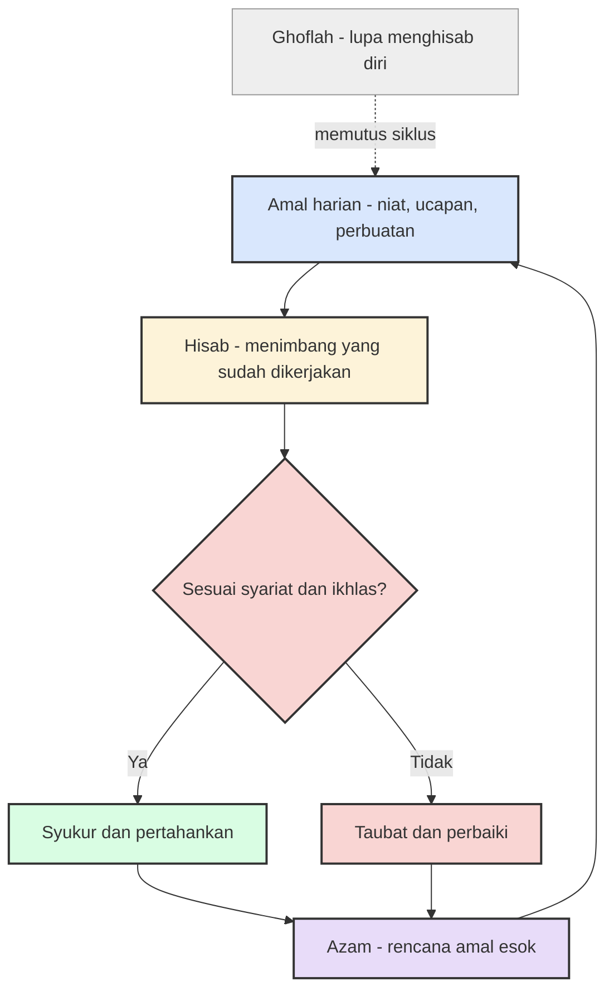

Ada satu warisan kalimat Umar bin Khattab yang tidak pernah kehilangan ketajamannya: "Hisablah diri kalian sebelum kalian dihisab, dan timbanglah diri kalian sebelum kalian ditimbang. Hisab pada hari esok akan terasa lebih ringan bagi kalian jika kalian menghisab diri kalian hari ini." Kalimat yang diriwayatkan Imam Ahmad itu memilih bahasa yang mencolok — bukan bahasa kasih sayang, melainkan bahasa akuntansi. Hisab berarti perhitungan, timbangan berarti meteran presisi. Umar, pemimpin imperium yang pembukuannya rapi, sengaja memakai metafora pembukuan untuk urusan jiwa. Dan pilihan metaforanya itu ternyata jauh lebih presisi daripada sekadar gaya bahasa.

Kita semua terbiasa mengaudit sesuatu. Insinyur memeriksa log sebelum insiden ditutup. Tim produk mengadakan retrospektif di akhir sprint. Perusahaan menutup buku setiap kuartal. Tapi hampir tidak pernah ada proses formal untuk mengaudit satu-satunya pihak yang bertanggung jawab atas semua keputusan itu: diri kita sendiri. Hidup berjalan dari satu deadline ke deadline berikutnya, dan evaluasi atas kualitas niat, ucapan, dan perbuatan kita hari ini biasanya tidak pernah masuk kalender.

Padahal justru di sanalah muhasabah berdiri.

## Bahasa hisab untuk urusan jiwa

Secara harfiah, muhasabah memang berarti penghitungan atau pengauditan — dalam konteks keislaman, menilai diri sendiri atas segala sesuatu yang akan, sedang, dan telah dikerjakan. Yang menarik, para ulama sejak dulu jujur mengakui bahwa istilah ini tidak muncul secara eksplisit dalam Al-Qur'an maupun hadits. Muhasabah adalah bangunan yang mereka konstruksi dari fondasi yang justru lebih tua.

Fondasi pertama adalah QS Al-Hasyr 59:18: "Waltanzur nafsun ma qaddamat lighad" — dan hendaklah setiap jiwa memperhatikan apa yang telah diperbuatnya untuk hari esok. Ibnul Qayyim menafsirkan ayat ini sebagai penanda kewajiban muhasabah: setiap orang dituntut memeriksa amal yang sudah ia panen hari ini, apakah termasuk amal yang menyelamatkan atau amal yang membinasakan. Fondasi kedua adalah QS Al-Qiyamah 75:14, "balil-insanu 'ala nafsihi bashirah" — manusia itu sendiri menjadi saksi yang paling jujur atas dirinya. Dari dua ayat ini, para ulama merumuskan mekanisme audit batin yang kelak menjadi disiplin tersendiri dalam tasawuf.

Rumusannya diperkuat hadits Syaddad bin Aus riwayat Imam Ahmad: "Orang yang cerdas adalah yang menghisab dirinya sendiri, lalu beramal untuk kehidupan setelah kematian. Dan orang yang lemah adalah yang mengikuti hawa nafsunya sambil berangan-angan kepada Allah." Perhatikan strukturnya: kecerdasan di sini bukan definisi IQ, melainkan kemampuan meninjau rekam jejak sendiri dan mengambil keputusan berdasarkan tinjauan itu.

Tokoh yang paling identik dengan praktik ini bahkan membawa namanya dalam julukan: al-Harith al-Muhasibi (781–857 M), ulama Baghdad yang nama belakangnya secara harfiah berarti "si penghisab diri". Ia menulis sekitar dua ratus karya, termasuk *Ri'ayah li Huquqillah* — Memelihara Hak-hak Allah — yang menjadi rujukan disiplin introspeksi dalam Islam. Muridnya, Junayd al-Baghdadi, menjadi salah satu maestro tasawuf terbesar; dan tiga abad kemudian al-Ghazali mengangkat kerangka berpikirnya ke dalam *Ihya' Ulumiddin*. Muhasabah bukan tren pengembangan diri yang datang belakangan; ia adalah salah satu teknologi psikologis tertua yang masih dipakai tanpa putus selama dua belas abad.

## Protokol retrospektif dari seribu tahun lalu

Definisi muhasabah yang paling saya sukai datang dari Al-Mawardi, cendekiawan abad ke-11 yang juga penulis kitab klasik tata negara: "Muhasabah adalah seseorang menelusuri di malam hari segala apa yang ia kerjakan di siang hari. Jika terpuji, ia lanjutkan dan ikuti dengan yang serupa. Jika tercela, ia perbaiki selagi bisa, dan berhenti dari yang seperti itu di masa depan."

Tempelkan kalimat itu di dinding ruang rapat hari ini dan tidak ada seorang pun yang akan curiga. Formatnya identik dengan retrospektif sprint yang dijalankan tim-tim agile di seluruh dunia: apa yang berjalan baik dan perlu dipertahankan, apa yang tercela dan perlu dihentikan, apa tindak lanjutnya. Pertanyaannya sama, hanya objeknya yang berbeda — sprint di ruang rapat, amal di ruang hati.

Kesamaannya berlanjut ke soal waktu. Ibnul Qayyim menganjurkan muhasabah sebelum mengerjakan sesuatu dan sesudahnya. Ibnu Qudamah membaginya menjadi muhasabah pagi — untuk memperkuat niat dan memastikan keikhlasan sepanjang hari — dan muhasabah sore, untuk mengoreksi niat, ucapan, dan perbuatan yang sudah lewat. Sembilan abad kemudian, Donald Schön dalam *The Reflective Practitioner* (1983) membedakan *reflection-in-action* (merenung sambil bekerja) dari *reflection-on-action* (merenung setelah bekerja) — dan buku itu menjadi teks kanonik profesional modern. Peta yang digambar Ibnul Qayyim dan Ibnu Qudamah ternyata mencakup wilayah yang sama.

Siklus lengkapnya kira-kira begini:

Satu kotak di luar siklus perlu diperhatikan: *ghoflah*, kelalaian. Muhasabah yang diabaikan tidak netral — ia membiarkan dosa kecil menumpuk tanpa penanganan, seperti bug kecil yang dibiarkan hingga menumpuk utang teknis. Dalam kedua dunia, kegagalan paling mahal jarang datang dari satu kesalahan besar; ia datang dari akumulasi kesalahan kecil yang tidak pernah direview.

## Apa kata data tentang jeda lima belas menit

Kalau tradisi Islam sudah menjalankan protokol ini selama dua belas abad, pertanyaan yang wajar adalah: apakah refleksi semacam itu memang benar-benar bekerja? Riset modern mengatakan ya, dengan angka yang tidak main-main.

Giada Di Stefano, Francesca Gino, Gary Pisano, dan Bradley Staats menelitinya dalam *Learning by Thinking: How Reflection Improves Performance* (Harvard Business School Working Paper 14-093, 2014). Mereka menjalankan eksperimen lapangan pada karyawan call center dukungan teknis Wipro di Bangalore. Sebagian karyawan diminta menghabiskan lima belas menit terakhir setiap hari kerja untuk menuliskan refleksi atas pelajaran yang mereka petik hari itu. Kelompok kontrol menggunakan lima belas menit yang sama untuk terus bekerja. Hasilnya: kelompok yang berhenti sejenak untuk berpikir mencatat skor tes performa sekitar 23% lebih tinggi. Belajar dari pengalaman ternyata tidak cukup — pengalaman harus dicerna agar berubah menjadi pembelajaran.

Penelitian James Pennebaker dari University of Texas at Austin mengarah ke arah yang sama dari sisi lain. Dalam paradigma *expressive writing* yang ia rintis sejak akhir 1980-an, partisipan diminta menulis sekitar lima belas sampai dua puluh menit per hari tentang pikiran dan perasaan terdalam mereka mengenai pengalaman yang menyulitkan. Studi perdananya bersama Sandra Beall (Journal of Abnormal Psychology, 1986) menunjukkan efek pada kesehatan; studi lanjutannya bersama Janice Kiecolt-Glaser dan Ronald Glaser (Journal of Consulting and Clinical Psychology, 1988) menemukan indikator perbaikan pada fungsi kekebalan tubuh — termasuk respons antibodi yang lebih baik setelah vaksinasi pada mahasiswa yang menuliskan pengalaman stresnya. Kontribusinya diakui luas hingga Pennebaker terpilih menjadi anggota National Academy of Sciences pada 2025.

Ada temuan yang membuat saya berhenti sebentar: mekanisme kerjanya. Menulis memaksa pengalaman yang berantakan di kepala menjalani struktur — awal, tengah, akhir, sebab, akibat. Emosi yang berputar-putar harus diurai menjadi kalimat, dan penguraian itu sendiri sudah separuh penyembuhan. Inilah alasan tradisi muhasabah klasik menuntut catatan tertulis. Renungan yang hanya berputar di kepala terlalu mudah kembali ke pola yang sama; catatan memaksa kita berhadapan dengan rekam jejak yang tidak bisa dinegosiasi.

## Di mana refleksi bisa salah

Ini bukan berarti refleksi selalu aman. Artikel Wikipedia tentang *reflective practice* mencatat peringatan yang jujur: refleksi saja tidak sepenuhnya andal, karena introspeksi dan penilaian diri bisa terdistorsi oleh bias kognitif. Refleksi bekerja paling baik ketika dipadukan dengan analisis kritis, umpan balik dari luar, dan pengetahuan berbasis bukti.

Tradisi Islam tahu risiko ini lebih dulu. Muhasabah tanpa ilmu bisa jatuh ke dua jurang sekaligus: dera diri yang melumpuhkan di satu sisi, atau pembenaran diri yang manis di sisi lain. Karena itu para ulama melengkapi siklusnya dengan dua pengaman. Pertama, kriterianya objektif — Ibnul Qayyim menilai muhasabah berdasarkan kesesuaian amal dengan syariat dan keikhlasan pelakunya, bukan berdasarkan perasaan enak atau tidak enak semata. Kedua, muhasabah wajib ditutup dengan tindak lanjut; ada ungkapan para ulama bahwa tobat berdiri di antara dua muhasabah — muhasabah yang mendahuluinya menuntut tobat itu, dan muhasabah setelahnya menjaganya. Hisab tanpa azam hanya menghasilkan arsip kesalahan.

Industri rekayasa perangkat lunak mempelajari pelajaran yang sama dengan cara yang lebih mahal. Praktik *blameless postmortem* lahir karena postmortem yang mencari orang untuk dihukum menghasilkan laporan yang ditutupi dan insiden yang berulang; postmortem yang mencari akar masalah menghasilkan perbaikan sistem. Muhasabah yang sehat bekerja dengan cara serupa: fokus pada perbaikan niat dan proses, bukan pada penghancuran diri. Menyalahkan diri dengan volume tinggi bukanlah kealusan — itu hanya drama yang memperlambat perbaikan.

## Praktiknya malam ini

Jika mau memulai, protokolnya tidak rumit. Lima belas menit sebelum tidur, dengan pena atau keyboard, melalui tiga pertanyaan yang secara struktur identik dengan retrospektif mana pun:

**Apa saja yang saya kerjakan hari ini?** Daftar amal wajibnya, amal baiknya, dan amal yang meleset — seobjektif mungkin, tanpa langsung membela diri.

**Niat apa yang berdiri di belakangnya?** Ini pertanyaan paling sulit dan paling penting. Rapat yang sama bisa dilalui demi menyelesaikan amanah atau demi terlihat sibuk. Ibnul Qayyim menempatkan keikhlasan sebagai salah satu dari dua kriteria utama hisab, jadi pertanyaan ini tidak bisa dilewati.

**Satu perbaikan konkret untuk besok apa?** Satu saja. Azam yang menggunung pada pukul sebelas malam biasanya mati sebelum jam tujuh pagi. Satu perbaikan yang benar-benar dijalankan esok hari lebih berharga daripada sepuluh resolusi yang menunggu momentum.

Lalu tutup dengan daftar syukur — tiga nikmat hari ini, sespesifik mungkin. Muhasabah yang hanya berisi kesalahan akan cepat terasa seperti ruang interogasi; ia butuh diseimbangkan dengan penghitungan karunia, dan itu juga bagian dari hisab yang jujur.

Sebagai orang yang pekerjaannya menuntut banyak keputusan cepat sepanjang hari, saya perhatikan pola yang konsisten: keputusan yang tidak pernah direview cenderung diulang dengan kualitas yang sama, baik buruknya. Refleksi lima belas menit itu terasa seperti biaya di malam hari, tapi tagihannya jauh lebih murah daripada mengulang kesalahan yang sama selama setahun penuh — di pekerjaan maupun di rumah.

Umar memilih kata hisab dengan sengaja, dan mungkin itulah pesan yang paling relevan hari ini: diri kita adalah aset yang paling jarang diaudit. Setiap tradisi dan setiap data sekarang menunjuk ke arah yang sama — pengalaman yang tidak dihisab tidak otomatis menjadi pembelajaran, dan hari yang tidak direview cenderung diulang tanpa perbaikan. Lima belas menit, tiga pertanyaan, satu azam. Hitunglah sebelum dihitung — karena pada akhirnya, perhitungan itu memang tidak akan pernah bisa ditunda selamanya.

## Referensi

1. "Muhasabah" — Wikipedia Indonesia: https://id.wikipedia.org/wiki/Muhasabah
2. "Muhasabah an-Nafs fi al-Islam" — Wikipedia Bahasa Arab (memuat definisi Ibnul Qayyim, Al-Mawardi, dan al-Muhasibi, serta riwayat Umar bin Khattab dan hadits Syaddad bin Aus): https://ar.wikipedia.org/wiki/محاسبة_النفس_في_الإسلام
3. "Al-Muhasibi" — Wikipedia Bahasa Inggris: https://en.wikipedia.org/wiki/Al-Muhasibi
4. "Reflective practice" — Wikipedia Bahasa Inggris (memuat konsep reflection-in-action dan reflection-on-action dari Donald Schön, 1983): https://en.wikipedia.org/wiki/Reflective_practice
5. "James W. Pennebaker" — Wikipedia Bahasa Inggris: https://en.wikipedia.org/wiki/James_W._Pennebaker
6. Pennebaker, J. W., & Beall, S. K. (1986). *Confronting a traumatic event: Toward an understanding of inhibition and disease*. Journal of Abnormal Psychology, 95(3), 274–281. doi:10.1037/0021-843X.95.3.274
7. Pennebaker, J. W., Kiecolt-Glaser, J. K., & Glaser, R. (1988). *Disclosure of traumas and immune function: Health implications for psychotherapy*. Journal of Consulting and Clinical Psychology, 56(2), 239–245.
8. Di Stefano, G., Gino, F., Pisano, G. P., & Staats, B. R. (2014). *Learning by Thinking: How Reflection Improves Performance*. Harvard Business School Working Paper 14-093: https://papers.ssrn.com/abstract=2414478
9. QS Al-Hasyr 59:18; QS Al-Qiyamah 75:14; hadits Syaddad bin Aus — HR Ahmad.
