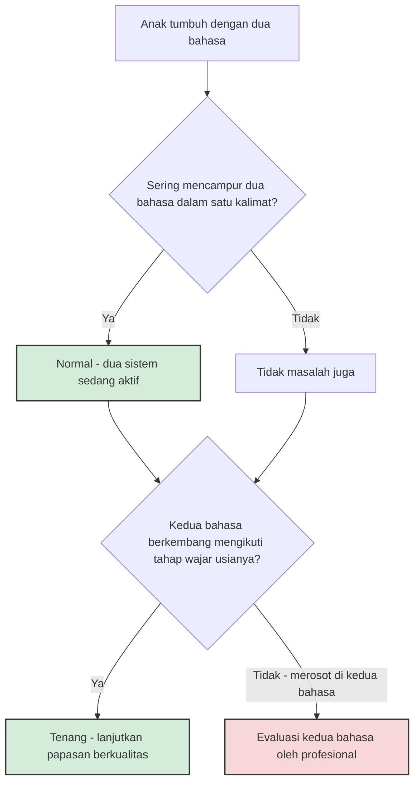

Ada satu keanehan dalam percakapan pengasuhan di Indonesia: kita membahas bilingualisme seolah-olah ia pilihan gaya hidup — sesuatu yang "diterapkan", seperti metode Montessori atau baby-led weaning. Padahal di negara dengan lebih dari 700 bahasa daerah yang masih hidup — sekitar 10% dari seluruh bahasa di dunia — kebanyakan keluarga Indonesia sudah bilingual jauh sebelum istilah itu menjadi bahan seminar parenting. Sensus 2020 mencatat lebih dari 97% penduduk Indonesia lancar berbahasa Indonesia, sementara bahasa ibu sebagian besar orang justru bahasa daerah: Jawa, Sunda, Minangkabau, Bugis, dan ratusan lainnya. Ensiklopedia bebas Wikipedia menyebut fenomena ini dengan lugas: plurilingualisme adalah *norma* di Indonesia.

Jadi pertanyaannya seharusnya bukan "apakah anak saya akan bilingual?" — hampir pasti iya — melainkan "bagaimana saya memahami proses itu dengan benar?" Dan di sinilah masalahnya muncul, karena dua mitos besar beredar paling keras di sekitar kita, dan keduanya sama-sama tidak didukung sains.

## Mitos pertama: dua bahasa membuat anak bingung dan telat bicara

Keyakinan ini bermula dari cara kita mengukur bahasa anak. Selama puluhan tahun, tes perkembangan bahasa dirancang untuk anak monolingual: hitung jumlah kata yang bisa diucapkan anak dalam *satu* bahasa, lalu bandingkan dengan rata-rata. Anak bilingual yang kosakatanya terbagi ke dua bahasa otomatis terlihat "kalah" — padahal kalau kosakata kedua bahasanya dijumlahkan, totalnya sejajar dengan teman sebayanya. Kesalahan ukur ini yang kemudian mengeras menjadi mitos "telat bicara".

Riset dua dekade terakhir telah membongkarnya. Sebuah artikel di *Frontiers in Psychiatry* edisi Maret 2026 karya Castellón dan koleganya menyebutnya sebagai bukti yang *robust*: bilingualisme tidak menghambat perkembangan bahasa — bahkan pada anak dengan autisme. Temuan yang lebih menggigit adalah ini: meski buktinya kuat, banyak tenaga profesional masih menyarankan keluarga multilingual meninggalkan bahasa ibunya dan beralih ke satu bahasa saja. Para peneliti menyebutnya *research-to-practice gap* — jarak antara apa yang diketahui sains dan apa yang dipraktikkan di lapangan. Saran yang tampak bijak itu sebenarnya memutus transmisi budaya antargenerasi dan, lebih parah, merusak saluran komunikasi antara anak dan orang tuanya sendiri.

Bukti itu bahkan berlaku untuk anak dengan tantangan perkembangan. Kay-Raining Bird, Genesee, dan Verhoeven (2016) meninjau penelitian pada anak dengan gangguan bahasa spesifik, autisme, dan sindrom Down: kemampuan komunikasi anak bilingual dengan kondisi tersebut setara dengan anak monolingual pembanding, selama bahasa terkuat si anak (atau keduanya) yang diukur. Kesimpulan praktisnya penting: jika seorang anak mengalami keterlambatan bahasa, penyebabnya hampir tidak pernah jumlah bahasanya — dan penanganan yang tepat adalah evaluasi yang menilai *kedua* bahasanya, bukan memotong salah satunya.

Lalu bagaimana dengan kebiasaan anak mencampur dua bahasa dalam satu kalimat — "mama, saya mau *milk* dulu"? Bukan kebingungan. Riset akuisisi bahasa pertama menunjukkan campuran semacam itu bersifat sistematis: anak sedang menarik dari dua sistem yang sama-sama aktif, sering kali karena satu kata lebih "tersedia" di satu bahasa. Anak-anak bilingual yang berinteraksi dengan penutur kedua bahasa itu sendiri akan menyesuaikan pilihan bahasanya dengan lawan bicaranya. Itu bukan tanda sistem yang rusak, melainkan tanda dua sistem yang hidup.

## Mitos kedua: dua bahasa membuat anak lebih pintar

Kalau mitos pertama merugikan, mitos kedua ini terasa menggembirakan — dan justru karena itu lebih halus. Buku-buku populer dan iklan sekolah bahasa gemar mengklaim bilingualisme melatih fungsi eksekutif otak, membuat anak lebih fokus, lebih multitasking, sampai menunda demensia. Klaim ini lahir dari penelitian nyata, terutama karya-karya awal Ellen Bialystok. Masalahnya, ketika sains menguji ulang dengan skala besar, gambarannya berubah.

Meta-analisis Lehtonen dan koleganya (2018) di *Psychological Bulletin* mengumpulkan 152 studi — 891 ukuran efek — membandingkan dewasa bilingual dan monolingual di enam domain fungsi eksekutif. Sebelum dikoreksi bias publikasi, tampak keunggulan sangat kecil pada inhibisi, peralihan, dan memori kerja. Setelah dikoreksi? Tidak ada keunggulan yang tersisa. Menariknya, justru ada sedikit *kerugian* pada kelancaran verbal — masuk akal, karena papasan dan penggunaan tiap bahasa terbagi dua. Kesimpulan tinjauan itu terang-terangan: bukti yang ada tidak mendukung anggapan luas bahwa bilingualisme memberi keuntungan kognitif pada orang dewasa.

Apakah ini berarti membesarkan anak dengan dua bahasa sia-sia? Tidak. Manfaatnya nyata, hanya bukan berbentuk poin IQ. Manfaatnya komunikatif, kultural, dan — mengejutkannya — ekonomi. Tinjauan di Wikipedia merangkum bahwa peneliti memperkirakan multilingualisme menambah sekitar 10% PDB Swiss, dan studi O. Agirdag di Amerika Serikat menemukan pekerja bilingual berpenghasilan sekitar 3.000 dolar lebih tinggi per tahun dibanding monolingual. Bagi anak, manfaat paling dekat justru yang paling sering dilupakan: kemampuan bercakap-cakap dengan kakek-neneknya sendiri, memahami leluhur, dan memiliki akses ke dua dunia budaya sekaligus.

Jadi kalau Anda menemukan diri Anda berpikir dua bahasa sebagai proyek prestasi anak — berhenti sejenak. Sains berkata klaim "lebih pintar" itu rapuh; klaim "lebih terhubung" jauh lebih kokoh.

Ironisnya, di Indonesia dua mitos ini sering bekerja sama dengan cara yang menyakitkan. Di kota-kota besar, tidak sedikit keluarga yang panik agar anak "tidak kalah" berbahasa Inggris — rela menyerahkan balita ke layar dan kelas — sementara bahasa daerah yang justru sudah hidup di rumah dan kampung halaman ditunda terus: "nanti saja, biar tidak bingung." Padahal yang pertama (bahasa lewat layar) terbukti tidak efektif tanpa interaksi, dan yang kedua (kebingungan) terbukti mitos. Kita rela membayar mahal untuk yang tidak bekerja, dan menunda gratis untuk yang sebenarnya bekerja. Riset Ramirez dan koleganya menyebut hilangnya bahasa warisan keluarga ini sebagai hal yang bisa dicegah — dan pencegahannya dimulai dari satu hal: apakah orang tua menganggap bahasa itu layak dipertahankan.

## Sejak kapan dua bahasa diperkenalkan?

Literatur membedakan dua jalur. *Simultan*: dua bahasa hadir sejak lahir, misalnya ayah berbahasa Jawa dan ibu berbahasa Sunda, atau rumah berbahasa daerah dan dunia luar berbahasa Indonesia. *Sekuensial*: bahasa kedua datang kemudian, misalnya saat masuk TK atau pindah kota. Keduanya sah, keduanya berhasil di jutaan keluarga — anak-anak di seluruh dunia menempuh keduanya setiap hari.

Yang beda adalah bentuk hasilnya. Jendela paling peka ada di bunyi bahasa (fonologi): bayi lahir mampu membedakan bunyi semua bahasa dunia, dan antara usia 6–12 bulan kemampuan itu menyempit mengikuti bahasa yang mereka dengar — ini temuan yang menjadi fondasi eksperimen Kuhl di bawah. Karena itu aksen penutur asli memang paling mudah "tertanam" sejak dini. Tapi tahu apa? Kosakata dan tata bahasa tidak pernah menutup tokonya — orang dewasa bisa dan terus belajar bahasa baru sampai tua. Jadi "terlambat" pada anak kecil hampir selalu soal aksen dan kefasihan akhir, bukan soal mustahil. Kriteria yang jauh lebih menentukan bukan usia, melainkan konsistensi papasan: bahasa yang hadir setiap hari akan tumbuh; bahasa yang hadir sesekali akan tersapu oleh yang lebih sering.

## Yang benar-benar menentukan: papasan dari manusia yang hidup

Kalau dua mitos itu tersingkir, apa yang sebenarnya membedakan anak bilingual yang berkembang baik? Jawabannya sederhana dan menuntut sekaligus: kualitas dan kuantitas papasan dari manusia sungguhan.

Eksperimen klasik Patricia Kuhl, Tsao, dan Liu (2003) di *PNAS* adalah bukti paling elegan untuk ini. Bayi Amerika berusia 9 bulan — usia ketika kemampuan membedakan bunyi bahasa asing mulai menurun — dibagi beberapa kelompok. Kelompok pertama mengikuti 12 sesi bermain bersama penutur asli bahasa Mandarin: dibacakan cerita, diajak bermain, dalam interaksi sosial sungguhan. Hasilnya, kemampuan mereka membedakan fonem Mandarin melonjak, menyamai bayi yang membesar di Taiwan. Kelompok kedua mengonsumsi materi dan penutur yang *sama persis*, tapi lewat rekaman video atau audio. Hasilnya: nol. Tidak ada efek apa pun.

Kuhl menyebut mekanisme ini *social gating*: belajar bahasa pada bayi melewati pintu interaksi sosial — kontak mata, giliran bersuara, responsivitas. Rekamannya secanggih apa pun tidak bisa mengetuk pintu itu. Bagi saya, temuan ini adalah penampol paling halus untuk industri "kelas bahasa Inggris untuk balita" berbasis video: tanpa manusia yang benar-benar berinteraksi dengan anak, kita sedang memutar rekaman ke pintu yang tidak akan terbuka.

Dua hal lain yang terbukti menentukan. Pertama, kuantitas: tiap bahasa butuh "waktu terbang" yang cukup. Bahasa yang hanya muncul dua jam seminggu di kelas tidak akan tumbuh seimbang dengan bahasa yang dipakai sehari-hari di rumah. Kedua, sikap orang tua. Studi Ramirez dan koleganya (2026) menunjukkan persepsi orang tua terhadap bilingualisme berpengaruh pada seberapa aktif anak memakai tiap bahasa dan seberapa mahir ia menguasainya — dan hilangnya bahasa warisan keluarga sebenarnya bisa dicegah. Anak membaca dari kita apakah sebuah bahasa layak dipakai dengan bangga, atau disembunyikan karena dianggap menghambat.

Bagaimana menyikapinya sehari-hari? Alurnya kira-kira begini:

Dari alur itu, beberapa keputusan praktis mengikuti dengan sendirinya. Gunakan bahasa yang paling Anda kuasai dan nyaman — input yang kaya dan hangat dari bahasa ibu lebih berharga daripada input kaku dari bahasa yang kita sendiri goyah. Beri ruang yang jelas bagi tiap bahasa, apa pun bentuknya: satu orang satu bahasa, rumah versus luar rumah, atau hari untuk bahasa daerah. Jangan menghukum campuran — ia akan rapi dengan sendirinya seiring bertambahnya usia. Dan ketika membandingkan anak dengan teman sebayanya, bandingkan total kosakatanya di kedua bahasa, bukan di satu bahasa saja.

Soal buku dan layar, temuan *social gating* tadi punya konsekuensi yang jelas. Kalau anak menonton video bahasa Inggris, dampingi dan ajak bicara tentang apa yang dilihatnya — giliran percakapan itulah, bukan videonya, yang sedang membangun bahasa. Dan buku tetap teknologi terbaik yang pernah diciptakan untuk input bahasa: kosakata terstruktur, konteks kaya, plus pangkuan orang tua yang membuatnya bersifat sosial. Membaca buku cerita dalam bahasa daerah sebelum tidur, bagi banyak keluarga, adalah cara paling murah dan paling ampuh untuk memastikan bahasa itu punya "waktu terbang" setiap hari.

Sebagai penutup, satu hal yang makin saya percaya: bahasa pada akhirnya bukan soal kosakata atau kecerdasan, melainkan soal *dengan siapa* anak bisa berhubungan. Dua bahasa berarti dua keluarga yang bisa diajak bicara, dua kumpulan cerita yang bisa masuk, dua cara merasa dirumahkan oleh dunia. Sebagai ayah, saya tidak ingin anak-anak mewarisi bahasa sebagai daftar prestasi — saya ingin mereka mewarisinya sebagai pintu. Dan sains, dengan jujur, membenarkan prioritas itu.

## Referensi

1. Kuhl, P. K., Tsao, F. M., & Liu, H. M. (2003). Foreign-language experience in infancy: Effects of short-term exposure and social interaction on phonetic learning. *PNAS*, 100(15), 9096–9101. https://doi.org/10.1073/pnas.1532872100
2. Lehtonen, M., Soveri, A., Laine, A., Järvenpää, J., de Bruin, A., & Antfolk, J. (2018). Is bilingualism associated with enhanced executive functioning in adults? A meta-analytic review. *Psychological Bulletin*, 144(4), 394–425. https://doi.org/10.1037/bul0000142
3. Kay-Raining Bird, E., Genesee, F., & Verhoeven, L. (2016). Bilingualism in children with developmental disorders: A narrative review. *Journal of Communication Disorders*, 63, 1–14. https://doi.org/10.1016/j.jcomdis.2016.07.003
4. Castellón, F. A., Gómez, L. R., & Ramos-Gallardo, T. (2026). Beyond the bilingualism myth: Toward culturally sustaining autism interventions for multilingual families. *Frontiers in Psychiatry*, 17, 1767278. https://doi.org/10.3389/fpsyt.2026.1767278
5. Ramirez, A. C., dkk. (2026). A community-based participatory research approach to evaluating perceptions of bilingualism among Latino parents of autistic children. *First Language*. https://doi.org/10.1177/01427237251407502
6. Wikipedia — *Multilingualism*. https://en.wikipedia.org/wiki/Multilingualism
7. Wikipedia — *Languages of Indonesia*. https://en.wikipedia.org/wiki/Languages_of_Indonesia
