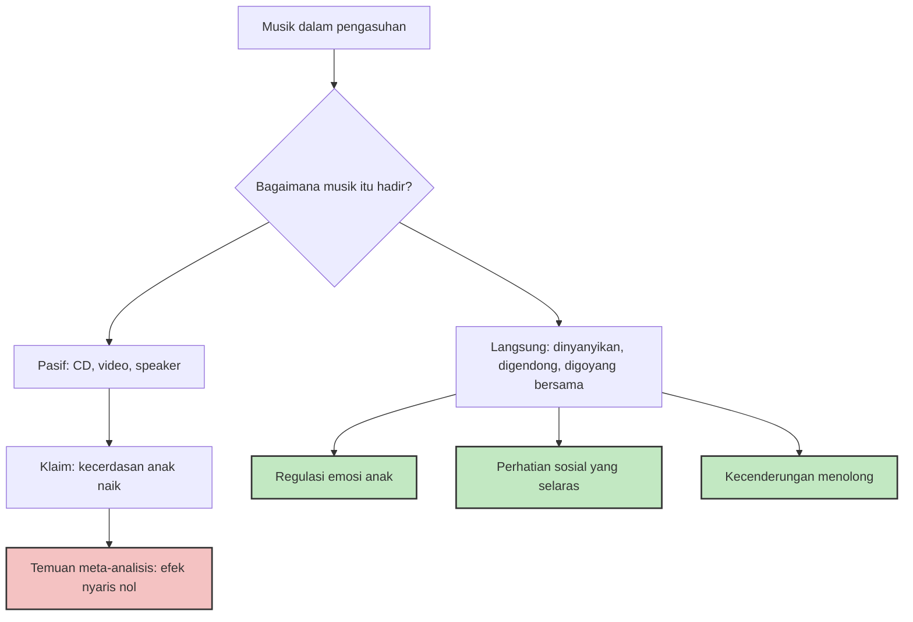

Pada 1998, pemerintah negara bagian Georgia, Amerika Serikat, mengusulkan anggaran agar setiap bayi yang lahir di sana menerima satu keping CD atau kaset musik klasik. Ide itu lahir dari keyakinan bahwa mendengarkan Mozart sejak dini akan membuat anak lebih pintar. Keyakinan tersebut berdiri di atas satu penelitian kecil — yang subjeknya bukan bayi, melainkan 36 mahasiswa kuliah.

Itu mungkin salah satu contoh terbaik tentang bagaimana satu temuan sains bisa membesar menjadi industri. Sebagai orang tua yang juga pemain piano, saya penasaran: kalau klaim "musik bikin anak cerdas" sudah luntur, lalu apa yang benar-benar ditawarkan musik kepada anak? Ternyata jawabannya jauh lebih menarik daripada mitosnya.

## Dari 15 menit pada mahasiswa menjadi industri miliar dolar

Kisahnya dimulai pada 1993, ketika Frances Rauscher, Gordon Shaw, dan Catherine Ky memublikasikan hasil eksperimen di jurnal *Nature*. Partisipan mereka diminta mendengarkan salah satu dari tiga kondisi: Sonata Dua Piano D-major K. 448 karya Mozart, instruksi relaksasi verbal, atau keheningan. Setelahnya, mereka mengerjakan subtes penalaran spasial dari Stanford-Binet. Hasilnya: skor sedikit lebih tinggi setelah mendengarkan Mozart — dan efeknya menguap dalam sekitar 15 menit. IQ secara keseluruhan tidak pernah diukur, dan yang diuji jelas bukan bayi.

Tekanan pers kemudian melakukan sisanya. Kolom di *New York Times* tahun 1994 menyimpulkan bahwa "mendengarkan Mozart benar-benar membuat Anda lebih pintar". Buku *The Mozart Effect* karya Don Campbell (1997) melengkapinya dengan rekomendasi memainkan musik klasik pilihan untuk bayi. Waralaba Baby Einstein lahir di era yang sama, dengan video *Baby Mozart* yang dirancang mengikuti gelombang klaim tersebut. Negara bagian Georgia dengan serius membelanjakan uang publik untuk CD klasik.

Meta-analisis yang menyusul mendinginkan semuanya. Kajian Pietschnig, Voracek, dan Formann (2010) yang menghimpun puluhan studi replikasi menyimpulkan bahwa bukti efek khusus Mozart pada penalaran spasial nyaris tidak ada. Rauscher sendiri berkali-kali menegaskan bahwa temuannya tidak berlaku untuk kecerdasan umum.

Yang jarang dikisahkan ulang: mitos ini tidak berhenti pada mendengarkan pasif. Versi besarnya — "les piano biar otaknya terlatih, matematikanya bagus" — juga goyah. Sala dan Gobet (2020) melakukan meta-analisis bertingkat terhadap 254 studi dengan total hampir 7.000 anak. Begitu kualitas desain penelitian dikontrol, efek pelatihan musik terhadap keterampilan kognitif umum dan prestasi akademik adalah nol. Bukan kecil — nol.

## Lalu mengapa lullaby ada di semua budaya?

Kalau musik tidak menaikkan IQ, mengapa hampir semua peradaban manusia mengembangkan nyanyian pengantar tidur? Mengapa nenek moyang kita yang tidak saling kenal, tersebar di benua berbeda, mengarang lagu dengan resep yang nyaris sama?

Riset tentang lullaby memberi petunjuk yang rapi. Di lintas budaya, nyanyian pengantar tidur berbagi sejumlah fitur akustik: tempo lambat, interval konsonan, kontur nada sederhana, dan meter tiga yang memberi sensasi mengayun — konon meniru gerakan yang dirasakan bayi di dalam rahim. Bayi terbukti lebih menyukai suara manusia tanpa iringan instrumen dibandingkan versi yang diorkestrasi.

Bukan cuma itu. Sebuah studi besar yang terbit di *Science* (Mehr dkk., 2019) menganalisis ratusan rekaman nyanyian vokal dari masyarakat-masyarakat yang tersebar di praktis seluruh kawasan dunia, lalu mengujinya ke pendengar dari budaya lain. Hasilnya: orang bisa menebak fungsi sebuah lagu — untuk menari, untuk menyembuhkan, untuk memadu, atau untuk menidurkan anak — hanya dari melodinya, tanpa lirik, tanpa konteks, meski lagu itu berasal dari budaya yang sama sekali asing. Kalau ada satu kategori yang paling mudah dikenali, nyanyian bayi selalu masuk kandidatnya. Ada semacam tanda tangan universal dalam musik yang dimaksudkan untuk menenangkan anak, dan otak manusia di mana pun dibekali kemampuan membacanya.

Artinya lullaby bukan hiburan, melainkan teknologi pengasuhan yang diwariskan lintas generasi. Dan mekanisme kerjanya baru mulai dipetakan sepuluh tahun terakhir ini.

## Suara Anda adalah sistem umpan balik

Di sinilah temuan-temuan terbaru berbeda total dari mitos CD Mozart. Miriam Lense dan koleganya di Vanderbilt serta Emory University (2022) memublikasikan studi di *PNAS* yang menunjukkan bahwa ketika orang tua menyanyi langsung untuk bayinya, sesuatu yang presisi terjadi: bayi berusia dua bulan sudah menyinkronkan pandangan matanya ke ritme nyanyian itu — menatap mata si penyanyi tepat pada ketukan — dan efek ini menguat dua kali lipat pada usia enam bulan. Orang tuanya pun ikut berubah: ekspresi positif melebar, gerakan mata menenangkan, kedipan berkurang, semuanya terkunci ke ritme yang sama, pada detik-detik ketika bayi justru menatap lebih banyak.

Kalau saya boleh meminjam bahasa kerja saya: musik yang direkam adalah siaran satu arah, sedangkan bernyanyi langsung adalah sistem dengan umpan balik. Bedanya bukan pada kualitas audionya — justru sering sebaliknya, suara kita false dan lupa lirik — melainkan pada *kontingensi*: respons yang tepat waktu dari satu sistem hidup ke sistem hidup lain. Yang melatih otak bayi bukan gelombang suara Mozart, melainkan sinkronisasi sosial berlapis yang menumpang di atasnya.

Temuan ini bukan satu-satunya. Review sistematis dari University of Auckland (Sharman dkk., 2023) yang menghimpun 21 studi menyimpulkan bahwa bernyanyi langsung oleh orang tua berdampak pada tiga arah sekaligus: regulasi emosi bayi, validasi peran orang tua yang menyanyi, dan penyesuaian afektif di antara keduanya. Perhatikan bahwa orang tua ikut menjadi objek manfaat — ini penting, karena pengasuhan bukan hanya soal mengoptimalkan anak, tapi juga menjaga orang yang merawatnya. Satu catatan jujur dari review yang sama: temuan paling konsisten datang dari bayi cukup bulan yang sehat, sementara untuk bayi prematur hasilnya masih campur aduk — pengingat bahwa sains pengasuhan jarang memberi jawaban mulus untuk semua konteks.

Ada pula temuan yang lebih mengejutkan. Laura Cirelli dan Laurel Trainor di McMaster University meneliti bayi usia 14 bulan yang digendong dan digoyangkan mengikuti musik, menghadap seorang eksperimenter yang bergoyang selaras — atau tidak selaras. Setelahnya, benda-benda milik eksperimenter "sengaja" dijatuhkan. Bayi yang bergoyang *selaras* dengannya jauh lebih rela menolong mengambilkannya. Efeknya spesifik pada orang yang dia sinkron dengannya, bukan pada orang asing mana pun. Bergerak bersama dalam irama, sedini itu, ternyata menjadi petunjuk bagi siapa "kita" — dan kepada siapa kebaikan selayaknya ditujukan.

## Bagaimana dengan les musik?

Satu bagian dari cerita ini baru menyusul belakangan dan menambah nuansa. Meta-analisis terbaru oleh Kevin Jamey dan kolega (2024) di jurnal *Cognition*, menghimpun 22 studi longitudinal termasuk 8 uji coba acak, menemukan bahwa pelatihan musik sungguhan memperbaiki satu hal spesifik: *inhibitory control* — kemampuan menahan impuls, komponen fungsi eksekutif yang menjadi fondasi pengaturan diri. Ukuran efeknya moderat hingga besar pada uji coba acak, dan musik tampaknya unggul dibandingkan olahraga, seni visual, atau drama untuk manfaat spesifik ini.

Ini tidak bertentangan dengan Sala dan Gobet. Bacaan jujurnya begini: pelatihan musik tidak akan mengubah anak menjadi jenius matematika, tetapi berlatih instrumen — yang menuntut memantau gerakan tangan, mendengarkan, dan menunda keinginan mempercepat — adalah sarang latihan pengaturan diri yang jarang ditandingi aktivitas lain. Ditambah satu hal yang tidak masuk metrik mana pun: anak yang belajar musik memiliki musik.

Survei terbaru yang dipimpin Angeline Dou bersama Cirelli (2025) pada ribuan orang tua juga mengonfirmasi hal yang masuk akal: repertoar lagu yang dipakai orang tua di rumah itu kecil, berulang, dan sangat personal. Anak tidak butuh kurasi playlist yang canggih; mereka butuh lagu-lagu yang sama, dinyanyikan orang yang sama, sampai lagu itu menjadi milik mereka.

## Apa artinya bagi kita yang tidak bisa menyanyi

Saya salah satu orang yang sampai sekarang masih senang duduk di depan piano, dan jujur saja, satu-satunya alasan saya masih memainkannya sampai sekarang bukan karena manfaat kognitifnya — data di atas dengan jujur mengatakan manfaat itu tidak sebesar yang diiklankan. Saya memainkannya karena hubungan dengan musik itu sendiri adalah barang konsumsi seumur hidup. Kalau ada yang saya harapkan bisa diwariskan ke anak-anak, bukan keterampilan bermain, melainkan rasa bahwa musik adalah tempat yang bisa didatangi siapa saja, kapan saja, tanpa syarat.

Bagaimana ini diterjemahkan ke praktik sehari-hari?

Musik rekaman boleh terus diputar — sebagai latar, sebagai kesenangan, sebagai pengenalan. Tidak ada yang salah dengan speaker. Yang keliru hanyalah menganggapnya sebagai suplemen otak, karena buktinya memang tidak mendukung klaim itu.

Bagian yang tidak bisa di-outsourcing-kan adalah suara sendiri. Nyanyikan saja — off-key pun tidak masalah, karena bayi tidak menilai pitch; yang mereka baca adalah kehadiran, ritme, dan responsivitas. Gendong, ayun, tepuk tangan bersama. Temuan Cirelli tentang goyangan selaras bisa dibaca sebagai izin ilmiah untuk menari konyol bersama anak di ruang tengah.

Sementara les musik adalah keputusan yang sah begitu anak sendiri menunjukkan ketertarikan pada sebuah instrumen — bukan demi nilai rapor, tapi demi pengaturan diri dan, lebih penting, demi musik itu sendiri. Ketertarikan yang tumbuh dari dalam cenderung bertahan; pelatihan formal yang dipaksakan sebagai proyek optimasi biasanya hanya bertahan sampai anak menemukan cara membencinya.

Dan satu catatan terakhir yang saya kira layak ditebalkan: dari semua temuan di atas, yang paling sering saya pikirkan justru temuan University of Auckland bahwa bernyanyi untuk anak juga menguatkan orang tuanya. Di fase hidup ketika waktu terasa seperti kebocoran di mana-mana, ide bahwa lima menit menyanyikan lagu yang sama untuk kesekian kalinya sedang memberi manfaat dua arah — untuk anak dan untuk saya — terasa seperti kabar baik yang tidak perlu dibeli dalam bentuk CD apa pun.

Mitos Mozart menjual harapan bahwa orang tua cukup menjadi pemutar musik. Sains yang sebenarnya menawarkan sesuatu yang lebih tua dan lebih murah: suara Anda sendiri, secara langsung, berulang-ulang. Itu instrumen yang tidak dijual di toko mana pun, dan sudah Anda bawa pulang sejak hari pertama.

## Referensi

1. Rauscher, F. H., Shaw, G. L., & Ky, K. N. (1993). *Music and spatial task performance*. Nature, 365, 611. doi:10.1038/365611a0
2. Pietschnig, J., Voracek, M., & Formann, A. K. (2010). *Mozart effect–Shmozart effect: A meta-analysis*. Intelligence, 38(3), 314–323.
3. Wikipedia — *Mozart effect* (riwayat populerisasi, usulan anggaran Georgia, dan Baby Einstein): https://en.wikipedia.org/wiki/Mozart_effect
4. Sala, G., & Gobet, F. (2020). *Cognitive and academic benefits of music training with children: A multilevel meta-analysis*. Memory & Cognition, 48(8), 1429–1441. PMID 32728850
5. Jamey, K., Foster, N. E. V., Hyde, K. L., & Dalla Bella, S. (2024). *Does music training improve inhibition control in children? A systematic review and meta-analysis*. Cognition, 252, 105913. PMID 39197250
6. Lense, M. D., Shultz, S., Astésano, C., & Jones, W. (2022). *Music of infant-directed singing entrains infants' social visual behavior*. PNAS, 119(45), e2116967119. PMID 36322755
7. Sharman, K. M., Meissel, K., Tait, J. E., Rudd, G., & Henderson, A. M. E. (2023). *The effects of live parental infant-directed singing on infants, parents, and the parent-infant dyad: A systematic review*. Infant Behavior and Development, 72, 101859. PMID 37343492
8. Cirelli, L. K., Einarson, K. M., & Trainor, L. J. (2014). *Interpersonal synchrony increases prosocial behavior in infants*. Developmental Science, 17(6), 1003–1011. PMID 25513669
9. Dou, A., & Cirelli, L. K. (2025). *The Active Infant's Developing Role in Musical Interactions: Insights From an Online Parent Questionnaire*. Infancy, 30(1), e12648. PMID 39780293
10. Mehr, S. A., Singh, M., Knox, D., et al. (2019). *Universality and diversity in human song*. Science, 366(6468), eaax0868. doi:10.1126/science.aax0868
11. Wikipedia — *Lullaby* (karakteristik akustik lintas budaya dan preferensi bayi): https://en.wikipedia.org/wiki/Lullaby
