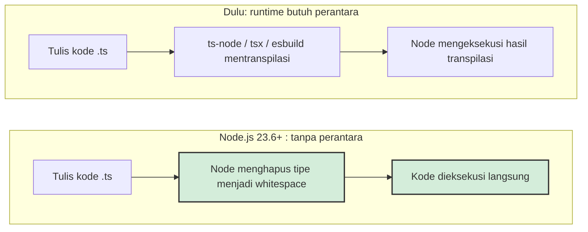
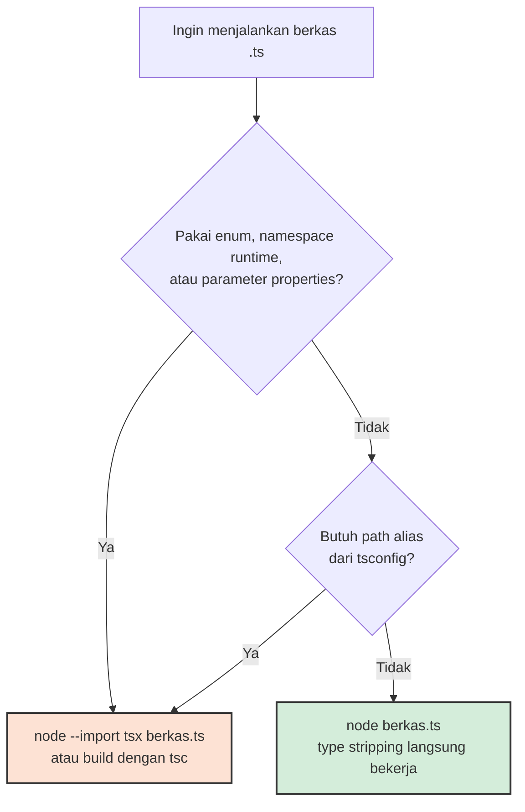

Selama hampir satu dekade, ada satu ritual yang tidak pernah absen di awal proyek Node.js yang ditulis dengan TypeScript: memasang perantara. Dulu namanya ts-node, lalu orang beralih ke tsx; kadang cukup esbuild atau swc dengan sedikit lem perekat. Ritualnya selalu sama — kita menulis berkas `.ts`, lalu membayar semacam pajak build sebelum kode itu boleh disentuh runtime. Untuk aplikasi besar dengan pipeline matang, pajak ini wajar. Tapi untuk skrip harian, prototipe cepat, atau orang yang baru belajar, biayanya sering terasa lebih besar daripada manfaatnya.

Maka perubahan yang masuk ke Node.js 23.6 pada awal 2025 layak mendapat perhatian lebih dari yang sempat ia dapat: sejak versi itu, `node server.ts` — perintah yang bertahun-tahun dianggap mustahil — langsung berjalan, tanpa flag apa pun. Menurut riwayat versi di dokumentasi resmi Node.js, fitur yang disebut *type stripping* ini mulai diperkenalkan eksperimental di v22.6.0, diaktifkan secara default di v23.6.0, dinyatakan stabil di v25.2.0 sekaligus di-backport ke v24.12.0, dan di Node.js 26 flag eksperimental `--experimental-transform-types` resmi dihapus dari codebase. Per akhir Agustus 2026, blog resmi Node.js mencatat versi Current sudah berada di 26.8.1, sementara 24.20.0 duduk sebagai LTS. Singkatnya: menjalankan TypeScript langsung di Node bukan lagi eksperimen. Itu perilaku bawaan yang stabil.

Tapi sebelum kita mengubur ts-node terlalu dalam, ada satu prinsip yang perlu dipahami betul-betul, karena dari situ seluruh desain fitur ini mengalir.

## Node Tidak Mengompilasi TypeScript — Node Menghapusnya

Cara kerja type stripping bukanlah "tsc diselinapkan ke dalam Node". Dokumentasi Node menjelaskan mekanismenya dengan gamblang: anotasi tipe diganti dengan *whitespace*, lalu kode dijalankan apa adanya. Tidak ada konversi sintaks, tidak ada modul yang diubah bentuk, tidak ada berkas JavaScript hasil kompilasi yang ditulis ke folder `dist`. Pekerjaan penghapusan ini ditangani oleh Amaro, pustaka Node yang membungkus parser SWC. Dan ada satu konsekuensi teknis yang cukup elegan: karena posisi setiap karakter tidak berubah — hanya ditimpa spasi — nomor baris di stack trace tetap akurat tanpa perlu source map sama sekali.

Konsekuensi lainnya dijelaskan dengan jujur di dokumentasi yang sama: **tidak ada pemeriksaan tipe saat runtime**. Node tidak memverifikasi tipe Anda; Node hanya menelan sintaksnya. Objek `User` yang salah struktur tidak akan membuat Node keberatan, karena bagi Node anotasi tipe itu memang tidak pernah ada. Verifikasi tetap menjadi tugas `tsc`, dan pola yang dulu biasa hanya di dunia Deno kini menjadi lazim di Node: `tsc --noEmit` untuk memeriksa, `node` untuk mengeksekusi. Pembagian kerjanya bersih — kompiler memeriksa, runtime menjalankan, dan keduanya tidak lagi dipaksa saling menunggu di satu pipeline.

Supaya konkret, beginilah perbedaan antara yang Anda tulis dan yang benar-benar dieksekusi Node:

```ts
// pengguna.ts — yang Anda tulis
interface Pengguna {
  id: number;
  nama: string;
}

function sapa(pengguna: Pengguna): string {
  return `Halo, ${pengguna.nama}`;
}

const tamu: Pengguna = { id: 1, nama: 'Aisyah' };
console.log(sapa(tamu));
```

Setelah type stripping, baris `interface` tinggal baris kosong, dan yang tersisa secara efektif adalah JavaScript biasa:

```js
function sapa(pengguna) {
  return `Halo, ${pengguna.nama}`;
}

const tamu = { id: 1, nama: 'Aisyah' };
console.log(sapa(tamu));
```

Tidak ada sulap. Justru karena tidak ada sulap, perilakunya mudah diprediksi — dan mudah dijelaskan ke rekan tim yang baru bertanya "sebenarnya Node menjalankan apa?"

## Kontrak Erasable Syntax

Pendekatan "hapus saja" menuntut satu kontrak yang ketat: semua sintaks TypeScript yang Anda tulis harus benar-benar *bisa dihapus* tanpa meninggalkan jejak runtime. Dokumentasi Node menyebut prinsip ini sebagai syarat *erasable syntax*. Kabar baiknya, mayoritas fitur tipe lolos: interface, generic, anotasi parameter, tipe union, bahkan `namespace` yang hanya menampung tipe. Kabar buruknya, fitur yang menuntut kompilator *menghasilkan* kode JavaScript baru akan ditolak dengan error `ERR_UNSUPPORTED_TYPESCRIPT_SYNTAX`.

Yang paling terasa adalah `enum`. Untuk membuat enum, kompilator harus membangkitkan objek nyata di kode output — itu transformasi, bukan penghapusan. Nasib yang sama menimpa `namespace` yang berisi nilai runtime, *parameter properties* di constructor class, dan *import aliases*. Dekorator juga ditolak, dan alasannya justru menarik: dekorator masih usulan Stage 3 di TC39, dan Node menyatakan tidak akan menyediakan polyfill — dekorator baru didukung setelah benar-benar menjadi JavaScript native. Ini adalah posisi yang konsisten: runtime menjalankan standar, bukan menebak-nebak masa depan bahasa.

Untungnya, hampir semua yang ditolak punya pengganti yang justru lebih idiomatik. Kebutuhan enum hampir selalu terlayani oleh union tipe string:

```ts
// ditolak runtime: enum membangkitkan objek
enum Peran { Admin, Editor, Pembaca }

// erasable: berjalan langsung di Node
type Peran = 'admin' | 'editor' | 'pembaca';
```

Bentuk kedua bukan kompromi murahan. Ia lebih ketat diperiksa oleh `tsc`, lebih murah dibaca debugger, dan muncul apa adanya di log. Migrasi kecil semacam ini sering kali memperbaiki kode, bukan sekadar menyesuaikannya dengan runtime.

Ada pula aturan import yang di awal terasa memaksa, tapi masuk akal begitu logikanya terlihat. Kata kunci `type` menjadi wajib saat mengimpor tipe: `import type { User } from './types.ts'`. Tanpa kata kunci itu, Node memperlakukan impor sebagai nilai dan berusaha memuatnya di runtime. Ekstensi berkas juga jadi wajib — `import './util.ts'`, bukan `import './util'` — sejalan dengan aturan ESM di Node. Berkas `.mts` dan `.cts` menentukan sistem module seperti sepupu mereka `.mjs` dan `.cjs`, sedangkan `.tsx` tidak didukung sama sekali.

Yang membuat kontrak ini penting bukan hanya soal Node. TypeScript 5.8 memperkenalkan opsi `erasableSyntaxOnly` di tsconfig — sebuah komitmen eksplisit bahwa subset "yang aman dihapus" kini punya nama resmi di bahasanya sendiri. Dokumentasi Node bahkan merekomendasikan kombinasi setting agar kode Anda dan pemeriksa tipe sepakat tentang aturan main yang sama:

```json
{
  "compilerOptions": {
    "target": "esnext",
    "module": "nodenext",
    "noEmit": true,
    "allowImportingTsExtensions": true,
    "rewriteRelativeImportExtensions": true,
    "erasableSyntaxOnly": true,
    "verbatimModuleSyntax": true
  }
}
```

Dengan setting seperti ini, kesalahan yang akan menggagalkan runtime — memakai enum, lupa kata kunci `type`, impor tanpa ekstensi — tertangkap di editor sebelum sempat menyentuh Node. `tsc` menjadi semacam asuransi kualitas yang murah, bukan gerbang wajib yang memperlambat. Dua ekosistem yang dulu sering berselisih soal module dan sintaks mulai menulis kontrak yang sama.

## Batas yang Sengaja Dibangun

Bagian paling jujur dari fitur ini justru daftar hal yang sengaja tidak dilakukan. Node tidak membaca `tsconfig.json` — artinya tidak ada dukungan *paths* untuk alias module (dokumentasi menyarankan *subpath imports* dengan prefiks `#` sebagai gantinya) dan tidak ada *downleveling*, kemampuan mengubah sintaks JavaScript modern menjadi versi lama untuk kompatibilitas. Node juga menolak menjalankan berkas TypeScript di dalam folder `node_modules`, sebuah keputusan yang dikemas dokumentasi sebagai upaya menegur para penerbit package: menulis library dalam TypeScript boleh, tetapi yang dikirim ke registry harus tetap JavaScript. REPL dan inspector juga belum mendukung sintaks TypeScript.

Dibaca satu per satu, batas-batas ini bisa terasa keras. Tapi digabungkan, mereka membentuk filosofi yang jarang dinyatakan begitu eksplisit di dokumentasi teknis: **Node adalah runtime, bukan toolchain**. Node tidak berusaha menjadi tsc, Babel, atau bundler. Untuk kebutuhan yang lebih berat — enum, decorator, alias, target browser lama — dokumentasi resmi justru mengarahkan kita ke alat pihak ketiga seperti tsx tanpa rasa bersalah sedikit pun. Ada dua jalur yang sama-sama sah: yang ringan ditangani runtime, yang berat tetap milik toolchain.



## Pustaka Tetap Diterbitkan sebagai JavaScript

Aturan soal `node_modules` tadi layak digarisbawahi karena sering disalahpahami. Type stripping bukan izin untuk menerbitkan berkas `.ts` ke npm. Ketika Node menolak memuat TypeScript dari dalam `node_modules`, pesannya eksplisit: konsumen pustaka Anda berhak mendapatkan JavaScript yang jalan di runtime mana pun, bukan kode sumber yang mengandalkan kemurahan hati runtime mereka. Praktik yang sehat tetap sama seperti sebelumnya — tulis pustaka dalam TypeScript, periksa dengan `tsc`, hasilkan deklarasi `.d.ts`, terbitkan hasil kompilasinya.

Jadi pembagiannya rapi: type stripping melayani *kode yang Anda jalankan sendiri*, bukan kode yang Anda titipkan ke orang lain. Aplikasi dan skrip dapat menikmati runtime tanpa build; pustaka tetap melewati pipeline sebelum sampai ke registry. Batas ini yang membuat proposal seperti "terbitkan TypeScript langsung ke npm" selalu berujung pada perdebatan panjang di komunitas — dan sampai hari ini, jawaban resmi Node tetap tidak.

## Kapan Cukup `node file.ts`?

Dengan kontrak di atas, keputusan praktis sehari-hari bisa dipetakan sederhana:



Untuk skrip otomasi, prototype API kecil, internal CLI, atau materi belajar, jalur `node berkas.ts` sudah lebih dari cukup — dan cepat, karena yang terjadi hanyalah penghapusan sintaks, bukan kompilasi penuh. Test runner bawaan ikut menikmati hal yang sama: berkas uji `.ts` dieksekusi `node --test` tanpa satu baris konfigurasi pun, sehingga proyek kecil bisa memiliki pengujian dan anotasi tipe sekaligus, tanpa dependensi devtool tambahan. Dan kalau tim Anda masih setia di jalur LTS, tidak ada yang perlu ditunggu: type stripping sudah stabil sejak Node 24.12.

Untuk aplikasi produksi yang menargetkan environment lama atau butuh dekorator dan enum, pipeline build tetap punya tempatnya, dan itu bukan kekalahan. Yang berubah adalah arah pertanyaannya. Dulu kita bertanya "kenapa proyek ini tidak pakai build step?"; sekarang pertanyaannya berbalik: "bagian ini benarkah masih butuh build step?" Tiap jawaban "tidak" berarti satu perantara yang bisa dilepas, satu konfigurasi yang tidak perlu dirawat, satu cara instalasi yang lebih pendek.

Dari sisi belajar-mengajar, efeknya juga nyata. Menulis materi pengenalan TypeScript dulu selalu diawali dengan bab setup: ts-node, tsconfig, perbedaan `module` dan `target`, baru kemudian kode pertama. Sekarang bab itu menyusut jadi dua kalimat — pasang Node versi baru, tulis berkas `.ts`, jalankan. Sebagai orang yang bertahun-tahun menulis materi dan mengelola tim developer, saya menilai penyederhanaan seperti ini lebih berharga daripada fitur besar mana pun: gesekan yang hilang di awal perjalanan adalah gesekan yang tidak pernah jadi alasan orang menyerah.

## Arus yang Lebih Besar

Kalau ditarik lebih lebar, fitur ini adalah babak akhir dari sebuah konvergensi. Deno menjalankan TypeScript secara native sejak hari pertamanya; Bun mengikuti dari versi 1.0. Node adalah runtime besar terakhir yang menyerah pada kenyataan bahwa bahasa yang dipakai mayoritas penggunanya tidak bisa dijalankan langsung. Persaingan runtime, yang dulu dimenangkan dengan angka benchmark, kini bergeser ke hal yang lebih halus: siapa yang memberi pengalaman paling tanpa gesekan bagi penulis TypeScript.

Sementara itu, TypeScript sendiri bergerak dari arah yang berlawanan menuju titik yang sama. Opsi `erasableSyntaxOnly` di TypeScript 5.8 mendefinisikan subset bahasa yang ramah penghapusan, dan Wikipedia mencatat bahwa kompilator ditulis ulang dalam bahasa Go pada TypeScript 7.0 — proyek yang membuat pemeriksaan tipe sendiri jauh lebih cepat. Dua arus ini bertemu di satu tempat yang layak disebut dengan namanya: menulis TypeScript perlahan menjadi terasa seperti menulis JavaScript. Tidak ada momen "tunggu build", tidak ada dua bahasa yang berbeda — hanya satu bahasa dengan anotasi yang menghilang saat kode berjalan.

Refleksi penutup dari saya: kontrak erasable syntax secara halus juga mengajari kita menulis kode yang lebih dekat ke standar. `enum` yang tidak didukung punya pengganti yang lebih sederhana — union dari string literal, atau `as const`. Parameter properties bisa ditulis manual dua baris tanpa kehilangan apa pun. Dalam beberapa kasus, fitur yang "dilarang" runtime ini ternyata memang fitur yang tidak kita butuhkan. Bahasa dengan disiplin lebih ketat sering memaksa kita menulis kode yang lebih jujur — dan kali ini, kode yang lebih jujur itu juga yang paling cepat berjalan.

## Referensi

1. Node.js Documentation — *Modules: TypeScript* (riwayat versi type stripping, mekanisme whitespace, batasan sintaks, aturan `node_modules`): https://nodejs.org/api/typescript.html
2. Node.js Blog — daftar rilis (Node.js 26.8.1 Current, 26 Agustus 2026; Node.js 24.20.0 LTS): https://nodejs.org/en/blog
3. TypeScript 5.8 Release Notes — opsi `erasableSyntaxOnly`: https://www.typescriptlang.org/docs/handbook/release-notes/typescript-5-8.html
4. Wikipedia — *TypeScript* (latar belakang bahasa; penulisan ulang kompilator dalam Go pada TypeScript 7.0): https://en.wikipedia.org/wiki/TypeScript
5. GitHub — nodejs/amaro, implementasi type stripping berbasis SWC yang digunakan Node.js: https://github.com/nodejs/amaro
