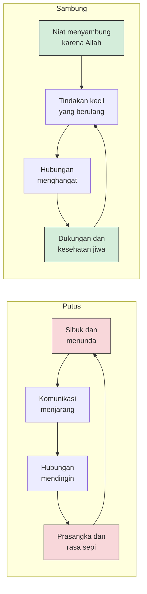

Pada 30 Juni 2025, Organisasi Kesehatan Dunia menerbitkan laporan bertajuk *From Loneliness to Social Connection: Charting a Path to Healthier Societies*. Isinya dingin dan berangka: kesepian diperkirakan berkontribusi pada sekitar 871.000 kematian setiap tahun — kira-kira seratus jiwa setiap jam. Laporan itu adalah keluaran Komisi WHO untuk Koneksi Sosial, yang dibentuk November 2023 dan dipimpin bersama oleh Chido Mpemba dari Zimbabwe dan Vivek Murthy, mantan Surgeon General Amerika Serikat. Data yang mereka himpun menunjukkan satu dari enam orang di dunia mengalami kesepian, dengan angka tertinggi justru pada remaja dan dewasa muda — satu dari lima.

Laporan ini bukan dokumen keagamaan, bukan pula nasihat motivasi. Ini dokumen kesehatan publik, dirumuskan oleh para epidemiolog dengan bahasa komisi internasional. Dan justru karena itu angkanya terasa aneh bagi saya yang tumbuh dalam lingkungan Muslim: seluruh kesimpulannya terdengar seperti nasihat yang dulu sering kita dengar dari mimbar pengajian — sambungkan silaturahmi, hadir ketika diundang, jenguk yang sakit, jangan biarkan kerabat mendingin. Para tetua kita menyebutnya silaturahmi dan memperlakukannya dengan kesungguhan yang sering membuat kita, generasi yang "sangat sibuk", merasa terganggu. Ternyata yang mereka lakukan sepanjang waktu itu sedang menekan satu faktor risiko kesehatan yang kini dihitung serius oleh lembaga kesehatan dunia.

## Sinyal, Bukan Aib

Sebelum bicara dalil, ada satu reframing yang menurut saya penting: penelitian modern tidak memperlakukan kesepian sebagai cacat karakter. Literatur psikologi menjelaskan kesepian sebagai *social pain* — sinyal biologis yang fungsinya mirip rasa lapar atau haus. Kalau lapar memaksa kita makan, kesepian memaksa kita mencari koneksi. Dalam ukuran yang wajar, ia justru mekanisme adaptif yang menjaga manusia tetap hidup berkelompok.

Masalahnya ketika sinyal itu menyala terus-menerus tanpa direspons. Kesepian kronis dikaitkan WHO dengan risiko kesehatan yang nyata: penyakit kardiovaskular, diabetes tipe 2, depresi, dan kecemasan. Ini bukan urusan perasaan semata, melainkan urusan tekanan darah, sistem imun, dan peradangan yang bekerja berlebihan karena tubuh membaca keterpisahan sebagai ancaman.

Reframing ini penting karena di banyak komunitas Muslim, mengaku kesepian terasa seperti mengaku lemah iman. Padahal para peneliti menempatkannya seperti mereka menempatkan lapar: alarm, bukan vonis. Dan seperti lapar, alarm itu hanya padam dengan satu obat — kehadiran orang lain.

## Perintah yang Lebih Dulu Ada

Dalam Shahih al-Bukhari (no. 5986) terdapat hadis yang sering dikutip: siapa yang senang dilapangkan rezekinya dan diwujudkan jejaknya setelah wafat, maka sambunglah silaturahmi. Dalam riwayat lain (no. 5984), Nabi ﷺ menyebut bahwa pemutus silaturahmi tidak akan masuk surga. Kedengarannya keras, sampai kita sadar bahwa seluruh peradaban modern baru sampai pada kesimpulan serupa lewat jalur yang jauh lebih memutar.

Tapi dalil yang paling saya sukai justru yang paling halus. Dalam Shahih al-Bukhari no. 5991, Nabi ﷺ mengoreksi pemahaman kita tentang apa itu menyambung: penyambung sejati bukanlah orang yang membalas kunjungan dengan kunjungan, melainkan orang yang tetap menyambung tatkala hubungan itu diputus. Definisinya bukan resiprokitas — melainkan inisiatif satu sisi. Manusia yang dipuji adalah yang berhenti menghitung.

Perhatikan juga bahwa Islam tidak menitipkan pesan ini pada nasihat saja. Ia membangun infrastrukturnya langsung ke dalam ibadah: shalat lima waktu yang paling utama dikerjakan berjamaah, salat Jumat yang mensyaratkan kehadiran fisik sekali seminggu, dua hari raya yang memenuhi masjid dan jalan, bahkan hak-hak antaruslim yang disebut dalam hadis (HR. al-Bukhari no. 1240) — termasuk menjawab undangan dan menjenguk yang sakit. Dalam desain ini, koneksi sosial bukan bonus rohani bagi yang punya waktu luang. Ia bagian dari arsitektur agama itu sendiri. Dan Al-Qur'an menempatkannya setingkat dengan takwa: "bertakwalah kepada Allah yang dengan nama-Nya kamu saling meminta, dan peliharalah hubungan kekerabatan" (QS. An-Nisa [4]: 1).

## Delapan Puluh Tujuh Tahun Data Harvard

Sekarang giliran sains menceritakan temuannya, dan yang paling terkena datang dari sebuah studi yang lebih tua dari hampir semua pembaca artikel ini. Harvard Study of Adult Development dimulai tahun 1938 — delapan puluh tujuh tahun lalu — mengikuti 724 pria dari dua kohort: 268 mahasiswa Harvard dan 456 pemuda dari keluarga miskin di kawasan Boston. Mereka diwawancarai, diperiksa kesehatannya, dan diikuti sepanjang hidup; kini anak-anak mereka pun diteliti.

Saat ini studi itu dipimpin psikiater Robert Waldinger, dan temuannya yang paling sering dikutip — juga dalam bukunya *The Good Life* (2023) bersama Marc Schulz — terdengar sederhana: kualitas hubungan dekat seseorang adalah prediktor kesehatan dan kebahagiaan jangka panjang yang lebih kuat daripada kekayaan, ketenaran, kelas sosial, IQ, bahkan gen. Pria yang hubungannya paling hangat di usia 50 tahun ternyata paling sehat secara fisik di usia 80. Dalam kohort ini, mereka yang paling tinggi skor kehangatan hubungannya bahkan berpenghasilan puncak rata-rata 141.000 dolar lebih tinggi — temuan yang dengan hati-hati bisa kita baca sebagai korelasi, bukan jaminan gaji.

Cerita Waldinger tentang studi ini di TED telah ditonton lebih dari 51 juta kali — salah satu yang paling banyak ditonton sepanjang sejarah TED. Jutaan orang memilih mendengarkan satu pesan: yang menentukan kualitas hidup kita bukan apa yang kita capai, melainkan siapa yang ada di sekitar kita ketika kita mencapainya.

Satu temuan lagi dari studi ini yang jarang dikutip padahal berat: kehangatan hubungan di masa kecil terbawa jauh ke masa dewasa. Pria yang masa kecilnya hangat dengan orang tuanya — khususnya dengan ibu — tercatat lebih rendah risikonya mengalami demensia di usia tua, dan kehangatan dengan ayah berkaitan dengan kecemasan yang lebih rendah di masa dewasa. Bagi saya yang sedang membesarkan dua anak kecil, data ini menggeser cara membaca waktu bersama mereka: yang sedang kita bangun bukan sekadar kenangan, melainkan fondasi biologis dan psikologis yang akan mereka huni lima puluh tahun lagi.

## Efeknya Sebanding dengan Faktor Risiko Klasik

Kalau studi Harvard adalah studi kasus terpanjang, meta-analisis Julianne Holt-Lunstad dan koleganya adalah pembuktiannya pada skala besar. Mereka menggabungkan 148 studi dengan total 308.849 partisipan, dan hasilnya terbit di *PLoS Medicine* (2010): orang dengan hubungan sosial yang kuat memiliki peluang bertahan hidup 50 persen lebih tinggi. Para peneliti menyimpulkan bahwa besarnya pengaruh ini sebanding dengan faktor risiko kematian yang sudah lama diakui dunia medis.

Ada satu detail teknis yang layak digarisbawahi. Efek paling kuat muncul bukan pada status "hidup bersama orang lain", melainkan pada ukuran integrasi sosial yang kompleks — seberapa terhubung seseorang dalam jejaring: punya pasangan, punya teman, terlibat dalam komunitas. Dengan bahasa kita: bukan sekadar menikah atau punya satu sahabat, melainkan teranyam dalam jamaah.

Di titik ini sains dan syariat bertemu dengan cara yang nyaris kaku: yang satu menyebut integrasi sosial sebagai prediktor kesehatan, yang lain membangun jamaah sebagai format baku ibadah harian. Keduanya tiba di kesimpulan yang sama dari arah yang berbeda.

## Dua Lingkaran yang Saling Berebut

Hubungan sosial bergerak dalam lingkaran yang menguatkan dirinya sendiri — ke arah mana pun lingkaran itu mulai berputar.

Lingkaran pertama akrab bagi kita semua: sibuk membuat menunda, menunda membuat komunikasi menjarang, dan yang jarang berkomunikasi mudah tumbuh prasangka — "dia juga tidak menghubungi saya" — lalu rasa sepi yang menyusul justru membuat kita makin menutup diri. Lingkaran kedua bekerja sebaliknya: niat menyambung melahirkan tindakan kecil yang berulang, dan tindakan kecil itulah — bukan grand gesture — yang menjaga hubungan tetap hangat.

Yang menentukan arah putaran biasanya bukan keadaan, melainkan satu keputusan kecil: siapa yang mengambil inisiatif lebih dulu.

## Mengapa Justru Sekarang

Pertanyaannya: kalau silaturahmi sudah menjadi desain sedemikian lama, mengapa WHO baru sekarang perlu membentuk komisi khusus? Jawabannya ada pada cara kita hidup sekarang. Interaksi pekerjaan berpindah ke layar; kota membesar hingga kerabat tersebar; dan generasi yang paling terhubung secara digital justru paling kesepian — WHO menemukan kesepian paling tinggi pada remaja dan dewasa muda, bukan pada lansia. Ada satu data lagi yang mengejutkan: kesepian justru paling umum di negara berpendapatan rendah, di mana hampir satu dari empat orang mengalaminya. Artinya problem ini tidak mengenal klaim keunggulan budaya komunal mana pun — ikatan yang dulu terjaga karena tidak adanya pilihan, kini harus dijaga dengan niat karena semua pilihan tersedia.

Sebagai engineering manager yang sebagian besar hari kerjanya berlangsung lewat layar, saya merasakan gesekan ini secara langsung — dan mengakui bahwa jadwal yang rapat membuat hubungan non-kerja terasa seperti item yang bisa ditunda tanpa konsekuensi. Justru riset di atas yang mengingatkan bahwa penundaan itu punya harga. Kita tidak pernah menunda makan siang karena "nanti kalau sempat"; kita menunda menelepon kakak atau orang tua setiap minggu. Padahal bagi tubuh dan jiwa, keduanya sama-sama kebutuhan.

## Kebugaran Sosial: Membuat Silaturahmi Menjadi Sistem

Waldinger dan Schulz memperkenalkan istilah yang saya suka: *social fitness*. Idéanya sederhana — hubungan sosial perlu dirawat seperti kebugaran fisik: bukan sekadar dikenang, melainkan dilatih secara rutin. Beberapa praktik yang bisa dijalankan:

**Perlakukan silaturahmi sebagai pemeliharaan, bukan suasana hati.** Kita menjadwalkan retrospective tim setiap sprint karena tahu percakapan yang tidak dijadwalkan tidak akan terjadi. Perlakukan hubungan dengan cara yang sama: satu slot mingguan untuk menelepon satu orang yang belum lama dikabari. Jangan menunggu rindu datang.

**Jadilah pihak yang menyambung.** Di sinilah hadis Bukhari 5991 menjadi sangat praktis. Banyak hubungan tidak mati karena permusuhan, melainkan karena dua pihak sama-sama menunggu disambung. Berhenti menghitung siapa yang terakhir menghubungi adalah bentuk nyata dari definisi Nabi ﷺ tentang penyambung sejati.

**Hadir di momen-momen kritis.** Hadis tentang hak antaruslim (HR. al-Bukhari no. 1240) menyebut menjawab undangan dan menjenguk yang sakit — bukan kebetulan. Pernikahan, sakit, dan kehilangan adalah tiga momen ketika kehadiran bernilai paling tinggi dan paling diingat. Kehadiran di momen seperti ini tidak bisa digantikan ucapan selamat lewat pesan, dan sering menjadi titik yang menyelamatkan hubungan yang hampir mendingin.

**Mulai dari yang terdekat.** Efek kesehatan terbesar datang dari kualitas hubungan terdekat, bukan jumlah kenalan. Orang tua, pasangan, saudara, tetangga — jejaring kecil yang terawat memberi perlindungan lebih besar daripada ribuan koneksi daring.

**Naikkan kelas medianya.** Teks singkat lebih rendah daripada panggilan telepon, dan panggilan telepon lebih rendah daripada kehadiran. Riset Harvard tentang kualitas hubungan tidak berbicara tentang jumlah pesan, melainkan tentang kehadiran yang nyata.

## Penutup

Membaca laporan WHO dan hadis-hadis silaturahmi berdampingan membuat saya semakin yakin bahwa tradisi kita tidak antik — ia hanya sering disajikan dengan cara yang membuatnya terdengar lebih rendah darinya: sekadar tuntutan menghadiri undangan kenduri. Sesungguhnya ada arsitektur kesehatan masyarakat yang sangat maju di dalamnya, yang baru dikonfirmasi dunia lewat delapan puluh tujuh tahun riset dan ratusan ribu partisipan.

Sebagai ayah, saya juga menyadari bahwa epidemi kesepian generasi berikutnya sedang dibentuk di rumah-rumah kita saat ini — pada apa yang anak-anak lihat kita lakukan dengan waktu dan ponsel kita. Mereka akan menyebut "normal" pada pola yang kita perlihatkan.

Dan kebetulan artikel ini terbit pada hari Jumat: satu hari dalam seminggu ketika seluruh kota Muslim diingatkan bahwa sebagian dari ibadah tidak bisa dikerjakan sendirian di rumah. Mungkin itulah pesan yang paling awet dari semua temuan ini — bahwa manusia tidak dirancang untuk berjalan sendiri, dan setiap langkah kecil menyambung yang terputus adalah investasi kesehatan yang tidak dicatat asuransi mana pun.

## Referensi

1. WHO Commission on Social Connection — *From Loneliness to Social Connection: Charting a Path to Healthier Societies* (30 Juni 2025). Komisi WHO untuk Koneksi Sosial, co-chair Chido Mpemba dan Vivek Murthy. https://www.who.int/groups/commission-on-social-connection
2. Holt-Lunstad J, Smith TB, Layton JB. "Social Relationships and Mortality Risk: A Meta-Analytic Review." *PLoS Medicine* 7(7): e1000316 (2010). DOI: 10.1371/journal.pmed.1000316. https://pubmed.ncbi.nlm.nih.gov/20668659/
3. Harvard Study of Adult Development (Grant Study & Glueck Study) — ringkasan temuan dan riwayat studi. https://en.wikipedia.org/wiki/Grant_Study
4. Waldinger R, Schulz M. *The Good Life: Lessons from the World's Longest Scientific Study of Happiness*. Simon & Schuster, 2023; serta ceramah TED Robert Waldinger "What Makes a Good Life?" (51+ juta penonton). https://www.ted.com/talks/robert_waldinger_what_makes_a_good_life_lessons_from_the_longest_study_on_happiness
5. Wikipedia — "Loneliness": kesepian sebagai *social pain* dan mekanisme adaptatif. https://en.wikipedia.org/wiki/Loneliness
6. Hadis silaturahmi: Shahih al-Bukhari no. 5984, 5986, 5991; Shahih Muslim no. 2557; hadis hak-hak muslim: Shahih al-Bukhari no. 1240.
7. QS. An-Nisa [4]: 1; QS. Al-Hujurat [49]: 10.
