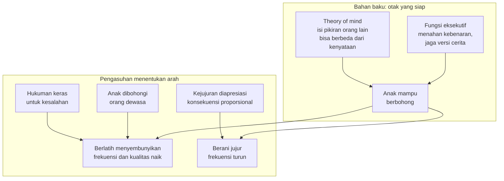

Ada satu momen yang hampir semua orang tua kenal: anak berdiri dengan wajah polos, tangan masih menyimpan bukti, dan mulut mengatakan sesuatu yang jelas tidak benar. Gelas pecah, tetapi "nggak saya yang bikin." Kue berkurang, tetapi "nggak tahu siapa yang makan." Reaksi pertama kita biasanya campuran—heran, sedikit lucu, lalu sedikit khawatir. Kok sudah berbohong? Dari mana belajarnya? Apakah ini awal dari masalah karakter?

Riset perkembangan kognitif dua puluh tahun terakhir menjawab pertanyaan itu dengan cara yang mengejutkan: kebohongan pertama anak bukan tanda karakter yang rusak, melainkan tanda bahwa otaknya sedang bekerja dengan sangat baik.

## Paradigma mengintip dan angka yang tidak mengbohongi

Untuk mempelajari kebohongan anak secara sistematis, peneliti seperti Kang Lee dari University of Toronto menggunakan eksperimen sederhana yang disebut *temptation resistance paradigm*—kurang lebih paradigma godaan. Anak diajak bermain tebak-tebakan. Di tengah permainan, peneliti meninggalkan ruangan dengan pesan: jangan mengintip kartu jawabannya. Kamera tersembunyi merekam. Hasilnya konsisten di berbagai negara: lebih dari 90% anak mengintip begitu dewasa meninggalkan ruangan.

Pertanyaan penelitian sesungguhnya baru muncul setelah itu: saat ditanya "kamu mengintip tidak?", apakah anak mengaku atau menutupi?

Dalam presentasinya di TED, Lee merangkum temuan lintas studi lintas negara: pada usia dua tahun, sekitar 30% anak yang mengintip akan berbohong tentang hal itu. Pada usia tiga tahun, angkanya 50%. Pada usia empat tahun, lebih dari 80%. Setelah itu, mayoritas anak berbohong dalam situasi tersebut—tidak peduli jenis kelamin, negara, atau latar belakang agama keluarganya. Kebohongan, dalam kata Lee, adalah bagian tipikal dari perkembangan.

Angka-angka ini meruntuhkan tiga keyakinan populer sekaligus. Pertama, bahwa anak hanya mulai berbohong setelah masuk sekolah dasar. Kedua, bahwa anak-anak adalah pembohong yang buruk sehingga mudah kita tangkap. Ketiga, bahwa anak yang berbohong di usia sangat dini membawa cacat karakter dan berpotensi menjadi pembohong patologis seumur hidup. Ketiganya, menurut Lee, salah.

## Dua bahan untuk satu kebohongan

Mengapa berbohong membutuhkan otak yang canggih? Karena kebohongan yang berhasil menuntut dua keterampilan kognitif yang berat.

Bahan pertama adalah *theory of mind*—kemampuan memahami bahwa orang lain punya pikiran, keyakinan, dan pengetahuan yang berbeda dari milik kita. Anak yang berbohong harus menghitung: "Ibu tidak melihat saya mengambil kue, jadi di kepala Ibu tidak ada informasi itu. Saya bisa mengisi kekosongan itu dengan versi saya." Tanpa kesadaran bahwa isi kepala orang lain bisa berbeda dari kenyataan, kebohongan secara teknis mustahil. Ensiklopedia psikologi perkembangan menempatkan theory of mind sebagai fondasi interaksi sosial manusia yang baru matang seiring perkembangan korteks prefrontal pada masa kanak-kanak.

Bahan kedua adalah fungsi eksekutif, terutama memori kerja dan kontrol inhibisi. Anak harus menahan kebenaran yang sudah ada di kepalanya (butuh kontrol inhibisi), mengingat versi cerita yang dia sampaikan dan konsisten dengannya (butuh memori kerja), lalu mengatur ekspresi wajah dan nada bicara agar tidak bocor. Studi Victoria Talwar dan koleganya di McGill menunjukkan bahwa anak dengan skor theory of mind dan memori kerja lebih tinggi juga lebih terampil menyembunyikan informasi—dalam salah satu penelitian mereka, anak-anak yang berhasil merahasiakan hadiah kejutan untuk orang tuanya justru yang unggul dalam pengukuran kognitif tersebut.

Jadi ketika anak dua atau tiga tahun mengucapkan bohong pertamanya, yang sesungguhnya terjadi adalah pemahaman bahwa "pikiranmu dan pikiranku berbeda, dan saya bisa mengelolanya." Itu pencapaian intelektual, bukan kemerosotian moral. Beberapa peneliti sampai menyebut kebohongan dini sebagai penanda perkembangan kognitif yang maju untuk usianya.

## Kabar buruknya: kita tidak sejago itu mendeteksi

Ada bagian yang kurang menyenangkan dari temuan-temuan ini: kepercayaan diri kita sebagai pendeteksi kebohongan anak hampir selalu berlebihan. Meta-analisis klasik Bond dan DePaulo yang mengumpulkan data dari lebih dari 24.000 penilai menunjukkan akurasi rata-rata deteksi kebohongan hanya sekitar 54%—nyaris lemparan koin. Dalam eksperimen Kang Lee, mahasiswa, polisi, jaksa, bahkan hakim pengadilan anak menilai video anak yang mengaku atau menyangkal dengan akurasi di sekitar tingkat peluang.

Petunjuk yang biasa kita andalkan—kontak mata yang menghindar, gelisah, gagap—ternyata bukan indikator andal. Artikel tentang kebohongan di Wikipedia mencatat bahwa penelitian menunjukkan orang-orang melebih-lebihkan makna isyarat nonverbal semacam itu sekaligus kemampuan mereka sendiri membacanya. Anak kecil yang berbohong tentang kue sering menatap kita dengan mata paling jujur sedunia. Kesimpulan praktisnya sederhana: jangan bangun strategi pengasuhan di atas asumsi bahwa kita selalu tahu kapan anak berbohong. Kita tidak selalu tahu.

## Yang membentuk frekuensi: lingkungan, bukan ceramah

Jika kebohongan adalah bagian normal dari perkembangan, maka pekerjaan orang tua bukan mencegahnya muncul—itu di luar kendali kita—melainkan memengaruhi seberapa sering dan dalam bentuk apa ia muncul. Di sinilah risetnya menjadi sangat relevan.

Temuan paling penting datang dari eksperimen alami Talwar dan Lee yang diterbitkan di *Child Development* tahun 2011. Mereka membandingkan anak usia 3-4 tahun dari dua sekolah di Afrika Barat: satu dengan disiplin yang sangat punitif (pelanggaran kecil dihukum keras), satu lagi tidak. Dalam permainan mengintip yang sama, anak-anak dari sekolah punitif bukan hanya lebih banyak berbohong—mereka juga lebih terampil mempertahankan kebohongannya saat ditanya lanjutan. Pesan studinya mengguncang: hukuman yang keras tidak mengurangi kebohongan. Hukuman justru melatih anak menjadi pembohong yang lebih baik, karena yang dipertaruhkan menjadi terlalu besar untuk jujur.

Studi kedua menunjuk arah yang sama dari sisi lain. Hays dan Carver dari UC San Diego menerbitkan penelitian berjudul lugas "Follow the liar" di *Developmental Science*. Anak-anak yang baru saja dibohongi oleh orang dewasa (dalam kasus ini: janji mainan yang tidak ditepati) kemudian lebih banyak mengintip dan lebih banyak berbohong tentang perilaku mereka sendiri dibanding anak yang tidak dibohongi. Anak belajar dari model, termasuk model ketidakjujuran kita. Janji manis yang tidak pernah ditepati, "bohong putih" di depan anak untuk menolak undangan, janji "nanti kita beli" yang sengaja dilupakan—semuanya adalah kurikulum terselubung tentang bagaimana dunia ini sebenarnya bekerja.

Sebaliknya, penelitian Talwar dan koleganya tahun 2017 menemukan bahwa pengasuhan yang hangat namun tetap tegas—gaya otoritatif—berkaitan dengan kecenderungan berbohong yang lebih rendah ketika bertemu dengan kontrol inhibisi anak yang baik. Lingkungan yang aman secara emosional menurunkan harga yang harus dibayar anak untuk berkata jujur.

## Cerita moral: mengapa Pinokio gagal

Bagian favorit saya dari literatur ini adalah studi tentang cerita moral. Hampir semua budaya punya cerita tentang bahaya berbohong, dan orang tua menyusunnya sebagai senjata rutin. Lee, Talwar, dan koleganya menguji empat cerita klasik pada anak usia 3-7 tahun dalam studi di *Psychological Science* (2014). Hasilnya: membacakan *Pinokio* dan *Anak Gembala yang Meneriakkan Serigala* tidak mengurangi kebohongan anak sama sekali. Keduanya menonjolkan konsekuensi negatif dari berbohong—hidung memanjang, domba-domba dimakan.

Satu cerita yang sukses dalam studi itu: kisah apokrif George Washington dan pohon ceri. Versi aslinya berakhir bukan dengan hukuman, melainkan dengan ayah yang memeluk anaknya dan mengatakan betapa jujurnya dia. Ketika peneliti memodifikasi cerita Washington agar fokus pada konsekuensi negatif, efek positifnya menghilang. Kesimpulannya tajam: yang menggerakkan kejujuran anak bukan ketakutan pada akibat bohong, melainkan pengalaman langsung bahwa jujur itu berharga dan dihargai.

Temuan ini konsisten dengan studi lingkungan punitif di atas. Pendekatan berbasis ancaman melatih anak menghindari tertangkap. Pendekatan berbasis apresiasi menumbuhkan preferensi pada kebenaran itu sendiri.

## Praktiknya di rumah

Bagaimana menerjemahkan semua ini dalam keseharian? Beberapa prinsip yang keluar langsung dari data.

**Pisahkan kesalahan dari kejujuran.** Anak memecahkan gelas lalu berkata jujur tentang itu? Tangani pecahan gelas sebagai kejadian kecil dengan konsekuensi kecil (bantu bersihkan), dan perlakukan kejujurannya sebagai hal besar yang diapresiasi. Kalau jujur pun dihukum sama kerasnya dengan bohong, matematika anak akan cepat menyimpulkan bahwa yang harus dioptimalkan adalah menyembunyikan bukti.

**Jangan pasang jebakan interogasi.** Jika kita sudah tahu jawabannya, bertanya "siapa yang makan kue ini?" sambil menatap tajam bukan lagi mencari informasi—itu ujian akting. Anak belajar performa, bukan kejujuran. Lebih baik nyatakan faktanya dengan datar: "Kamu makan kue ini tanpa izin. Ayo kita bicara." Percakapan jujur butuh pintu keluar yang aman.

**Waspadai kebohongan kecil kita sendiri.** Studi "Follow the liar" mengingatkan bahwa anak usia sekolah yang dibohongi cenderung membalasnya dengan perilaku serupa. Kalau kita terbiasa berkata "besok ya" tanpa niat membeli es krim, anak tidak belajar tentang besok—dia belajar bahwa janji adalah alat negosiasi yang boleh kosong.

**Bedakan fantasi dari kebohongan.** Anak prasekolah bercerita tentang naga di halaman atau "kenangan" yang tidak pernah terjadi bukan sedang berbohong dalam pengertian psikologis. Literatur membedakan ini dari konfabulasi dan khayalan—pernyataan tanpa intensi menipu. Menyalahkan anak karena berimajinasi adalah kategori kesalahan yang berbeda, dan jauh lebih merugikan.

**Evaluasi intensi saat anak mulai tumbuh.** Penelitian terbaru tentang pemahaman anak terhadap kebohongan menunjukkan pergeseran perkembangan yang menarik: anak usia 5-6 tahun cenderung menilai pernyataan salah sebagai bohong apa pun motonya, sementara anak yang lebih tua mulai menimbang intensi—bohong untuk melindungi perasaan orang dinilai lebih positif daripada bohong untuk keuntungan sendiri. Diskusi tentang "bohong baik" di keluarga bukan keraguan moral; itu bagian dari perkembangan penalaran moral yang sehat, dan hasil evaluasinya berbeda-beda antar budaya.

Sebagai ayah dari dua anak kecil, saya menemukan pemahaman ini melegakan sekaligus menantang. Melegakan, karena panik berlebihan saat anak mulai "pintar bicara" ternyata tidak ada dasar ilmunya. Menantang, karena setiap kali saya mengambil jalan pintas—janji yang mudah, ancaman yang berlebihan, pertanyaan jebakan yang memuaskan ego—saya sedang mengajarkan sesuatu yang persis berlawanan dengan yang saya inginkan. Kejujuran anak tidak dibangun lewat nasehat tentang kejujuran. Ia dibangun lewat pengalaman berulang bahwa berkata benar di rumah ini selalu, selalu, lebih murah daripada menyembunyikannya.

Bohong pertama anak bukan alarm bahwa pengasuhan kita gagal. Ia pengumuman bahwa anak sedang tumbuh menjadi makhluk sosial yang lengkap—dengan semua kapasitas, godaan, dan kebutuhan akan rasa aman yang menyertainya. Pekerjaan kita bukan mencegah kemampuan itu muncul, melainkan memastikan ia tidak pernah merasa perlu menggunakannya melawan kita.

## Referensi

1. Lee, K. (2016). *Can you really tell if a kid is lying?* TED Talk. — https://www.ted.com/talks/kang_lee_can_you_really_tell_if_a_kid_is_lying
2. Talwar, V., & Lee, K. (2011). A punitive environment fosters children's dishonesty: a natural experiment. *Child Development*, 82(6), 1751–1758. — https://doi.org/10.1111/j.1467-8624.2011.01663.x
3. Lee, K., Talwar, V., McCarthy, A., Ross, I., Evans, A., & Arruda, C. (2014). Can classic moral stories promote honesty in children? *Psychological Science*, 25(8), 1630–1636. — https://doi.org/10.1177/0956797614536401
4. Hays, C., & Carver, L. J. (2014). Follow the liar: the effects of adult lies on children's honesty. *Developmental Science*, 17(6), 977–983. — https://doi.org/10.1111/desc.12171
5. Talwar, V., Lavoie, J., Gomez-Garibello, C., & Crossman, A. M. (2017). Influence of social factors on the relation between lie-telling and children's cognitive abilities. *Journal of Experimental Child Psychology*, 159, 185–198. — https://doi.org/10.1016/j.jecp.2017.02.009
6. Lavoie, J., & Talwar, V. (2020). Care to share? Children's cognitive skills and concealing responses to a parent. *Topics in Cognitive Science*, 12(2), 485–503. — https://doi.org/10.1111/tops.12390
7. Bond, C. F., Jr., & DePaulo, B. M. (2006). Accuracy of deception judgments. *Personality and Social Psychology Review*, 10(3), 214–234. — https://doi.org/10.1207/s15327957pspr1003_2
8. Cantarero, K., Król, M., Gruberska, D., et al. (2025). If someone is wrong but sincere, is it a lie? The role of objective falsity, intention, and motivation in children's understanding of lying. *Journal of Experimental Child Psychology*, 260, 106350. — https://doi.org/10.1016/j.jecp.2025.106350
9. Wikipedia: *Lie* dan *Theory of mind* — https://en.wikipedia.org/wiki/Lie, https://en.wikipedia.org/wiki/Theory_of_mind
