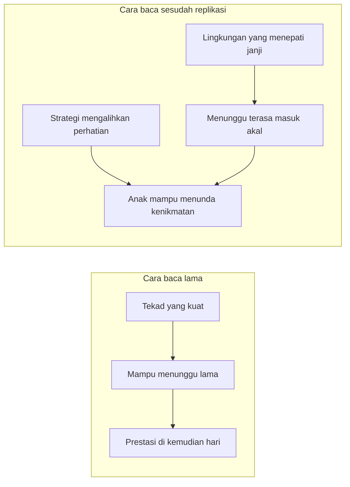

Ada satu eksperimen psikologi yang hampir setiap orang tua pernah dengar: anak usia empat tahun ditinggal sendirian di sebuah ruangan bersama sebutir marshmallow. Kalau ia sanggup tidak memakannya sampai pengujinya kembali—sekitar lima belas menit—ia akan mendapat dua butir. Ceritanya kemudian menggulung: anak-anak yang berhasil menunggu dilaporkan tumbuh menjadi remaja yang lebih kompeten, dengan skor SAT lebih tinggi, dan hidup yang lebih tertata. Kesimpulan populer yang tersebar dari temuan itu terdengar sederhana dan menggoda: kesabaran di masa kecil meramalkan masa depan, jadi tandai anak Anda sekarang, dan kalau ia melahap marshmallow itu dalam tiga puluh detik, mulailah berlatih tekadnya.

Saya juga pernah menyerap narasi itu tanpa banyak bertanya. Baru beberapa tahun belakangan, ketika mulai membaca literatur perkembangan anak secara lebih serius, saya sadar cerita marshmallow ini punya babak yang jarang diberitakan—babak di mana eksperimen legendaris itu diuji ulang, dan hasilnya mengubah pesan yang seharusnya kita bawa pulang ke rumah.

## Apa yang Sebenarnya Terjadi di Ruangan Itu

Eksperimen aslinya dijalankan Walter Mischel bersama Ebbesen pada 1970 di Bing Nursery School, Stanford, dengan anak-anak usia sekitar tiga setengah hingga lima tahun. Anak memilih camilannya—pretzel atau kukis hewan—lalu diberi pilihan: makan sekarang dan dapat yang kurang disukai, atau tunggu dan dapat yang lebih disukai. Yang sering dilewatkan dari kisah populer ini adalah hal yang justru paling mengagumkan Mischel: anak-anak tidak menunggu dengan mengertakkan gigi. Mereka menemukan strategi sendiri. Sebagian menutup mata dengan tangan, sebagian menyandarkan kepala di lengan, mengobrol sendiri, bernyanyi, mengarang permainan dengan jari-jari dan kaki—dan seperti dicatat Mischel dan Ebbesen dalam laporan aslinya, ada yang bahkan berhasil tertidur.

Artinya, sejak awal, kesabaran yang teramati bukanlah "tekad bawaan" yang keras, melainkan keterampilan mengatur perhatian. Follow-up pada 1988 menemukan anak penunggu lama dinilai orang tuanya lebih kompeten sebagai remaja; studi 1990 oleh Shoda, Mischel, dan Peake menemukan korelasi dengan skor SAT. Studi pencitraan otak pada 2011 yang melibatkan peserta asli saat paruh baya—dipimpin Casey dan koleganya di PNAS—menunjukkan perbedaan aktivitas korteks prefrontal versus ventral striatum antara penunggu lama dan penunggu pendek. Narasi itu kokoh selama beberapa dekade.

Tapi ada catatan metodologis yang kemudian menjadi penting: peserta aslinya anak-anak di lingkungan kampus Stanford, sampelnya kecil, dan keluarganya relatif homogen. Pertanyaannya bukan apakah temuannya palsu—melainkan untuk siapa temuan itu berlaku, dan apa sebenarnya yang diukur.

## Retakan Pertama: Dua Belas Menit versus Tiga Menit

Retakan paling terkenal datang dari Celeste Kidd dan koleganya di University of Rochester, dipublikasikan di jurnal *Cognition* (2013). Sebelum marshmallow dikeluarkan, anak-anak lebih dulu mengalami satu kejadian kecil yang tampak sepele: pengujinya menjanjikan mereka perlengkapan menggambar dan stiker. Pada setengah anak, janji itu ditepati. Pada setengah lainnya, pengujinya kembali dengan tangan kosong dan minta maaf. Baru setelah itu tes marshmallow dimulai.

Hasilnya mencolok. Anak-anak yang baru saja mengalami janji yang ditepati menunggu rata-rata sekitar dua belas menit; mereka yang janjinya diingkari menyerah rata-rata tiga menit. Selisihnya empat kali lipat, pada anak-anak yang secara acak dibagi ke dua kelompok—artinya bukan bakat yang membedakan mereka, melainkan pengalaman lima menit sebelumnya. Kesimpulan Kidd: lamanya anak menunggu bukan hanya cermin pengendalian diri, tapi juga keputusan yang masuk akal atas keyakinan tentang reliabilitas dunianya. Kalau bukti terbaru menunjukkan orang di sekitarmu tidak menepati janji, mengambil marshmallow sekarang justru pilihan yang cerdas.

Yang membuat ini semakin menarik: dokumentasi prosedur asli menunjukkan tim Mischel sendiri membangun kepercayaan itu sebelum pengukuran—anak-anak lebih dulu bermain permainan bel untuk memanggil kembali pengujinya, dan bagian menunggu baru dimulai setelah anak paham bahwa janji akan ditepati. Eksperimen itu, tanpa mengumumkannya, selalu berdiri di atas pondasi kepercayaan yang sudah dipasangkan lebih dulu.

## Retakan Kedua: Sampel Sepuluh Kali Lebih Besar

Retakan berikutnya datang dari Watts, Duncan, dan Quan yang menerbitkan replikasi konseptual di *Psychological Science* (2018). Mereka memakai data longitudinal lebih dari sembilan ratus anak—sampel sepuluh kali lebih besar dan jauh lebih beragam secara sosioekonomi, termasuk anak-anak dari keluarga dengan ibu tanpa pendidikan sarjana. Temuannya: korelasi antara lama menunggu di usia empat tahun dengan capaian akademik di usia lima belas masih ada, tapi jauh lebih kecil daripada laporan asli, dan korelasi dengan masalah perilaku nyaris tidak signifikan secara statistik. Begitu peneliti mengontrol kemampuan kognitif awal, latar belakang keluarga, dan kualitas lingkungan rumah, efek yang tersisa menyusut drastis. Sebagian besar dari apa yang dulu tampak sebagai "kekuatan tekad anak" ternyata membawa jejak latar ekonomi dan kestabilan rumah tempat anak itu dibesarkan.

Analisis lanjutan oleh ekonom Falk, Kosse, dan Pinger di *Psychological Science* (2020) yang membandingkan langsung kedua studi tersebut sampai pada kesimpulan serupa: efek prediksi yang realistis kira-kira separuh dari versi aslinya, dan sebagian dijelaskan oleh faktor keluarga. Ditambah lagi, studi di University of California pada 2020 menemukan dimensi yang jarang dibahas: manajemen reputasi. Anak-anak menunggu hampir dua kali lebih lama ketika diberi tahu bahwa gurunya akan mengetahui berapa lama mereka menunggu. Tugas marshmallow, ternyata, juga tugas sosial—anak membaca konteks dan menyesuaikan perilakunya.

## Twist yang Jarang Diceritakan: Anak Zaman Sekarang Justru Lebih Sabar

Di tengah narasi "generasi sekarang terbiasa serba instan", ada satu temuan yang nyaris tidak pernah dikutip. Carlson dan koleganya—termasuk Mischel sendiri, beberapa tahun sebelum wafatnya—menerbitkan studi kohort di *Developmental Psychology* (2018). Mereka pertama mensurvei ratusan orang dewasa Amerika: mayoritas yakin anak-anak zaman sekarang lebih tidak mampu menunggu dibanding anak-anak zaman dulu. Lalu mereka menganalisis data asli 840 anak dari tiga generasi kohort—1960-an, 1980-an, dan 2000-an—dengan latar sosial serupa.

Hasilnya kebalikan dari intuisi publik: kemampuan menunggu justru meningkat linear dari waktu ke waktu. Anak-anak kelahiran 2000-an menunggu rata-rata dua menit lebih lama daripada anak-anak 1960-an. Penurunan kesabaran antargenerasi, yang terdengar seperti kebenaran yang sudah final di meja kopi keluarga, tidak mendukung data.

## Yang Masih Berdiri: Keterampilan, Bukan Ramalan

Setelah semua retakan itu, apa yang tersisa? Cukup banyak, sebenarnya—selama kita menggeser bacaannya. Pengendalian diri tetap berkorelasi dengan berbagai hasil hidup, dan cara anak mengatur perhatian saat menunggu ternyata bisa diamati dan dilatih. Studi terbaru Raghunathan dan koleganya dari Johns Hopkins di *Journal of Experimental Child Psychology* (2023) menganalisis perilaku 144 anak usia lima tahun selama tugas menunggu versi Mischel dan menemukan tiga pola: regulator pasif yang tenang dan sedikit bergerak, regulator aktif yang banyak mengobrol dan mengamati godaan, dan regulator disruptif. Anak-anak dengan pola pasif paling mungkin bertahan sampai akhir. Kembali ke observasi asli Mischel di 1970: yang membedakan bukan ketangguhan karakter, melainkan kualitas strategi.

Cara membaca temuan-temuan ini bisa dirangkum dalam satu pergeseran:

## Artinya untuk Kita di Rumah

Kalau kesabaran anak tumbuh dari kepercayaan dan strategi—bukan dari ukuran tekad bawaan—konsekuensinya sangat praktis.

**Janji kecil yang ditepati adalah kurikulum kesabaran yang sesungguhnya.** "Lima menit lagi, ya" yang memang lima menit. Janji jalan-jalan Sabtu yang tidak menguap saat Sabtu tiba. Anak kecil pada dasarnya sedang mengumpulkan data tentang satu pertanyaan besar: apakah dunia ini bisa diprediksi? Setiap janji yang ditepati adalah satu baris data yang mendukung kesimpulan bahwa menunggu itu bernilai. Studi Kidd menunjukkan betapa cepatnya data itu terkumpul—cukup satu insiden kecil untuk menggeser keputusan menunggu anak sampai empat kali lipat.

**Jangan mengubah meja makan jadi ujian masuk.** Anak yang langsung melahap camilan belum tentu sedang menunjukkan kelemahan karakter. Bisa jadi ia sedang menilai kredibilitas sistem di sekelilingnya—dan pada konteks tertentu, keputusannya rasional. Reaksi kita yang paling berguna bukan menghela napas kecewa, melainkan bertanya: darimana ia belajar bahwa menunggu tidak terbayar?

**Latih strateginya, bukan menghukum kegagalannya.** Mischel sendiri menekankan ini: kesabaran adalah keterampilan mengalihkan perhatian, dan keterampilan bisa dilatih. Ajak anak menyanyi sambil menunggu, main tebak-tebakan, atau sederhananya pindahkan godaan dari jangkauan pandangan. Sebagai orang yang bekerja di software engineering, saya melihat paralel yang kuat di sini: kita tidak menguji disiplin engineer dengan menaruh kredensial produksi di grup obrolan lalu menghukum yang tergoda. Kita membangun sistem yang membuat perilaku benar menjadi perilaku paling mudah. Perapian rumah bekerja dengan logika yang sama.

**Konsistensi lintas pengasuh menentukan rata-rata.** Anak tidak memilah data berdasarkan siapa yang memberi. Ayah yang menepati janji, ibu yang menepati janji, lalu satu pengasuh yang sering mengingkari—bagi anak, semuanya masuk ke satu kalkulus. Ini yang membuat konsistensi terasa mahal: ia bukan proyek individual, melainkan kerja kolektif seisi rumah.

**Ritme yang bisa diprediksi adalah bentuk janji yang diam.** Studi-studi perkembangan anak selalu menemukan hal yang sama tentang rutinitas: anak yang tahu apa yang terjadi setelah mandi sore, di mana buku cerita diletakkan, dan kapan lampu kamar dimatikan, lebih mudah berpindah dari satu aktivitas ke aktivitas berikutnya tanpa drama. Jadwal tidak harus kaku—cukup bisa ditebak. Dalam bahasa rekayasa perangkat lunak, ini soal mengurangi variabel yang tidak terduga: semakin sedikit kejutan, semakin murah "biaya menunggu" bagi anak, karena ia tahu hal yang dijanjikan sedang dalam perjalanan, bukan sedang dinegosiasikan ulang.

**Saat anak gagal menunggu, perbaiki kepercayaannya, bukan labelnya.** Kegagalan menunggu adalah informasi, bukan vonis. Anak yang menyerah pada godaan hari ini bisa jadi sedang mengalami hari yang panjang, tidur yang kurang, atau baru saja mengalami janji yang pecah. Respons yang memperbaiki—"yah, tadi susah ya nunggunya, coba nanti kita bikin permainan saat nunggu"—melakukan dua hal sekaligus: menjaga relasi dan mengajarkan strategi.

## Catatan Kecil untuk Diri Sendiri

Bagian yang paling menggelitik dari sejarah eksperimen ini, bagi saya, adalah kebalikannya yang pelan tapi tajam: eksperimen yang selama setengah abad dianggap menguji anak-anak ternyata diam-diam juga menguji orang dewasanya. Pertanyaan yang dijawab anak di ruangan itu bukan sekadar "seberapa kuat tekadmu", melainkan "seberapa bisa dipercaya orang-orang di duniamu". Dan pertanyaan kedua itu—kita yang menjawabnya, setiap hari, lewat hal-hal sekecil janji lima menit.

Sebagai ayah, saya menemukan pembingkaian ini melegakan sekaligus menohok. Melegakan, karena beban tidak lagi bergantung penuh pada "sifat bawaan" anak yang seolah harus ditambal sejak dini. Menohok, karena pindah ke bahu yang tepat: kestabilan yang saya bangun—kata-kata yang konsisten dari pagi ke sore, dari hari ini ke hari berikutnya—adalah bahan bakar kesabaran anak-anak saya. Marshmallow test versi rumah kami tidak diadakan di meja dengan camilan, melainkan diam-diam, setiap kali saya berkata "nanti" dan anak-anak mencatat apakah "nanti" itu benar-benar datang.

## Referensi

1. Mischel, W., & Ebbesen, E. B. (1970). Attention in delay of gratification. *Journal of Personality and Social Psychology*. Ringkasan prosedur dan sejarah eksperimen: Wikipedia, "Stanford marshmallow experiment" — https://en.wikipedia.org/wiki/Stanford_marshmallow_experiment
2. Shoda, Y., Mischel, W., & Peake, P. K. (1990). Predicting adolescent cognitive and social competence from preschool delay of gratification. *Developmental Psychology*.
3. Kidd, C., Palmeri, H., & Aslin, R. N. (2013). Rational snacking: Young children's decision-making on the marshmallow task is moderated by beliefs about environmental reliability. *Cognition*, 126(1), 109–114. DOI: 10.1016/j.cognition.2012.08.004
4. Watts, T. W., Duncan, G. J., & Quan, H. (2018). Revisiting the marshmallow test: A conceptual replication and investigation of the predictive power of preadolescents' delay of gratification. *Psychological Science*, 29(7), 1159–1177. DOI: 10.1177/0956797618761661
5. Falk, A., Kosse, F., & Pinger, P. (2020). Re-revisiting the marshmallow test: A direct comparison of studies by Shoda, Mischel, and Peake (1990) and Watts, Duncan, and Quan (2018). *Psychological Science*, 31(1), 100–104. DOI: 10.1177/0956797619861720
6. Carlson, S. M., Shoda, Y., Ayduk, O., et al. (2018). Cohort effects in children's delay of gratification. *Developmental Psychology*, 54(8), 1395–1407. DOI: 10.1037/dev0000533
7. Raghunathan, R. S., Musci, R. J., Knudsen, N., & Johnson, S. B. (2023). What children do while they wait: The role of self-control strategies in delaying gratification. *Journal of Experimental Child Psychology*, 226, 105576. DOI: 10.1016/j.jecp.2022.105576
8. Casey, B. J., et al. (2011). Behavioral and neural correlates of delay of gratification 40 years later. *PNAS*, 108(36), 14998–15003.
