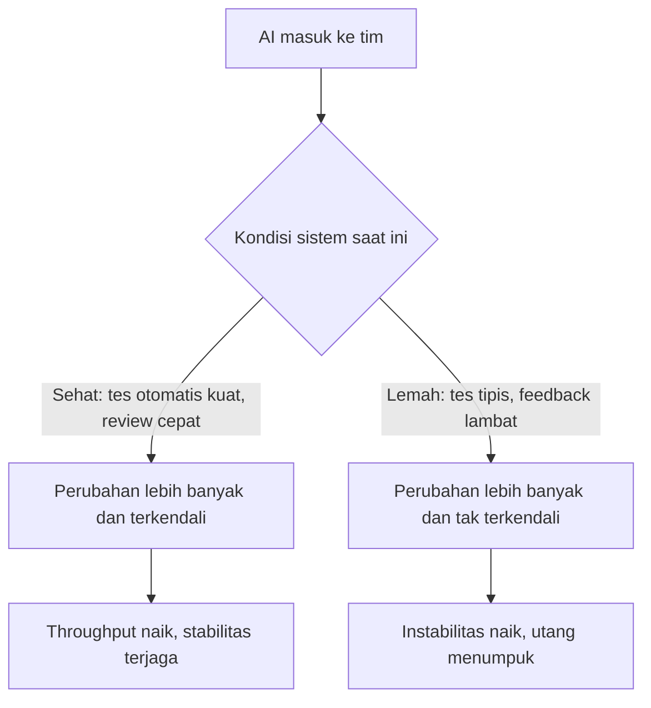

Dua angka yang tampak saling meniadakan. Laporan DORA 2025 menemukan lebih dari 80% profesional teknologi yakin AI meningkatkan produktivitas mereka. Sementara itu, ketika METR — organisasi riset nonprofit yang mengkhususkan diri pada pengukuran kemampuan AI — menjalankan eksperimen terkontrol terhadap developer open source berpengalaman, hasilnya terbalik: mereka yang bekerja dengan AI justru menyelesaikan pekerjaan 19% lebih lama.

Yang menarik bukan sekadar angkanya, tapi celah antara persepsi dan pengukuran. Sebelum eksperimen, para developer tersebut memperkirakan AI akan mempercepat pekerjaan mereka sekitar 24%. Setelah eksperimen usai — setelah terbukti lebih lambat — mereka masih yakin AI mempercepat mereka 20%. Perasaan cepat dan kenyataan cepat ternyata dua hal berbeda, dan selisihnya mencapai puluhan poin persentase.

Bagi saya sebagai engineering manager, inilah persoalan inti pekerjaan saya beberapa waktu terakhir. Pertanyaan "haruskah tim memakai AI" sudah mati: survei developer Stack Overflow 2025 mencatat 84% responden sudah memakai atau berencana memakai AI dalam proses pengembangan, dan separuh profesional memakainya setiap hari. Pertanyaan yang masih hidup jauh lebih sulit: bagaimana memimpin tim ketika alat yang dipakai semua orang itu efeknya tidak seragam, sulit diukur, dan bergantung pada kondisi tim itu sendiri.

## Efeknya Tergantung di Mana Kode Ditulis

Kontradiksi antara temuan METR dan keyakinan mayoritas developer sebenarnya bisa dijelaskan, dan penjelasannya penting bagi siapa pun yang mengelola tim.

Eksperimen GitHub pada 2023 yang dilakukan Peng dan koleganya menunjukkan kelompok yang memakai Copilot menyelesaikan tugas membuat HTTP server dalam JavaScript 55,8% lebih cepat daripada kelompok tanpa AI. Itu angka yang spektakuler — dan konteksnya juga spesifik: tugas baru, batasan jelas, spesifikasi rapi. Kondisi ideal untuk AI: menulis kode dari nol pada masalah yang sudah terdefinisi baik.

METR menguji kondisi yang berbeda: developer yang sudah sangat menguasai kodebase milik mereka sendiri, mengerjakan masalah rumit di repositori besar yang sudah berjalan bertahun-tahun. Di situ, AI justru menyeret waktu penyelesaian naik 19%. Para peneliti mencatat para developer memakai Cursor dengan model Claude Sonnet — peralatan terbaik pada masanya — jadi ini bukan soal alat yang kurang canggih.

Mengapa bisa lebih lambat? Mekanismenya masuk akal kalau dipikirkan. Keunggulan seorang ahli di kodebase miliknya sendiri adalah pengetahuan implisit — ia tahu bagian mana yang rapuh, jebakan apa yang pernah terjadi, konvensi tidak tertulis apa yang berlaku. Pengetahuan semacam ini mahal untuk ditransfer ke dalam prompt. Sementara itu, biaya yang sering luput dari perhitungan: waktu menyusun instruksi, waktu memeriksa keluaran yang "hampir benar", waktu mengoreksi dan mencoba lagi, plus biaya kognitif berpindah konteks antara menulis sendiri dan mengawasi asisten. Developer menaksir manfaatnya dengan gampang tapi biaya pengawasan itu nyaris tak pernah masuk estimasi — itulah yang membuat persepsi 20% lebih cepat dan kenyataan 19% lebih lambat bisa hidup berdampingan di kepala yang sama.

Kesimpulannya bukan "AI mengecewakan" atau "AI ajaib", melainkan: efek AI bergantung pada jenis pekerjaannya. Tugas baru yang terdefinisi rapi dan kode boilerplate adalah wilayah AI. Mengubah logika inti di sistem kompleks yang sudah dipahami mendalam oleh manusianya adalah wilayah yang justru bisa melambat. Tim yang tidak menyadari perbedaan ini akan kesulitan: mereka melihat speed di satu jenis pekerjaan lalu menggeneralisasi ke semua pekerjaan, lalu bingung mengapa sprint terasa lebih pendek tapi rilis tidak lebih cepat.

## Adopsi Masif, Kepercayaan Retak

Survei Stack Overflow 2025 — diikuti puluhan ribu developer — memberi potret ketegangan yang tajam. Di satu sisi adopsi terus naik: 84% memakai atau berencana memakai AI, naik dari 76% setahun sebelumnya, dan 51% profesional memakainya harian. Di sisi lain, kepercayaan justru menurun: 46% responden aktif tidak memercayai akurasi keluaran AI, melawan 33% yang memercayainya. Hanya 3% yang "sangat memercayai". Developer paling berpengalaman justru paling waspada — 20% dari mereka menyatakan sangat tidak percaya.

Frustrasinya juga konkret. Dua keluhan terbesar: solusi AI yang "hampir benar tapi belum tepat" (dikutip 66% responden) dan debugging kode hasil AI yang memakan waktu lebih banyak (45%). Yang paling mengganggu bagi pemimpin tim justru dua keluhan berikutnya: 20% developer merasa kepercayaan diri pada kemampuan problem solving mereka menurun, dan 16% mengaku sulit memahami bagaimana atau mengapa kode itu bekerja.

Arah perjalanannya juga sudah kelihatan. Dari developer yang memakai AI agent di pekerjaan, 84% mengarahkannya untuk tugas software engineering — jauh di atas kegunaan lain seperti analitik data atau operasi IT. Artinya pola pemakaiannya bergeser dari pelengkap autokomplet menjadi delegasi tugas: agent menjalankan pekerjaan berurutan, lalu manusia memeriksa hasilnya. Konsekuensinya halus tapi fundamental — titik hambatan berpindah dari menulis ke memeriksa, dan antrean di titik itu tidak otomatis pendek hanya karena penulisannya jadi instan.

Ini sinyal serius. Kode yang jalan tapi tidak dipahami orang yang mencommit-nya adalah utang teknis dalam bentuk paling murni — utang pemahaman, yang bunganya dibayar saat produksi bermasalah pukul dua pagi.

Sementara itu, METR menerbitkan pembaruan pada Februari 2026 yang menarik untuk dibaca dengan hati-hati. Eksperimen lanjutan mereka dengan alat-alat akhir 2025 mulai menunjukkan arah percepatan (perkiraan sementara 4–18% lebih cepat), tapi para peneliti menandai masalah metodologis yang justru mengungkap fakta sosial: makin banyak developer menolak berpartisipasi karena tidak mau bekerja tanpa AI, dan 30–50% peserta mengaku menyimpan sebagian tugas agar tidak diacak ke kondisi tanpa AI. Ketergantungan sudah sedemikian dalam sampai eksperimennya sendiri yang rusak.

Artinya, terlepas dari apakah AI mempercepat atau memperlambat pada titik tertentu, satu hal sudah pasti: kuda sudah lari dari kandang. Kebijakan yang mengandaikan tim bisa "kembali ke cara lama" bukan kebijakan, melainkan fantasi.

## AI Itu Amplifier, Bukan Penyelamat

Laporan DORA 2025 berjudul *State of AI-assisted Software Development* — disusun dari survei hampir 5.000 profesional dan lebih dari 100 jam data kualitatif — memberi kerangka yang menurut saya paling berguna untuk semua data di atas. Temuan sentralnya sederhana dan tajam: AI tidak memperbaiki tim; AI mengamplifikasi apa yang sudah ada di dalamnya. Tim yang kuat menjadi makin efisien. Tim yang bermasalah menemukan masalahnya makin keras.

Data DORA menunjukkan hubungan positif antara adopsi AI dengan throughput pengiriman dan performa produk — membaik dibanding 2024, tanda bahwa orang belajar di mana dan kapan AI paling berguna. Tetapi satu hubungan tetap negatif: stabilitas pengiriman. Percepatan tanpa sistem kendali yang matang — pengujian otomatis yang kuat, praktik version control yang disiplin, feedback loop yang cepat — berarti volume perubahan yang lebih besar mengalir ke sistem yang tidak siap menahannya. Hasilnya instabilitas.

DORA juga menemukan 90% organisasi sudah memiliki setidaknya satu platform internal, dan kualitas platform itu berkorelasi langsung dengan kemampuan organisasi membuka nilai AI. Poinnya jelas: yang menentukan hasil bukan lisensi Copilot atau Cursor, melainkan kualitas sistem di sekelilingnya.

Diagram ini adalah cara paling ringkas saya membayangkan pekerjaan pemimpin engineering saat ini: kita tidak mengontrol amplifiernya, kita mengontrol kondisi yang diamplifikasi.

## Lima Pergeseran Tugas Pemimpin Engineering

Dari semua riset ini, saya melihat lima pergeseran konkret dalam pekerjaan memimpin tim engineering.

**Kecepatan memverifikasi mengalahkan kecepatan menulis.** Survei Stack Overflow menunjukkan 75% developer tetap akan bertanya pada manusia ketika mereka tidak memercayai jawaban AI — posisi manusia bergeser dari penulis kode menjadi arbiter terakhir kualitas dan kebenaran. Ini berarti kultur review harus naik kelas: review bukan lagi sekadar mengecek gaya kode, melainkan memverifikasi penalaran — apakah solusi ini benar-benar menyelesaikan masalah, atau hanya tampak menyelesaikannya. Keluhan "hampir benar tapi belum tepat" yang dialami 66% developer adalah beban yang pindah dari menulis ke memverifikasi. Ada asimetri baru di sini: menulis kini nyaris gratis dan instan, tapi memverifikasi tetap sebatas kecepatan manusia memahami. Kalau diff yang masuk review membesar lima kali sementara kapasitas pemahaman reviewer tetap, satu-satunya jalan sehat adalah diff yang lebih kecil, tes yang berfungsi sebagai spesifikasi, dan deskripsi pull request yang menjelaskan alasan — bukan hanya daftar perubahan. Tim yang review-nya lemah akan menumpuk beban itu tanpa menyadarinya.

**Melatih penilaian, bukan hanya menulis.** Angka 20% developer yang kehilangan kepercayaan diri pada problem solving, dan 16% yang sulit memahami kode yang jalan, adalah alarm untuk jalur karier junior. Dulu, engineer muda membangun insting melalui ribuan jam menulis kode jelek lalu memperbaikinya. Jika generasi baru memulai dengan mendelegasikan penulisan, dari mana insting itu datang? Jawabannya harus didesain, bukan dikira muncul sendiri: sesi membaca kode bersama, latihan debugging pada kode hasil AI, forum kecil di mana junior diminta mempertahankan keputusan teknis mereka — bentuk-bentuk latihan yang dulu terjadi alami lewat struggle, kini harus disengaja. Menulis kode mungkin makin murah; penilaian justru makin mahal — dan penilaian itulah yang harus ditanamkan sejak dini.

**Kelola sistemnya, bukan beli kecepatannya.** Temuan amplifier dari DORA mengubah prioritas investasi. Membeli lisensi itu langkah termurah dan paling tidak menentukan. Yang menentukan adalah pengujian otomatis yang bisa dipercaya, pipeline yang memberi feedback dalam hitungan menit, arsitektur yang longgar sehingga perubahan di satu tempat tidak meruntuhkan tempat lain, dan platform internal yang membuat developer tidak mengarang solusi yang sama berulang kali. Semua itu pekerjaan lama yang sekarang berlipat nilainya — bukan karena tren, tapi karena AI mengalirkan volume perubahan lebih besar ke dalam sistem ini.

**Kebijakan per konteks, bukan larangan menyeluruh.** Karena efek AI bergantung jenis pekerjaan, kebijakan yang masuk akal juga per jenis pekerjaan, bukan per orang atau per tim secara menyeluruh. Boilerplate, test scaffold, migrasi mekanis, dokumentasi — dorong penuh. Logika bisnis inti, perubahan pada jalur kritis keamanan, perbaikan bug di sistem yang sedang hidup — di sinilah verifikasi manusia harus paling ketat, dan di sinilah pula data METR memperingatkan bahwa kecepatan bisa jadi ilusi. Tuliskan peta ini eksplisit, diskusikan dengan tim, dan revisi tiap kuartal, karena lanskapnya berubah cepat.

**Ukur hasilnya, jangan bertanya perasaannya.** Pelajaran paling praktis dari eksperimen METR bukan "AI itu lambat", melainkan "persepsi developer bukan instrumen pengukuran". Para partisipannya adalah orang-orang jujur dan cerdas — tetap saja keyakinan mereka meleset puluhan poin dari kenyataan. Kalau dampak AI di tim dinilai hanya dari survei kepuasan atau cerita di retrospective, yang terukur adalah perasaan, bukan hasil. METR bahkan harus mendesain ulang eksperimennya karena peserta sudah tak bisa dipisahkan dari AI. Untuk tim yang belum sanggup bikin eksperimen, mulai dari sinyal yang sudah tercatat di pipeline: lead time per jenis perubahan, jumlah revision di pull request, insiden setelah rilis. Angka-angka ini tidak sempurna, tapi jauh lebih jujur daripada kesan "terasa lebih cepat".

## Yang Berubah dari Pekerjaan Saya

Jujur, bagian tersulit dari semua ini bukan teknisnya. Adopsi AI di tim berjalan lebih cepat daripada kesanggupan saya merenungkan konsekuensinya — dan saya curiga hampir semua manager merasakan hal yang sama. Yang berubah bagi saya adalah pertanyaan yang saya tanyakan pada diri sendiri. Dulu: alat apa yang sebaiknya dipakai tim? Sekarang: kalau AI mengamplifikasi kondisi tim saya hari ini, apa yang akan teramplifikasi?

Kalau jawaban kedua pertanyaan itu mengganggu, itu bukan masalah AI-nya. Itu daftar kerja.

## Referensi

1. Stack Overflow — *Developer Survey 2025: AI* — https://survey.stackoverflow.co/2025/ai
2. Becker, J., Rush, N., Barnes, B., & Rein, D. (2025) — *Measuring the Impact of Early-2025 AI on Experienced Open-Source Developer Productivity*, METR — https://metr.org/blog/2025-07-10-early-2025-ai-experienced-os-dev-study/
3. Becker, J., et al. (2026) — *We are Changing our Developer Productivity Experiment Design*, METR — https://metr.org/blog/2026-02-24-uplift-update/
4. Google Cloud — *Announcing the 2025 DORA Report: State of AI-assisted Software Development* — https://cloud.google.com/blog/products/ai-machine-learning/announcing-the-2025-dora-report
5. DORA — *2025 DORA Report* — https://dora.dev/research/2025/dora-report/
6. Peng, S., Kalliamvakou, E., Cihon, P., & Demirer, M. (2023) — *The Impact of AI on Developer Productivity: Evidence from GitHub Copilot* (arXiv:2302.06590) — https://arxiv.org/abs/2302.06590
