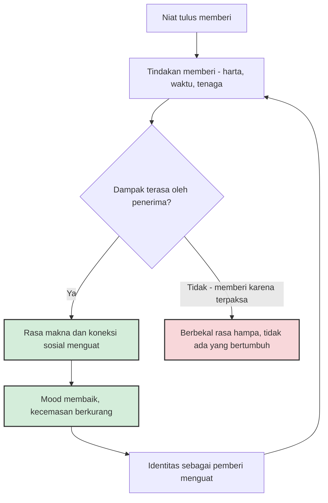

Dalam hadits riwayat Imam Muslim, Rasulullah ﷺ bersabda bahwa sedekah tidak akan mengurangi harta. Kalimat pendek itu—*ma naqashat shadaqatun mālan*—termasuk yang paling sering dikutip di khutbah dan pengajian. Sebagian orang membacanya sebagai janji spiritual: berikan sebagian hartamu, sisanya akan dijaga dan diganti. Sebagian lain tersenyum simpatis, mencatatnya sebagai klaim iman yang tidak mungkin diuji di laboratorium.

Yang menarik, dalam dua dekade terakhir para peneliti psikologi menemukan sesuatu yang aneh: manusia yang rutin memberi kepada orang lain secara konsisten melaporkan hidup yang lebih bahagia—bukan hanya di negara kaya, bukan hanya pada orang beragama, bahkan bukan hanya pada manusia dewasa. Kalimat "tidak mengurangi" itu ternyata bisa dibaca dari sisi yang selama ini jarang diperhatikan.

## Sidq: Kata "Jujur" yang Tersembunyi di Balik Sedekah

Sebelum bicara sains, ada baiknya kita luruskan dulu apa itu sedekah, karena kata ini sering menyempit menjadi "transfer uang ke kotak amal".

Dalam bahasa Arab, sedekah berakar dari kata *sidq*—kejujuran, ketulusan. Sebuah pemberian disebut sedekah justru karena kualitas batin pemberinya: memberi tanpa mengharap ganti, dengan niat karena Allah. Kamus dan ensiklopedia keislaman mencatat bahwa sedekah adalah lawan dari zakat dalam satu hal: zakat wajib dengan kadar yang sudah ditetapkan, sedangkan sedekah sukarela, jumlahnya ditentukan sepenuhnya oleh pemberinya. Sedekah tidak harus uang. Riwayat-riwayat klasik menyebut contoh yang membuat kita tersentak: menyingkirkan duri atau penghalang dari jalan adalah sedekah, menuntun orang yang buta adalah sedekah, kalimat yang baik adalah sedekah—bahkan tersenyum di hadapan saudara pun dicatat sebagai sedekah.

Artinya, dalam pandangan Islam, memberi bukan sebatas transaksi keuangan. Ia adalah sikap hidup yang bisa dilatih lewat ribuan tindakan kecil sepanjang hari. Dan justru di titik inilah temuan psikologi modern menjadi menarik untuk disandingkan.

## Eksperimen Lima Dolar

Kisahnya dimulai tahun 2008 di University of British Columbia. Elizabeth Dunn, Lara Aknin, dan Michael Norton menerbitkan sebuah makalah pendek di jurnal *Science* yang kemudian jadi salah satu paper psikologi paling banyak dikutip dekade ini. Dalam eksperimennya, partisipan diberi uang—sebagian lima dolar, sebagian dua puluh dolar—dan diminta membelanjakannya sebelum sore: separuh untuk diri sendiri, separuh untuk orang lain. Malam harinya, yang membelanjakan uangnya untuk orang lain ternyata lebih bahagia daripada yang memanjakan dirinya sendiri. Jumlahnya tidak signifikan berpengaruh; penerimanya yang menentukan.

Pertanyaan berikutnya wajar muncul: apakah ini cuma keistimewaan orang Kanada yang hidupnya berkecukupan? Aknin dan koleganya lalu menguji datanya berskala raksasa—survei Gallup World Poll dari 136 negara—dan menemukan pola yang sama di mana-mana: di negara kaya maupun miskin, menghabiskan uang untuk membantu orang lain berkorelasi dengan kebahagiaan yang lebih tinggi. Eksperimen lanjutan di Kanada, Uganda, India, dan Afrika Selatan mengonfirmasi arah kausalnya. Kesimpulannya cukup berani untuk standar akademik: kebahagiaan dari memberi kemungkinan adalah *psychological universal*—pola dasar manusia, bukan produk budaya tertentu.

Temuan paling mengguncang datang dari ruang bermain. Aknin, bersama Hamlin dan Dunn, merekrut balita di bawah usia dua tahun—usia ketika konsep agama, budaya, atau "citra dermawan" belum masuk akal. Anak-anak ini diberi camilan lalu diberi kesempatan memberikannya kepada orang asing. Hasilnya: mereka tampak lebih bahagia saat memberi daripada saat menerima. Lebih lanjut lagi, mereka lebih bahagia saat memberi camilan milik mereka sendiri dibanding memberi camilan yang bukan miliknya—memberi yang "menyakitkan" justru terasa lebih memuaskan. *Warm glow* saat berbagi tampaknya terpasang di diri manusia sebelum kita bisa mengucapkan kalimat pertama.

Neurosains menambahkan lapisan berikutnya. Tahun 2017, tim dari Universitas Lübeck dan Zurich memindai otak partisipan yang berkomitmen membelanjakan uang untuk orang lain selama empat minggu ke depan. Dibanding kelompok kontrol yang berkomitmen membelanja untuk diri sendiri, kelompok "dermawan" menunjukkan aktivasi yang lebih kuat di *temporo-parietal junction* dan hubungannya dengan *ventral striatum*—area hadiah di otak. Dan aktivitas striatum saat mengambil keputusan dermawan berkorelasi langsung dengan kenaikan kebahagiaan yang dilaporkan partisipan.

Kalau efeknya "hanya" perasaan, mungkin masih bisa dikesampingkan. Tapi penelitian tahun 2016 membawa temuan ini ke ranah fisik: lansia penderita hipertensi yang diminta membelanjakan uang untuk orang lain selama tiga minggu menunjukkan penurunan tekanan darah—sistolik dan diastolik—dibanding kelompok yang membelanja untuk diri sendiri. Dalam laporannya di *Health Psychology*, para penulis mencatat bahwa besar efeknya sebanding dengan intervensi seperti obat antihipertensi atau olahraga. Dan data paling baru memperkuat daya tahan temuan ini: survei terhadap lebih dari lima belas ribu orang Amerika menunjukkan hubungan antara memberi dan kebahagiaan yang konsisten lintas usia, jenis kelamin, dan tingkat pendapatan—bahkan pada orang yang tidak percaya bahwa memberi bisa membahagiakan diri mereka. Mereka tetap merasakannya.

## Lingkaran Memberi

Kalau dirangkai, temuan-temuan ini membentuk sebuah lingkaran—bukan keajaiban, melainkan mekanisme yang masuk akal:

Psikologi menjelaskan tiga tuas yang menggerakkan lingkaran ini. Pertama, *sense of agency*: memberi menghadirkan perasaan bahwa hidup kita berpengaruh, bahwa masalah di sekitar kita bukan sesuatu yang hanya bisa disaksikan. Kedua, koneksi sosial: sedekah hampir selalu berjalan lewat relasi—dengan penerima, dengan organisasi penyalur—dan relasi adalah prediktor kebahagiaan yang paling kuat dalam literatur. Ketiga, makna: uang yang berubah menjadi makanan untuk keluarga lain atau buku untuk anak-anak menempel pada sebuah kisah, bukan sekadar angka yang berkurang dari rekening.

Ada satu keistimewaan lagi yang jarang disadari. Kebahagiaan dari membeli barang untuk diri sendiri umumnya cepat pudar—psikologi menyebutnya adaptasi hedonis, kecenderungan kembali ke tingkat kebahagiaan dasar tidak lama setelah kenikmatan baru diperoleh. Memberi tampaknya lebih tahan banting. Setiap pemberian melahirkan kisah sosial yang berbeda—siapa penerimanya, apa yang berubah, bagaimana relasi itu berlanjut—dan kisah baru tidak mudah dianggap "biasa saja" oleh otak kita. Mungkin karena itu Rasulullah ﷺ menyebut amal yang paling dicintai Allah adalah yang dilakukan secara berkesinambungan meskipun sedikit (HR Bukhari–Muslim): bukan besarnya angka yang dikejar, melainkan berjalannya waktu yang mengulang pola tersebut.

## Syaratnya Sudah Dijelaskan Empat Belas Abad Lalu

Tapi riset yang sama memberi peringatan penting: tidak semua pemberian melahirkan kebahagiaan. Memberi karena dipaksa, memberi tanpa melihat dampaknya, memberi sekadar untuk dipuji—semua jalur ini gagal menyalakan lingkaran di atas. Psikologi menyebut syaratnya dengan istilah *autonomy* dan *impact visibility*: memberi harus terasa sebagai pilihan bebas, dan kita perlu melihat atau membayangkan hasilnya dengan jelas.

Yang membuat saya tercengang adalah betapa persisnya paralel ini dengan ajaran yang sudah ada jauh sebelum ada jurnal peer-review. Al-Qur'an memperingatkan sedekah yang diniatkan riya—dipertontonkan agar dilihat orang, lalu kehilangan nilainya di sisi Allah (QS 2:264). Al-Qur'an menyebut sedekah yang disembunyikan lebih baik bagi pemberinya daripada yang dipamerkan (QS 2:271), persis menghapus motif "dilihat orang" yang oleh psikologi disebut merusak. Al-Qur'an juga melarang mengungkit-ungkit dan menyakiti hati penerima, dan menyebut perkataan yang baik plus pemberian maaf lebih baik daripada sedekah yang disertai tindakan menyakitkan (QS 2:262–263)—karena pemberian yang menyakitkan justru memutus koneksi sosial yang menjadi sumber kebahagiaan pemberinya sendiri. Dan hadits tentang senyum sebagai sedekah? Ia memperluas definisi memberi hingga batasnya hilang—tidak ada orang yang kekurangan senyum.

Empat belas abad tradisi spiritual telah memikirkan psikologi memberi: niat, cara, dan martabat penerima. Sains modern datang belakangan, mengukurnya dengan kelompok kontrol dan alat pencitraan otak, dan sampai pada rambu-rambu yang kurang lebih sama. Setidaknya bagi saya, ini bukan kebetulan yang bisa diabaikan begitu saja.

## Negara Terdermawan dan Tantangan Sedekah Sekali Sentuh

Ada kabar baik dari rumah sendiri. World Giving Index—indeks tahunan yang disusun Charities Aid Foundation berbasis data Gallup dari lebih 140 negara, mengukur tiga perilaku: membantu orang asing, menyumbang uang, dan menjadi relawan—menempatkan Indonesia di posisi pertama pada edisi 2021 dan 2022. Dari data yang sama terlihat pula Myanmar sempat empat tahun berturut-turut di puncak; keduanya menyisakan pelajaran bahwa kedermawanan tinggi tidak memerlukan negara kaya. Yang dibutuhkan adalah budaya yang menumbuhkannya, dan di Indonesia budaya itu ada: dari kotak amal di masjid hingga gelombang berbagi takjil dan santunan menjelang Idulfitri.

Tapi zaman juga mengubah caranya. Sedekah hari ini bisa berlangsung tiga detik: buka aplikasi, pilih kampanye, bayar dengan QRIS. Biayanya turun drastis, dan itu bagus. Risikonya kurang terlihat: donasi yang terlalu mudah bisa menjadi impulsif, terlepas dari perencanaan; berita sedih yang mengalir tanpa henti bisa membuat rasa iba kita tumpul; dan kanal yang tidak transparan membuat "dampak terlihat"—syarat penting agar memberi tetap bermakna—menguap begitu saja. Riset memberi tahu bahwa kualitas pemberian lebih menentukan daripada jumlahnya. Memilih satu kanal yang melaporkan penggunaan dana dengan jujur, lalu menjadikannya tempat kembali secara rutin, mungkin lebih bernilai daripada dua puluh transfer impulsif di tengah doomscrolling.

## Yang Sebenarnya Tidak Berkurang

Saya tidak ingin terdengar seperti sedang menjual sedekah sebagai terapi kebahagiaan. Riset-riset di atas berkorelasi kuat dan arah kausalnya sudah banyak diuji, tapi ia bukan formula ajaib, dan kebahagiaan bukanlah tujuan sedekah—ia lebih seperti efek samping yang dititipkan. Orang yang memberi demi merasa bahagia saja, tanpa kepedulian sungguhan kepada penerima, sedang berjalan di jalan buntu yang oleh Al-Qur'an disebut riya dan oleh psikologi disebut *instrumental giving*.

Yang akhirnya saya pahami dari hadits "sedekah tidak mengurangi harta" adalah sesuatu yang lebih dalam dari angka. Yang berkurang ketika kita memberi bukanlah harta, melainkan cengkeraman kita terhadap harta—rasa takut bahwa apa yang kita punya tidak akan pernah cukup, kecemasan yang membuat tangan menggenggam semakin erat justru ketika yang digenggam semakin banyak. Sebagai ayah, saya percaya anak-anak belajar memberi bukan dari nasihat, melainkan dari apa yang mereka saksikan dilakukan orang tuanya berulang-ulang, dalam skala sekecil apa pun.

Al-Qur'an melukiskan sedekah dengan perumpamaan sebutir benih yang menumbuhkan tujuh tangkai, dan setiap tangkai berisi seratus biji (QS 2:261). Perumpamaan itu tidak mengajarkan pertumbuhan yang linear; ia mengajarkan bahwa pemberian yang tulus bertumbuh lewat jalur yang tidak selalu bisa kita hitung—sebagian di rekening, sebagian di tekanan darah, sebagian di ketenangan malam hari. Tradisi ini bahkan punya konsep untuk memberi yang menembus batas waktu: sedekah jariyah, pemberian yang pahalanya terus mengalir setelah pemberinya tiada—sumur yang digali, sekolah yang didirikan, ilmu yang diajarkan kepada orang lain. Ketika seseorang membangun fasilitas air bersih untuk desa, ia sedang menanam benih yang buahnya akan dipetik anak-anak yang bahkan belum lahir; pertumbuhan seperti itu tidak pernah masuk laporan keuangan pribadi siapa pun. Psikologi modern baru saja mulai menghitung satu pecahan dari perkalian itu. Sisanya, seperti biasa, di luar jangkauan laboratorium.

## Referensi

1. Dunn, E. W., Aknin, L. B., & Norton, M. I. (2008). *Spending money on others promotes happiness.* Science, 319(5870), 1687–1688. doi:10.1126/science.1150952 — https://pubmed.ncbi.nlm.nih.gov/18356530/
2. Aknin, L. B., dkk. (2013). *Prosocial spending and well-being: cross-cultural evidence for a psychological universal.* Journal of Personality and Social Psychology, 104(4), 635–652. doi:10.1037/a0031578 — https://pubmed.ncbi.nlm.nih.gov/23421360/
3. Aknin, L. B., Hamlin, J. K., & Dunn, E. W. (2012). *Giving leads to happiness in young children.* PLoS ONE, 7(6), e39211. doi:10.1371/journal.pone.0039211 — https://pubmed.ncbi.nlm.nih.gov/22720078/
4. Park, S. Q., dkk. (2017). *A neural link between generosity and happiness.* Nature Communications, 8, 15964. doi:10.1038/ncomms15964 — https://pubmed.ncbi.nlm.nih.gov/28696410/
5. Whillans, A. V., dkk. (2016). *Is spending money on others good for your heart?* Health Psychology, 35(6), 574–583. doi:10.1037/hea0000332 — https://pubmed.ncbi.nlm.nih.gov/26867038/
6. Lok, I., & Dunn, E. W. (2022). *Are the benefits of prosocial spending and buying time moderated by age, gender, or income?* PLoS ONE, 17(6), e0269636. — https://pubmed.ncbi.nlm.nih.gov/35679298/
7. Wikipedia. *Sadaqah* — https://en.wikipedia.org/wiki/Sadaqah
8. Wikipedia. *World Giving Index* — https://en.wikipedia.org/wiki/World_Giving_Index
9. Imam Muslim. *Shahih Muslim* no. 2588 (hadits "sedekah tidak mengurangi harta") — https://sunnah.com/muslim:2588
10. Imam Bukhari & Imam Muslim. Hadits "amal yang paling dicintai Allah adalah yang paling berkesinambungan walau sedikit" (*ahabbul a'mal adwamuha*) — https://sunnah.com/bukhari:6464
