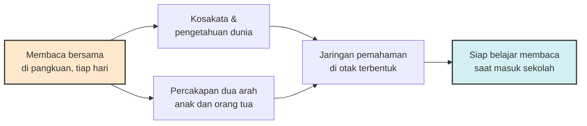
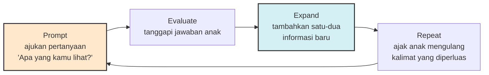

Hasil PISA 2022 menempatkan skor membaca siswa Indonesia di angka 359, jauh di bawah rata-rata OECD yang mencapai 476. Perbincangan yang mengikuti angka ini biasanya berkutat pada kurikulum, metode pengajaran, atau beban guru. Semua relevan. Tapi ada satu ruang yang jarang masuk pembahasan: ruang keluarga, tahun-tahun sebelum anak mengenal huruf. Riset selama beberapa dekade menunjukkan bahwa kebiasaan yang tampak paling sepele — membacakan buku kepada anak — adalah salah satu prediktor terkuat kesiapan literasi, dan jejaknya bahkan bisa dilihat di pemindaian otak.

## Sejuta kata yang tidak terdengar

Angkanya cukup telak. Logan dkk. (2019) dari Ohio State University menghitung jumlah kata yang terpapar ke anak dari sesi membaca buku menggunakan data 60 judul buku anak yang umum dibaca. Hasilnya: satu buku cerita per hari setara dengan sekitar 78.000 kata per tahun. Secara kumulatif, anak yang tumbuh di rumah kaya literasi mendengar sekitar 1,4 juta kata lebih banyak dari kegiatan membacakan buku sebelum masuk sekolah dasar, dibandingkan anak yang tidak pernah dibacakan sama sekali. Studi yang sama mencatat fakta yang lebih menarik dari angkanya: sekitar seperempat pengasuh di Amerika Serikat tidak pernah membacakan buku kepada anak mereka.

Kenapa kata dari buku berbeda dari kata sehari-hari? Percakapan rumah tangga sangat repetitif — "ayo makan", "sudah mandi belum", "jangan lari". Kosakata dalam buku cerita bekerja di wilayah yang berbeda: buku tentang dinosaurus memuat nama-nama spesies, buku tentang hujan membawa kata-kata seperti "gerimis" atau "menggenang". Peneliti menyebutnya kata jarang (rare words) — dan paparan kata jarang justru yang paling menentukan pertumbuhan kosakata anak.

## Yang terlihat di otak

Kalau angka tadi masih terdengar seperti hitungan akuntansi, studi berikutnya memindai otaknya langsung. Hutton dkk. (2015) di Cincinnati Children's Hospital memindai 19 anak usia 3–5 tahun dengan fMRI sambil mereka mendengarkan cerita. Anak-anak yang lebih sering dibacakan buku di rumah menunjukkan aktivasi lebih tinggi di wilayah sisi kiri otak yang terlibat dalam pemrosesan makna — kawasan parietal-temporal-oksipital yang bertugas menghubungkan bunyi kata dengan citra mental dan artinya. Mural hasil visualisasi studi ini kemudian dikenal luas sebagai "The Reading Mural": otak anak yang sering dibacakan cerita tampak "lebih menyala" saat mendengarkan kisah.

Studi lanjutan memperkuat temuan ini dari sisi lain. Compton dkk. (2026) di Vanderbilt menemukan bahwa lingkungan literasi rumah berkaitan dengan spesialisasi otak anak usia 5–8 tahun untuk pengolahan bunyi bahasa dan makna kata. Kraus dkk. (2025) bahkan menunjukkan bahwa konektivitas jaringan otak saat anak mendengarkan cerita berkaitan dengan kualitas interaksi orang tua–anak saat membaca bersama — artinya yang bekerja bukan sekadar "ada suara cerita di ruangan", tapi "ada orang yang menemani dan mengajak berdialog".

Dan ini bukan sekadar korelasi. Meta-analisis Dowdall dkk. (2020) terhadap 19 uji coba terandomisasi melibatkan 2.594 anak menemukan bahwa intervensi yang melatih orang tua berbagi buku cerita memberi efek positif pada bahasa ekspresif anak (d = 0,41) — ukuran efek yang cukup berarti untuk intervensi se murah sebuah buku. Menariknya, efek terbesar justru muncul pada kompetensi pengasuhnya sendiri (d = 1,01): orang tua yang dilatih menjadi lebih cakap berinteraksi lewat buku. Studi dari Helsinki oleh Mustonen dkk. (2024) terhadap 164 anak usia prasekolah menambahkan satu temuan yang menenangkan: membacakan, bercerita bebas, dan bernyanyi sama-sama berasosiasi dengan kemampuan bahasa anak — tapi membacakan buku memiliki nilai penjelas tertinggi, dan satu-satunya yang berasosiasi dengan kemampuan reseptif (memahami) anak.

## Koreksi penting: bukan soal jumlah semata

Sebelum kita terlalu percaya diri menghitung kata, ada nuansa yang jujur perlu disampaikan. Klaim klasik "kesenjangan 30 juta kata" dari Hart dan Risley era 1990-an ternyata mengalami koreksi serius. Meta-analisis Dailey dan Bergelson (2022) terhadap 19 studi menemukan kesenjangan itu nyata, tapi jauh lebih kecil dari angka legendaris tersebut — dan hanya muncul besar ketika peneliti menghitung ucapan yang benar-benar ditujukan kepada anak (child-directed speech), bukan seluruh percakapan yang menggelayut di sekitarnya.

Implikasinya penting: yang menentukan bukan volume suara di rumah, melainkan percakapan dua arah yang sungguh-sungguh melibatkan anak. Dan di titik inilah buku cerita unggul — halaman bergambar adalah mesin percakapan yang sangat efisien. Setiap halaman adalah pertanyaan yang menunggu dijawab.

## Cara membacakan yang menghidupi sesi

Lalu bagaimana membacakan yang benar? Laporan teknis American Academy of Pediatrics tahun 2024 (Klass, Mendelsohn, Hutton, dkk.) merangkum bukti bahwa kualitas interaksi saat membaca lebih menentukan daripada durasinya. Pendekatan yang dalam literatur dikenal sebagai dialogic reading intinya sederhana: jadikan sesi membaca sebagai percakapan, bukan pertunjukan satu orang. Polanya berjalan melingkar — di literatur disebut PEER:

Beberapa temuan riset bisa dijadikan pegangan praktis:

- **Jenis buku menentukan panjang percakapan.** Catão dkk. (2026) menganalisis 557 video sesi membaca bersama 52 anak usia 6 bulan hingga 3 tahun, dan menemukan buku naratif serta buku konsep (angka, warna, bentuk) menghasilkan sesi yang lebih panjang dengan lebih banyak tindakan komunikasi dari anak. Buku interaktif seperti lift-the-flap punya tempatnya untuk anak yang lebih kecil.
- **Buku cerita bukan cuma soal kosakata.** Gümrükçü Bilgici (2026) menelaah 120 buku cerita dan menemukan 70,8% di antaranya memuat konten regulasi diri — tokoh yang menunggu, kecewa, menahan diri, mencoba lagi. Buku adalah pintu untuk mengobrolkan emosi tanpa harus menghakimi.
- **Repetisi adalah fitur, bukan bug.** Anak yang meminta buku yang sama untuk kali ke tujuh belas sedang bekerja, bukan bingung. Pengulangan memperdalam kosakata yang sama di konteks yang makin dikenalnya. Orang tua yang mulai bosan bisa mengganti peran: hari ini bertanya tentang alur, besok biarkan anak yang menceritakan halamannya sendiri.

## Sejak kapan? Sejak lahir — dan tidak pernah terlambat

American Academy of Pediatrics merekomendasikan membacakan buku dimulai sejak lahir — rekomendasi yang tampak absurd karena bayi baru lahir jelas tidak memahami isi cerita. Tapi justru di situlah logikanya: pemahaman berkembang jauh sebelum kemampuan bicara, dan jaringan otak untuk memroses narasi dibangun dari mendengarkan, bukan dari mengeja. Bayi yang digendong sambil dibacakan mungkin hanya menyerap irama suara orang tuanya, tapi irama itu datang bersama kebiasaan — dan kebiasaan itulah yang akan memudahkan saat ia mulai menunjuk gambar, lalu bertanya, lalu membaca sendiri.

Bagi orang tua yang anaknya sudah lebih besar dan ritual ini tidak pernah terbentuk, kabar baiknya: meta-analisis Dowdall tidak menemukan pengaruh usia anak terhadap hasil intervensi — yang menentukan adalah dosis dan cara, bukan titik nol. Memulai di usia empat atau enam tahun tetap memberi efek, sepanjang sesinya tetap berupa percakapan dan bukan ceramah.

## Kalau anaknya tidak mau duduk

Tidak semua anak langsung jatuh cinta pada sesi membaca, dan ini bukan kegagalan. Dua penyesuaian biasanya menolong. Pertama, ikuti minatnya, bukan minat toko buku: anak yang obsesif pada mobil akan lebih cepat terikat pada ensiklopedia kendaraan daripada cerita pemenang penghargaan. Kedua, turunkan ambisinya: sesi "gagal" yang berlangsung tiga halaman tetap lebih baik daripada nol. Beberapa anak juga lebih reseptif saat tubuhnya sibuk — mendengarkan cerita sambil menyusun balok itu tetap mendengarkan cerita. Yang diukur dari kebiasaan ini bukan kekhusyukan, tapi akumulasi.

## Cetak atau layar

Pertanyaan yang pasti muncul di rumah mana pun: bolehkah e-book? Munzer dkk. (2019) memvideokan 37 pasangan orang tua–anak usia 24–36 bulan yang membaca tiga format buku: cetak, e-book polos, dan e-book dengan animasi serta efek suara. Dengan buku cetak, orang tua menghasilkan verbalisasi dialogik hampir dua kali lipat dibanding e-book enhanced (11,9 berbanding 6,2 per sesi). Sebagian energi interaksi di format layar tersita menjadi arahan teknis — "jangan tekan tombolnya dulu", "tunggu audionya selesai". Studi kembarannya di JAMA Pediatrics menemukan hal serupa: resiprositas sosial antara orang tua dan balita lebih tinggi saat membaca buku cetak.

Ini bukan larangan mutlak, tapi soal memahami mekanismenya: fitur "menarik" pada e-book bersaing memperebutkan perhatian yang seharusnya dipakai untuk saling menatap dan berdialog. Jika memang harus layar, pilih versi paling polos dan pertahankan kebiasaan bertanya. Jika ada pilihan, cetak menang.

## Dosis, bukan durasi

Meta-analisis Dowdall menemukan satu moderator yang layak digarisbawahi: dosis. Intervensi berdosis rendah nyaris tidak berdampak. Artinya sepuluh menit yang konsisten setiap malam mengalahkan satu jam penuh teatrikal yang hanya terjadi sekali sebulan. Ini kabar baik untuk orang tua yang bekerja penuh waktu dan pulang dalam keadaan setengah hidup — standar keberhasilannya rendah, yang penting berulang.

Sebagai ayah yang dulu menghabiskan malam dengan novel-novel tebal sebelum anak hadir, saya menemukan semacam keajaiban kecil di sini: tumpukan buku di atas nakas berganti menjadi buku bergambar, dan anehnya itu tetap terasa seperti membaca. Kebiasaan lama bertahan dalam bentuk yang sama sekali berubah — dan riset di atas meyakinkan saya bahwa bentuk barunya ini bukan kompromi, melainkan investasi.

Skor PISA adalah angka agregat dari jutaan rumah. Angka 359 bukan semata hasil kerja ruang kelas; sebagian pekerjaannya dikerjakan di kasur, jam delapan malam, dengan satu buku gambar pada satu waktu. Kita tidak bisa mengubah kebijakan pendidikan nasional dari ruang tamu, tapi risetnya cukup jelas untuk satu hal: dari semua intervensi literasi yang ada, membacakan buku untuk anak adalah yang paling murah, paling tidak butuh pelatihan, dan — tidak kalah penting — paling menyenangkan untuk dimulai malam ini juga.

## Referensi

1. Logan, J.A.R., Justice, L.M., Yumuş, M., & Chaparro-Moreno, L.J. (2019). "When Children Are Not Read to at Home: The Million Word Gap." *Journal of Developmental & Behavioral Pediatrics*, 40(5), 383–386. https://pubmed.ncbi.nlm.nih.gov/30908424/
2. Hutton, J.S., Horowitz-Kraus, T., Mendelsohn, A.L., DeWitt, T., & Holland, S.K. (2015). "Home Reading Environment and Brain Activation in Preschool Children Listening to Stories." *Pediatrics*, 136(3), 466–478. https://pubmed.ncbi.nlm.nih.gov/26260716/
3. Dowdall, N., Melendez-Torres, G.J., Murray, L., Gardner, F., Hartford, L., & Cooper, P.J. (2020). "Shared Picture Book Reading Interventions for Child Language Development: A Systematic Review and Meta-Analysis." *Child Development*, 91(2), e383–e399. https://pubmed.ncbi.nlm.nih.gov/30737957/
4. Munzer, T.G., Miller, A.L., Weeks, H.M., Kaciroti, N., & Radesky, J. (2019). "Differences in Parent-Toddler Interactions With Electronic Versus Print Books." *Pediatrics*, 143(4), e20182012. https://pubmed.ncbi.nlm.nih.gov/30910918/
5. Munzer, T.G., dkk. (2019). "Parent-Toddler Social Reciprocity During Reading From Electronic Tablets vs Print Books." *JAMA Pediatrics*, 173(11), 1076–1083. https://pubmed.ncbi.nlm.nih.gov/31566689/
6. Klass, P., Mendelsohn, A.L., Hutton, J.S., dkk. (2024). "Literacy Promotion: An Essential Component of Primary Care Pediatric Practice: Technical Report." *Pediatrics*, 154(6), e2024069091. https://pubmed.ncbi.nlm.nih.gov/39342415/
7. Mustonen, R., Torppa, R., & Stolt, S. (2024). "Parental linguistic support in a home environment is associated with language development of preschool-aged children." *Acta Paediatrica*, 113(8), 1852–1859. https://pubmed.ncbi.nlm.nih.gov/38700433/
8. Dailey, S., & Bergelson, E. (2022). "Language input to infants of different socioeconomic statuses: A quantitative meta-analysis." *Developmental Science*, 25(3), e13192. https://pubmed.ncbi.nlm.nih.gov/34806256/
9. Catão, M., Delehanty, A., & Lorio, C.M. (2026). "Frequency, Form, and Function of Child Communication During Early Shared Book Reading Experiences." *Journal of Speech, Language, and Hearing Research*, 69(7), 3127–3148. https://pubmed.ncbi.nlm.nih.gov/42159552/
10. Gümrükçü Bilgici, B. (2026). "Investigation of self-regulation skills in children's picturebooks: a quantitative content analysis." *Frontiers in Psychology*, 17, 1916149. https://pubmed.ncbi.nlm.nih.gov/42688395/
11. Compton, A.B., Banaszkiewicz, A., Wang, J., & Booth, J.R. (2026). "The Relation of Home Literacy Environment to Brain Specialization and Sensitivity for Phonological and Semantic Processing of Spoken Words." *Journal of Speech, Language, and Hearing Research*, 69(4), 1686–1705. https://pubmed.ncbi.nlm.nih.gov/41885550/
12. OECD, *PISA 2022 Results* — skor membaca Indonesia. Ringkasan di Wikipedia: Programme for International Student Assessment. https://en.wikipedia.org/wiki/Programme_for_International_Student_Assessment
