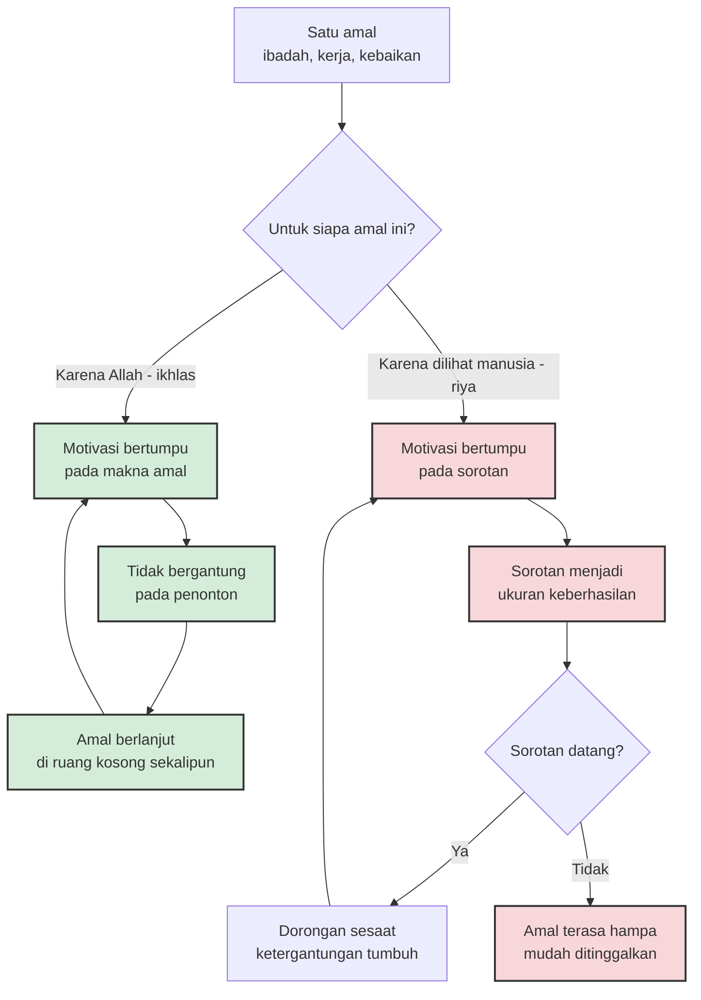

Pada awal 1970-an, tiga peneliti di Stanford mengundang anak-anak taman kanak-kanak untuk bermain dengan alat gambar. Anak-anak ini dipilih justru karena mereka sudah menyukai menggambar — kegiatan yang mereka pilih sendiri setiap kali jam bermain bebas tiba. Lalu peneliti menawarkan kesepakatan: gambarlah untuk kami, dan kau akan mendapat *Good Player Award*, sertifikat berpita dengan namamu tercetak di dalamnya. Sebagian anak dijanjikan hadiah sejak awal, sebagian mendapat hadiah kejutan setelah selesai, sebagian tidak mendengar apa-apa tentang hadiah.

Beberapa hari kemudian peneliti mengamati kelas saat alat gambar tersedia, hadiah sudah tidak ada, dan tidak seorang pun mengawasi. Hasilnya janggal: anak-anak yang dulu dijanjikan sertifikat justru menjadi kelompok yang paling jarang menggambar — lebih jarang dari kebiasaan mereka sendiri sebelum eksperimen, dan lebih jarang dari anak-anak yang tidak pernah tahu soal hadiah (Lepper, Greene & Nisbett, 1973). Kegemaran mereka tidak habis karena bosan. Kegemaran itu ditulis ulang alasannya: dari *aku menggambar karena aku suka* menjadi *aku menggambar karena ada bayarannya* — dan begitu bayaran hilang, alasan untuk menggambar ikut pergi.

Empat belas abad sebelum laboratorium itu berdiri, Nabi Muhammad ﷺ menceritakan skenario yang jauh lebih seram. Dalam hadits riwayat Imam Muslim, tiga manusia pertama yang dipanggil menghadap di hari kiamat adalah seorang yang gugur di medan perang, seorang yang menuntut ilmu lalu mengajarkannya dan rajin membaca Al-Qur'an, dan seorang yang diberi kelapangan harta lalu menyedekahkannya di jalan Allah. Ketiganya membeberkan amal terbesar mereka. Dan ketiganya menerima jawaban yang sama: *engkau berdusta*. Yang pertama berperang agar disebut pemberani. Yang kedua menuntut ilmu agar disebut alim dan qari. Yang ketiga bersedekah agar disebut dermawan. Sebutan itu memang mereka dapatkan — lalu amalnya ditolak (HR. Muslim no. 1905).

Dua kisah ini berangkat dari tempat yang jauh berbeda: satu dari ruang bermain anak, satu dari riwayat kenabian. Tapi keduanya menunjuk mekanisme yang sama. Sebuah perbuatan bisa tampak utuh dari luar sementara alasannya sudah dipindahtangankan ke pihak lain. Islam memberi penyakit itu sebuah nama: riya. Dan psikologi motivasi, tanpa pernah berniat membahas agama, sudah setengah abad lebih memetakan cara kerjanya.

## Niat itu soal arah, bukan upacara

Hadits yang dihafal hampir setiap muslim sejak kecil justru hadits tentang hal ini: *innamal a'malu bin niyyat* — sesungguhnya amal itu tergantung niatnya (HR. Bukhari no. 1 dan Muslim no. 1907). Bukan kebetulan hadits tentang niat menjadi pintu masuk empat puluh hadits inti ajaran Islam. Al-Qur'an sendiri menyandingkan perintah beribadah dengan syarat keikhlasan: "Padahal mereka tidak diperintah kecuali untuk menyembah Allah dengan ikhlas menaati-Nya semata-mata karena agama" (QS. Al-Bayyinah: 5).

Yang sering disalahpahami dari ikhlas adalah menganggapnya sebagai perasaan — semacam getaran khidmat yang harus hadir sebelum amal dianggap sah. Ibadah dan amal saleh tidak sesederhana itu. Ikhlas lebih mirip arah aliran daripada intensitas air: perbuatan yang sama, dengan volume yang sama, bisa mengalir ke muara yang berbeda-beda tergantung kemiringan hati yang membawanya. Orang yang menyumbang membangun masjid dan orang yang menyumbang agar namanya terpampang di gedung itu melakukan gerakan yang persis sama; bedanya hanya di titik muara.

Bahasa Arabnya akurat secara struktural. *Ikhlas* berarti memurnikan — membersihkan alasan sampai tersisa satu. Bahkan surah ke-112 dinamai Al-Ikhlas padahal kata itu tidak muncul sekali pun di dalam ayat-ayatnya; para ulama menamainya demikian karena isi surah itu murni bicara tentang Allah, tidak bercampur yang lain. Ikhlas adalah monoteisme yang diterapkan ke dalam motivasi: satu amal, satu alasan, satu yang dituju.

## Apa yang sebenarnya ditemukan di laboratorium

Kembali ke Stanford. Temuan Lepper dan koleganya itu kelak disebut psikologi sebagai *overjustification effect*: memberi insentif eksternal yang diharapkan — hadiah, hadiah, penghargaan — untuk kegiatan yang sudah dinikmati secara alami justru menurunkan motivasi intrinsik orang tersebut terhadap kegiatan itu. Ensiklopedia psikologi menyebut prosesnya sebagai *crowding out*: motivasi dari dalam terdesak keluar oleh motivasi dari luar. Studi lanjutan pada anak-anak yang sama menunjukkan efek ini tidak cepat pulih; jejaknya masih terbaca sampai tujuh minggu setelahnya (Greene & Lepper, 1974).

Edward Deci, peneliti yang sejak awal 1970-an bereksperimen dengan teka-teki Soma dan mahasiswa, bersama Richard Ryan mengembangkan penjelasan yang lebih dalam lewat *self-determination theory* — teori yang kini menjadi kerangka utama psikologi motivasi, bertumpu pada tiga kebutuhan dasar: otonomi, kompetensi, dan keterhubungan. Bagaimana hadiah eksternal dipersepsikan menentukan dampaknya: hadiah yang terasa mengendalikan menggeser persepsi *di mana letak penyebab tindakanku* — dari dalam diri ke luar diri.

Bukti terkuat datang dari meta-analisis 128 eksperimen yang ditulis Deci, Koestner, dan Ryan untuk *Psychological Bulletin* (1999). Kesimpulannya telak: hadiah berwujud yang dijanjikan di depan secara konsisten menurunkan motivasi intrinsik yang terukur lewat waktu pilihan bebas — efek terkuat pada hadiah yang menggantung diri pada keterlibatan (d = −0,40). Dan satu temuan yang bagi saya paling menohok: efek merusak hadiah berwujud justru *lebih besar pada anak-anak* daripada mahasiswa. Anak kecil yang paling mudah kehilangan kecintaan mereka pada sesuatu begitu sesuatu itu mulai dibayar.

Mekanismenya bisa dibaca lewat teori persepsi diri Daryl Bem: manusia menyimpulkan alasan perilakunya sendiri dari kondisi eksternal yang mencolok. Kalau ada sertifikat berpita menunggu, kesimpulan yang paling gampang adalah *aku melakukan ini untuk sertifikat*. Klasik Festinger dan Carlsmith (1959) menunjukkan versi terbaliknya: partisipan yang dibayar cuma satu dolar untuk memuji tugas membosankan justru menilai tugas itu lebih menyenangkan daripada yang dibayar dua puluh dolar — sebab mereka tidak bisa menyalahkan uang, mereka menyimpulkan dirinya memang menyukainya. Pikiran kita rajin sekali menulis ulang alasan.

Sekarang ganti sertifikat berpita itu dengan tatapan manusia. Riya, dalam kerangka ini, adalah *overjustification effect* dalam bentuk sosialnya: penonton adalah hadiahnya, dan sorotan adalah pembayarannya. Perbuatan baik yang berulang kali diperuntukkan bagi penonton akan mengalami nasib yang sama dengan menggambar anak-anak Stanford — alasan berpindah, dan begitu penonton kosong, keinginan untuk berbuat ikut mengering.

## Panggung yang kita bawa di saku

Generasi sekarang menghadapi versi riya yang tidak pernah dihadapi para pendahulu: panggung yang menyala dua puluh empat jam dan muat di saku. Setiap amal kini punya potensi menjadi pertunjukan dengan angka penontonnya sendiri — sedekah yang difoto, ngaji yang direkam, tulisan yang dibagikan, kode sumber terbuka yang disaksikan ribun orang, kebajikan yang ditunggu validasinya berupa angka kecil di sudut layar.

Di dunia kerja teknologi tempat saya berpijak, tarikannya nyata. Ada perbedaan yang halus antara kode yang ditulis agar *benar* dan kode yang ditulis agar terlihat pintar saat direview; antara berbagi ilmu karena ingin berguna dan berbagi ilmu karena ingin disebut ahli; antara memperjuangkan arsitektur karena kokoh dan memperjuangkannya karena ingin tercatat sebagai pemilik gagasan. Dari luar, aktivitas-aktivitas itu identik. Yang beda hanya muaranya — dan muara itu jarang terlihat di dif, di repositori, atau di laporan kinerja.

Al-Qur'an ternyata sangat teliti memilih kata untuk fenomena ini. Surah Al-Ma'un menghardik orang yang shalat tapi lalai, lalu menyebut mereka *alladziina hum yuraa'uun* — mereka yang mengerjakan sambil menunggu dilihat (QS. Al-Ma'un: 4–6). Al-Baqarah ayat 264 lebih tegas lagi: jangan sampai sedekah dibatalkan oleh penyebutan dan rasa injak, seperti orang yang menginfakkan hartanya *riaa'an naas* — untuk dipertontonkan kepada manusia. Kata kerjanya bukan "berbohong tentang niat", melainkan menunggu dan mengarahkan. Riya jarang datang sebagai keputusan; ia datang sebagai kemiringan yang terbentuk pelan-pelan setiap kali kita menengok reaksi penonton.

Dan di sinilah loop diagram di atas bekerja tanpa jeda: setiap notifikasi yang menghadirkan angka penonton memberi dorongan kecil yang melatih kita menulis, berbagi, dan beramal untuk sorotan. Riset Lepper memprediksi akhir ceritanya — begitu sorotan surut, keinginan ikut surut. Kekeringan spiritual banyak bermula bukan dari berhenti berbuat, tapi dari berbuat terlalu lama untuk penonton yang akhirnya pergi.

## Ikhlas bukan alergi terhadap apresiasi

Tapi jangan salah baca datanya. Meta-analisis Deci dan koleganya memuat satu temuan yang berlawanan arah: umpan balik positif justru *memperkuat* motivasi intrinsik (d = 0,33) — sebab apresiasi yang informatif memberi rasa kompetensi tanpa mengambil alih alasan berbuat. Psikologi membedakan insentif yang memberi tahu (*this is good work*) dari insentif yang mengendalikan (*do this and you'll be seen*). Yang pertama memperkuat, yang kedua memindahkan.

Paralelnya dengan Islam cukup rapi. Nabi ﷺ tidak pernah melarang memuji; beliau justru memuji Abu Bakar, Umar, dan para sahabat di depan umum. Ucapan terima kasih kepada orang berbuat baik adalah sunnah. Yang dilarang bukan adanya pandangan manusia — itu tidak mungkin dihindari — melainkan berubahnya pandangan manusia dari akibat menjadi tujuan. Imam Al-Ghazali, dalam Ihya' 'Ulum al-Din, membahas riya sebagai penyakit hati yang berlapis-lapis kedalamannya: dari pamer yang kasar sampai bentuknya yang paling halus, misalnya menikmati kenyataan bahwa orang menganggap kita orang yang tidak suka pamer. Semakin halus, semakin sulit dideteksi — dan semakin mirip kejujuran.

Karena itu menjawab riya dengan menghindari semua amal publik juga keliru. Shalat berjamaah, dakwah, menuntut ilmu, memimpin dengan baik — semuanya amal yang terekspos dan justru dianjurkan. Yang dilatih bukan penampilan kita di depan umum, melainkan arah kita di belakang panggung.

## Melatih arah, bukan mendeklarasikannya

Kalau ikhlas adalah kemiringan, ia bukan saklar yang dinyalakan sekali seumur hidup. Ia dipelihara lewat latihan harian yang membosankan. Tradisi Islam menyediakan ruang latihannya: amal rahasia. Sedekah yang tidak diketahui penerimanya dari siapa dana datang. Shalat sunnah di sepertiga malam ketika satu-satunya saksi adalah Yang menghitung. Amal-amal semacam ini bukan pelarian dari dunia, melainkan pusat pembibitan: di ruang tanpa penonton, alasan berbuat tidak punya pilihan lain selain menghadap ke atas.

Ada satu pertanyaan sederhana yang bisa dipakai untuk mengaudit amal apa pun, dari kode yang kita tulis sampai sedekah yang kita berikan: *kalau tidak ada seorang pun yang tahu, apakah aku masih akan melakukannya dengan cara yang sama?* Bukan untuk menghukum jawaban jujur kita — jawabannya sering membuat malu — tapi untuk mengetahui posisi kemiringan hari ini. Arah bisa diluruskan; yang tidak bisa diluruskan adalah kemiringan yang tidak pernah diukur.

Sebagai ayah dan sebagai orang yang bekerja di ruang yang penuh penilaian, saya mengakui soal ini tidak ada selesainya. Yang saya bisa lakukan hanyalah memastikan ada bagian hidup yang tetap tak tercatat: doa yang tidak dibagikan, kebaikan yang tidak diceritakan, pekerjaan yang dikerjakan karena memang harus dikerjakan dengan benar. Laboratorium Stanford mengingatkan bahwa apa pun yang kita jadikan penonton akan menulis ulang alasan kita. Hari kiamat, kata hadits Muslim itu, akan memanggil amal-amal paling megah untuk menyingkap alasan yang sebenarnya. Lebih murah menyingkapnya sendiri lebih dulu — di ruang yang sepi, jauh sebelum sertifikat, angka, atau nama baik siapa menunggu.

## Referensi

1. Lepper, M. R., Greene, D., & Nisbett, R. E. (1973). *Undermining children's intrinsic interest with extrinsic reward: A test of the "overjustification" hypothesis.* Journal of Personality and Social Psychology, 28(1), 129–137.
2. Greene, D., & Lepper, M. R. (1974). *Effects of extrinsic rewards on children's subsequent intrinsic interest.* Child Development, 45(4), 1141–1145. — https://pubmed.ncbi.nlm.nih.gov/4143868/
3. Deci, E. L. (1971). *Effects of externally mediated rewards on intrinsic motivation.* Journal of Personality and Social Psychology, 18(1), 105–115.
4. Deci, E. L., Koestner, R., & Ryan, R. M. (1999). *A meta-analytic review of experiments examining the effects of extrinsic rewards on intrinsic motivation.* Psychological Bulletin, 125(6), 627–668. — https://pubmed.ncbi.nlm.nih.gov/10589297/
5. Wikipedia. *Overjustification effect* — https://en.wikipedia.org/wiki/Overjustification_effect
6. Wikipedia. *Self-determination theory* — https://en.wikipedia.org/wiki/Self-determination_theory
7. Wikipedia. *Niyyah* dan *Al-Ikhlas* — https://en.wikipedia.org/wiki/Niyyah
8. Al-Qur'an: QS. Al-Bayyinah ayat 5, QS. Al-Baqarah ayat 264, QS. Al-Ma'un ayat 4–6 — terjemahan Sahih International via AlQuran Cloud (https://alquran.cloud)
9. Imam Muslim. *Shahih Muslim* no. 1905 — hadits tiga golongan pertama yang diadili — https://sunnah.com/muslim:1905
10. Imam Al-Ghazali. *Ihya' 'Ulum al-Din* — pembahasan riya sebagai penyakit hati.
